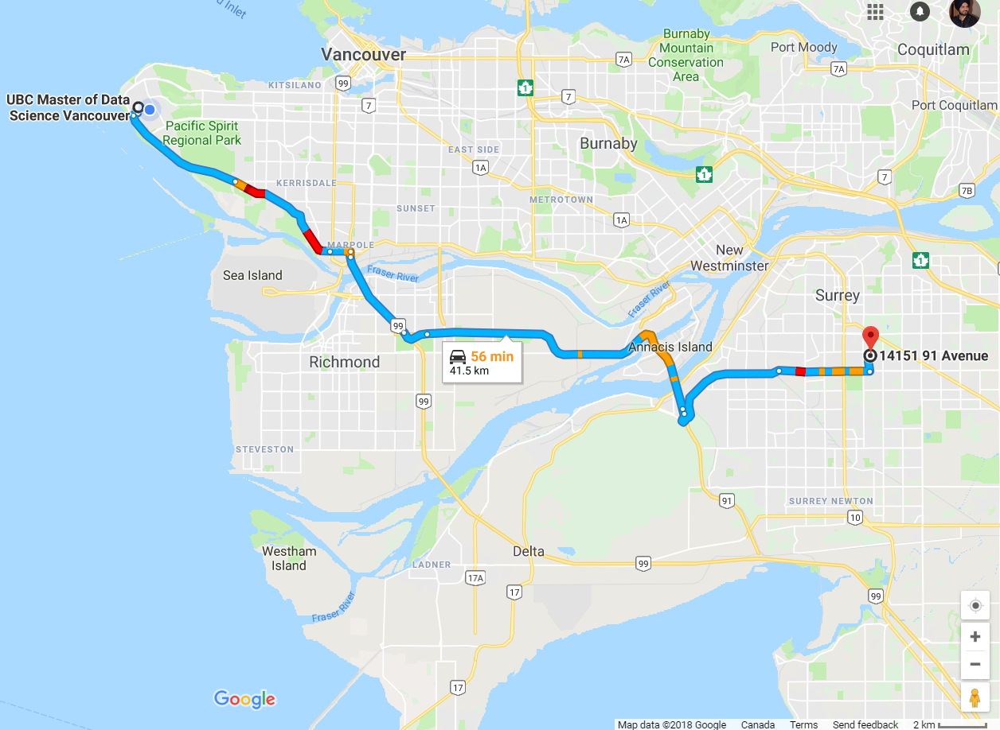
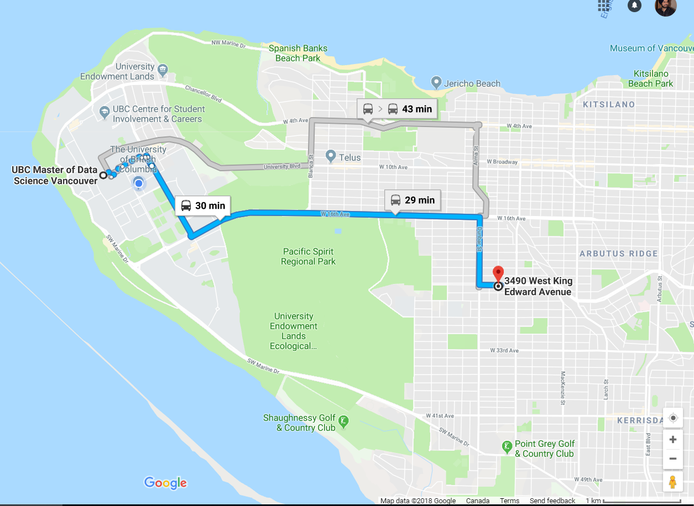
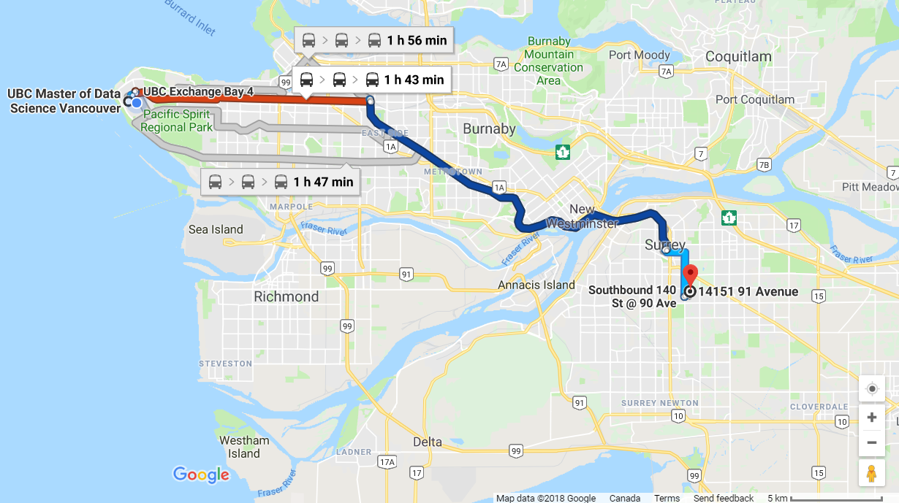
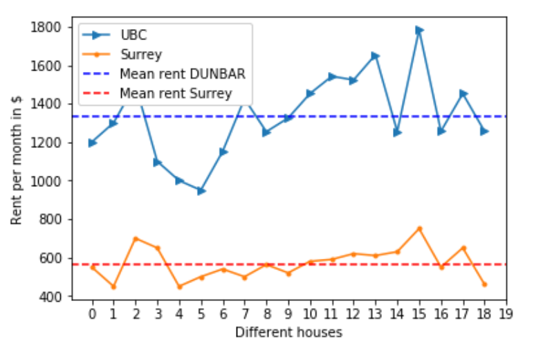
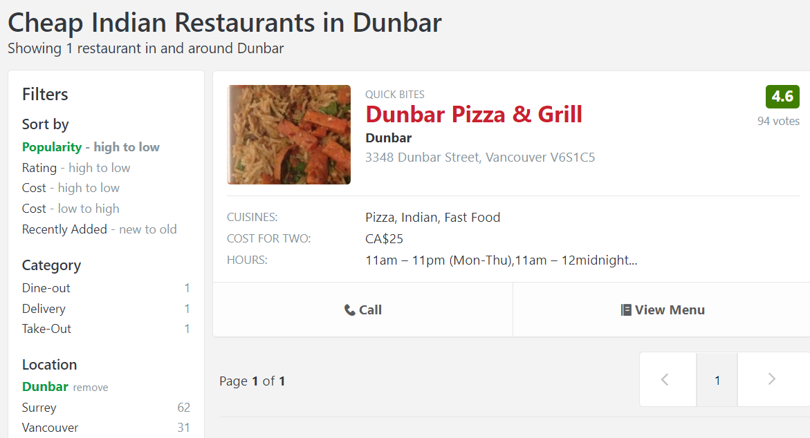
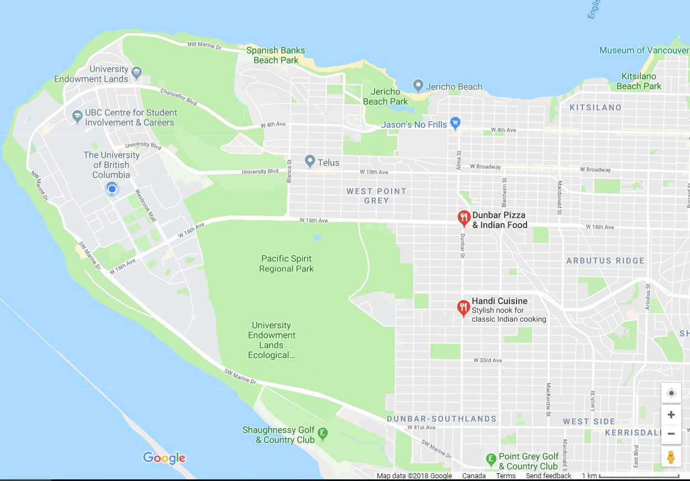
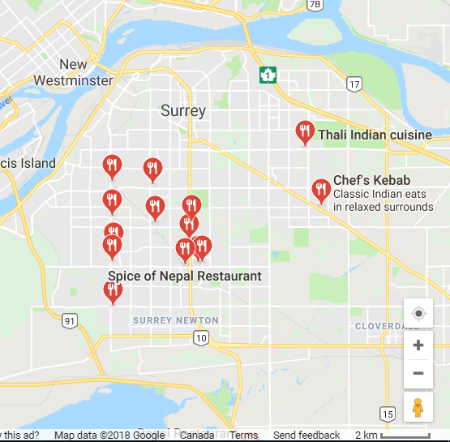
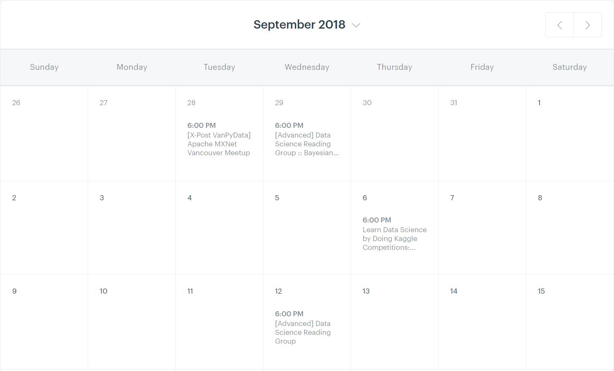
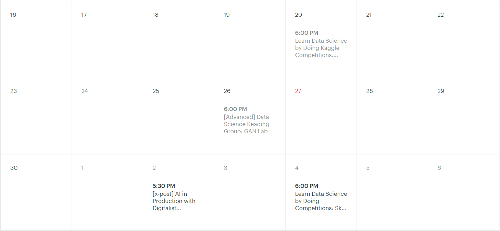
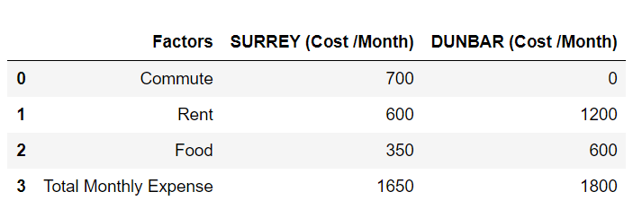

One fine evening in may this year I returned from my work after an hour-long bus ride to my home in Surrey. Totally exhausted I lay on the bed and before I could realize I was in deep sleep. In the middle of the night I woke up and a thought crossed my mind. My Master of Data Science program was just 3 months away and I started questioning my decision to stay in Surrey and not in Vancouver. My work was tiring but the MDS program would be much more tiring. I started thinking if I had made wise choice to plan to stay in Surrey and commute to UBC everyday. It was at 2 AM when the data scientist in me woke up and I started my research.
The question in mind was to analyze if it was better to stay in Surrey and commute to UBC everyday or rent a place closer to UBC. I discussed with my friends studying at UBC and I decided to limit my search to the Dunbar area in case I decide to move. I shortlisted couple of important factors I had to base my decision on.

**1. Distance**

*Distance between my home in Surrey and the UBC-MDS department*

*Distance between Dunbar area and the UBC-MDS department (Rough estimate)*

The Dunbar area that I was targeting in Vancouver would not be more than 6-8 km from my department. Whereas my house in Surrey was 42 km  from the department.

**2. Commute time**  

*Time of commute between Dunbar area and the UBC-MDS department during office hours*

*Time of commute between Surrey and the UBC-MDS department during office hours*

During the morning hours (7AM-9AM) the commute from Surrey to UBC would take around 1.5 to 2 hours by Public transport and at least 1- 1.5 hours by car where as the time of commute by bus from Dunbar area to UBC would be around 25-30 minutes. I was probably going to spend around 4 hours in public transport if I decide to travel from Surrey to UBC everyday. This comparison worried me a bit.

**3. Rent**

In case I had to move I thought of checking the rent in both the areas. In surrey even if I had to move around, the rent was typically in the range of $500 – $700. I had no idea about the Vancouver rentals, so I looked up to the Craigslist and Kijiji websites of house rentals. I shortlisted 19 houses based just on the distance from UBC. I also saw few houses in surrey in case I decide to move in future. I was amazed by the findings.

*Rent of houses in Dunbar area compared to Surrey close to my house*

The average rent in Dunbar area was around $1300 which was much more than average rent in surrey around $600.
Another factor that I couldn’t have neglected was food.

**4. Food**

I had a good idea about the Indian restaurants in Surrey but I had to enquire if there were any good options to eat in Dunbar area. I had limited budget and hence looked for cheap ( < $10 per meal ) Indian restaurants in Zomato and Yelp. I discovered that there were just 2 restaurants in Dunbar region within my budget. However, there were 62 restaurants in surrey within the same budget and 20 of them were within 15 minutes bus ride from my home.

*List of Indian restaurants in Dunbar area*

*Location of Indian restaurant in Dunbar area*

*Indian restaurants in Surrey*

**5. Networking events**

At the professional level I plan to be part of the networking events relevant to data science. I came across the website Meetup and there were more than 5 events every month. Apparently, all the meetups take place in downtown which is much closer to Dunbar area compared to Surrey.

*Calender of Data Science events planned by Meetup website in September 2018*

Besides the external events I also wanted to be actively engaged in the activities within the campus. Commuting from Surrey for such events would have been tiring.

**6. Human Factor**

Being practical I gave some thought towards my health. Travel of 4 hours per day every day would not have been easy. In case of illness it would be even worse.

**Analysis**

Now that I had looked at all my concerns, I decided to do some cost analysis as it was the only thing pulling be back in surrey.
-	Rent :
It had been clear now that the rent in Dunbar would be almost double the rent it Surrey. I took the average values for rent in surrey and Dunbar as 600 and 1200 respectively.
-	Food :
Based on my previous credit card bills I was spending monthly around $350 in Surrey for food and groceries. In Dunbar considering I spend $8 per meal and take two meals a day and adding a few groceries it would amount to $600 monthly.
-	Commute :
Travel from Surrey to UBC I would spend on an average $400 on gas and $300 insurance. That means 700 total per month.
On top of it I would have to buy a car worth $10000 at least. I summarized the calculations in the table below.

*Cost Analysis of stay in Surrey and Dunbar*

The total expenditure from Surrey was no less than what I would be spending in Vancouver.

**I came to following conclusion:**

Since Dunbar gave me more opportunities to learn from peers and more professional opportunities at the same price and much less hassle of travelling daily. I made the choice of moving closer to UBC. I also started learning to cook on my own to save some extra money.

Words: 950

Resources :
Google Maps: https://www.google.com/maps
Zomato : https://www.zomato.com/canada
Craigslist : https://vancouver.craigslist.ca/search/apa
Kijiji: https://www.kijiji.ca/
YELP: https://www.yelp.ca/vancouver
Meetup Data Science events : https://www.meetup.com/LearnDataScience/events/calendar/
