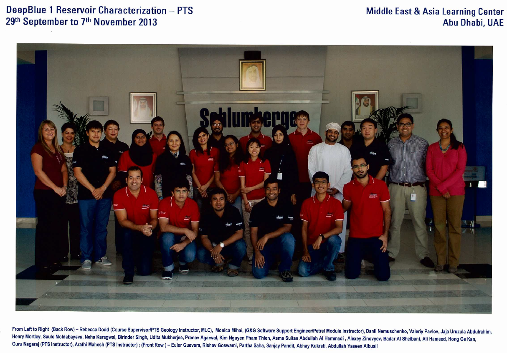
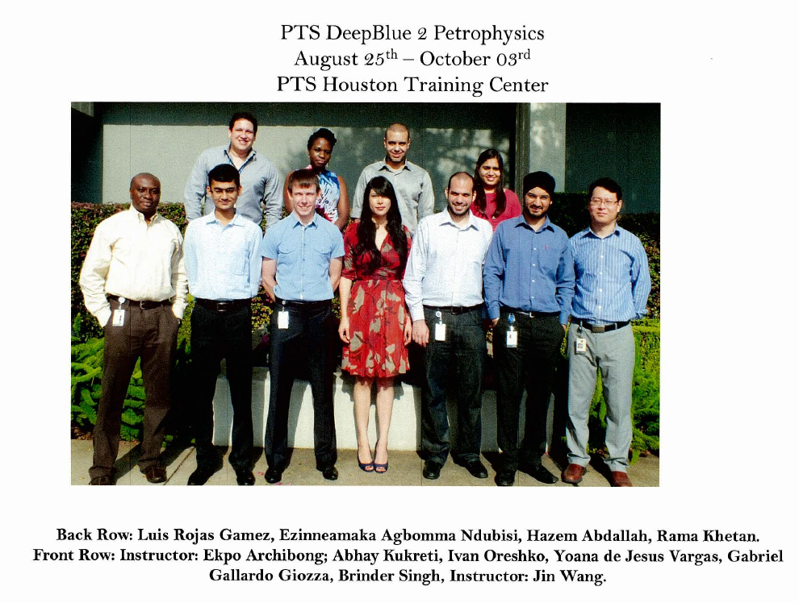
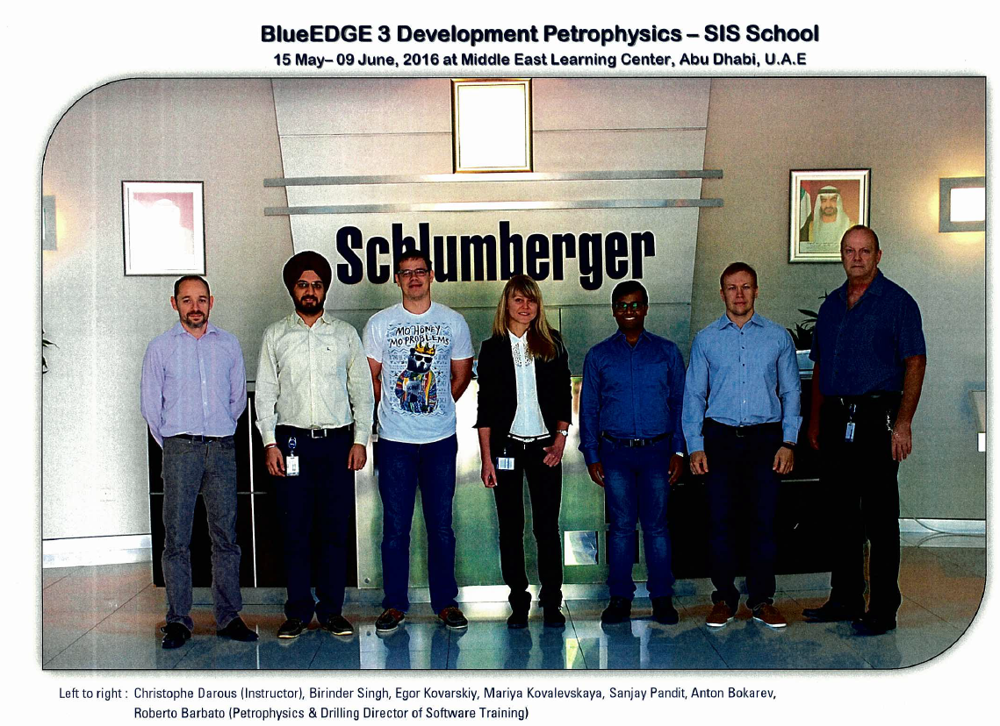

**Schlumberger**

I got into Schlumberger through campus placement and had an enriching 5 years working in the field and in the office.
I worked as a petrophysicist and Well placement Engineer for Schlumberger clients in India and abroad. Some of the major clients I handled India were
ONGC, OIL, Cairn India ltd. and Oilmax. I got and opportunity to be the face of Logging While Drilling segment proposing the Schlumberger Technologies as a Technical Sales Engineer. The frequent client visits were hectic but the joy of serving our clients and see their target achieved was what kept me going day and night.
I also worked as lead Petrophysicist and played a key role in establishing the Data Services Hub which is the centre of excellence for the processing and interpretation for Schlumberger. We handled the Schlumberger clients globally and some of the major clients include the name of major O&G giants like SHELL, ExxonMobil, BP, Petro Canada and Chevron.
Having experienced the drilling and interpretation side of the industry I started getting curios in the potential of using ML application in making the redundant tasks automated. I wrote couple of scripts which would reduce the time spent on manually doing some tasks with much more efficiency and in much less time.  
I started developing my skills in programming and with several ideas in mind decided to get into the structured way of learning Data Science and decided to pursue Master of Data Science from The University of British Columbia.

There is lot more coming on my experience but for no here is a glimpse of some good old days from My Schlumberger Trainings.

**Trainings In Schlumberger**

