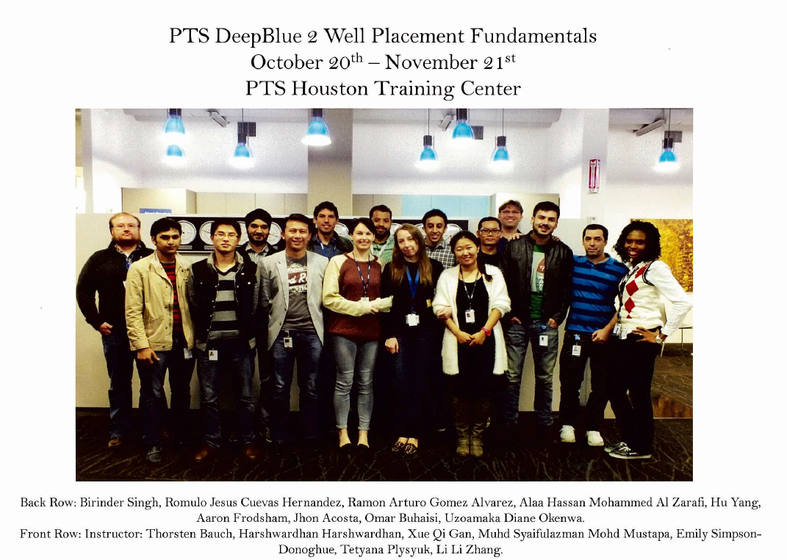

**Geophysicist**

After qualifying the IIT JEE(Indian Institute of Technology Joint Entrance Examination) in 2008 I got into studying Geophysical Technology from the prestigious IIT Roorkee. I was an outgoing person and the field offered me exactly what I wanted. I loved going on field trips and we had couple of them in my first and second year at IIT Roorkee. Due to my love for the subject I did voluntary internship in 2009 at The Wadiya Institute if Himalayan Geology, Dehradun under the guidance of Scientist-B Dr. Naresh Dhatwalia. I got great insights about carrying out the Earthquake analysis. I was curious to work in the field of Seismic and in 2011 I got a chance to go on funded Internship at The University of Bergen, Norway. This was a lifetime experience for me. We went on the research cruise aboard G.O SARS looking for Black smokers. We along with the Team from STATOIL now Equinor investigated the gas leakages from the Sliepner Storage sites in the North Sea. I learnt a lot during 2 months in the sea. I worked with advanced Technologies like Multi beam Echo Sounder and many more.
My experiences are shared on the University website [My Experiences](https://www.uib.no/en/geobio/54047/discovering-new-world-beneath-one%E2%80%99s-feet).

**Schlumberger**

I got into Schlumberger through campus placement and had an enriching 5 years working in the field and in the office.
I worked as a petrophysicist and Well placement Engineer for Schlumberger clients in India and abroad. Some of the major clients I handled in India were
ONGC, OIL, Cairn India ltd. and Oilmax. I got and opportunity to be the face of Logging While Drilling segment proposing the Schlumberger Technologies as a Technical Sales Engineer. The frequent client visits were hectic but the joy of serving our clients and see their targets achieved was what kept me going day and night.
I also worked as lead Petrophysicist and played a key role in establishing the Data Services Hub which is the centre of excellence for the processing and interpretation for Schlumberger. We handled the Schlumberger clients globally and some of the clients were the major O&G giants like SHELL, ExxonMobil, BP, Petro Canada and Chevron.
Having experienced the drilling and interpretation side of the industry I started getting curios in the potential of using Machine Learning applications in making the redundant tasks automated. I wrote couple of scripts which would reduce the time spent on manually doing some tasks with much more efficiency and in much less time.  
I started developing my skills in programming and with several ideas in mind decided to get into the structured way of learning Data Science and decided to pursue Master of Data Science from The University of British Columbia, Vancouver.

There is lot more coming on my experience but for now here is a glimpse of some good old days from My Schlumberger Trainings.

**Trainings In Schlumberger**

