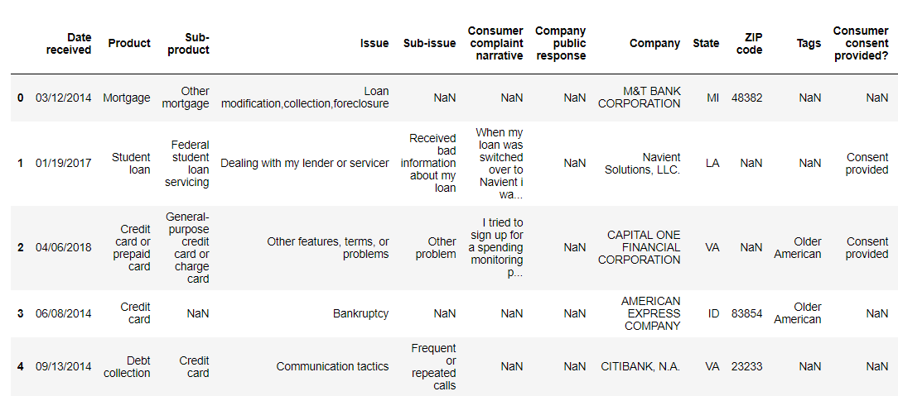
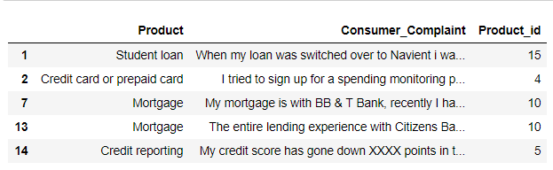
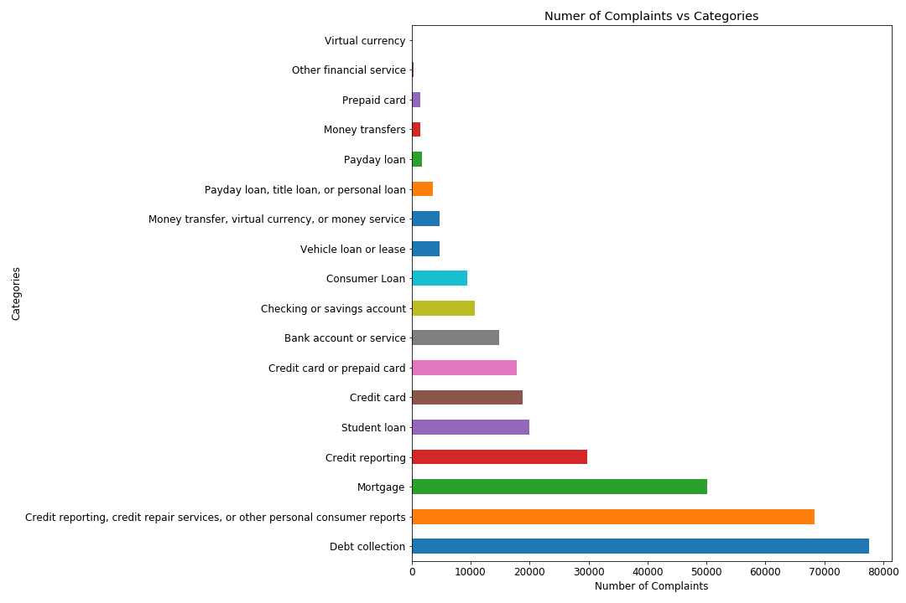
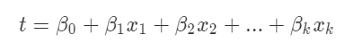
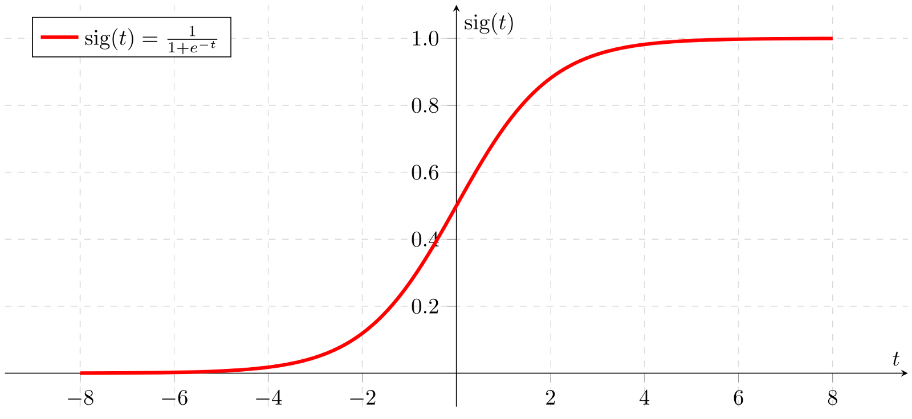
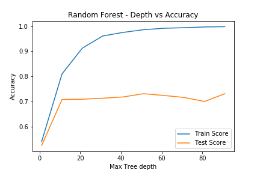
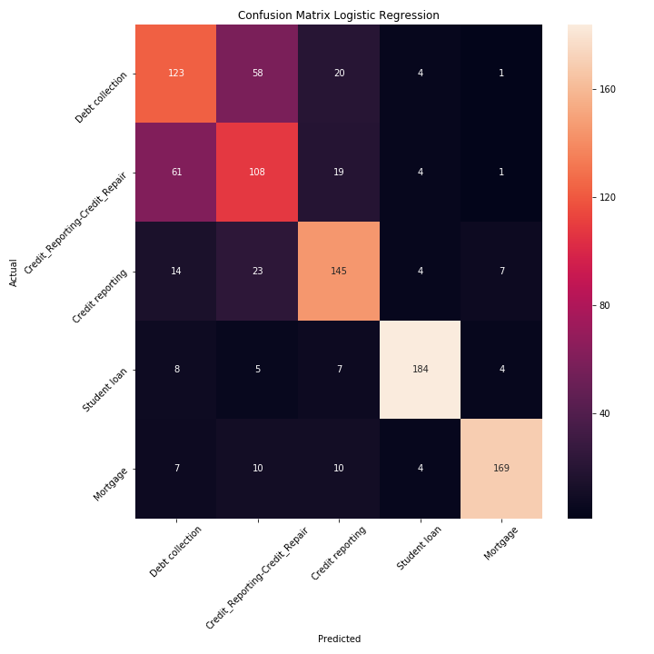
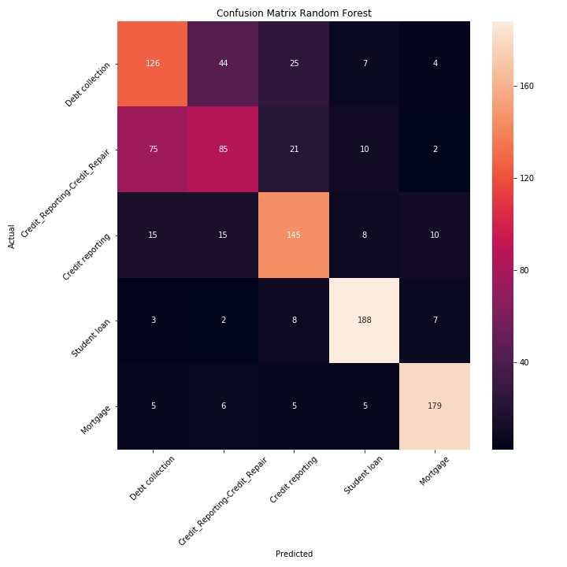

**Introduction**

I had previously worked with the Spam and Not Spam problems which were mainly binary classifications. I recently came across an interesting article on Medium and thought of trying the Multi class classification. In fact in the real world there is a more chance of encountering Multi Class and Multi label classifications rather than the simple binary classifications. In the following analysis the assumption is that the review belongs to only one class. Had it been multi class then we would call it multi label classification. For now I am only considering Multi class classification.
The analysis has been carried out in Python and Jupyter notebook. The well known scikit learn has been used for the machine leaning analysis.

**Data**

The data is available at [Data](https://catalog.data.gov/dataset/consumer-complaint-database). It is a big dataset with 15 product categories and for each of them different customer complaint narratives. I have used only the subset of it this dataset. In actual the dataset is imbalanced with each class having different examples for training but for now I have chosen only 5 most commonly occurring classes and chose 1000 examples of each. In short the final dataset that I worked with is balanced with 1000 examples to train on for each of the 5 classes.

**Analysis**

[Data Cleaning](https://en.wikipedia.org/wiki/Data_cleansing)

The first step was loading the data in proper format in the Jupyter Notebook. I used the pandas library to load the csv file.The below snapshot shows how the dataframe looks upon loading. The two columns of our interest are :

 1. Product
 2. Consumer complaint narrative

*** Consumer review snippet *** 
  

Based on the customer complaint narrative we intend to categorize the data in different product categories. I noticed there are several Null values in the Consumer complaint narrative which will not add any value to our training, hence I removed these Null values.
I assigned numeric values to the product categories in a separate column names : Product_id since in fact the python also treats the categorical variables as Numeric in the memory and while conducting any analysis.

The 3 main columns look like below :
 

*** Consumer review snippet *** 

 

Next I checked how many examples I have for each category and the plot below shows the imbalanced categories.

*** Number of complaints vs Product classes ***

 
You can notice there is a big imbalance between the categories. I chose the top 5 of those categories listed below and converted my data in balanced dataset.

- Credit reporting, credit repair services, or other personal consumer reports
- Debt collection
- Mortgage
- Credit reporting
- Student loan

I chose 1000 examples of each of these classes and constructed a DataFrame of 5000 rows.

[Machine Learning](https://en.wikipedia.org/wiki/Machine_learning)

So far I obtained the DataFrame with 5000 examples where each of the 5 classes has 1000 examples corresponding. But the algorithms cannot process the reviews in the form we humans understand. We need to transform the text reviews in a way the algorithms understand and process.
For that we will convert the reviews into features (words) and count the occurrence of each feature in each example(complaint).
The widely used approach of doing this is using the Bag or Words which is nothing but a dictionary of words. We choose based on the dataset we have total number of major features/words and then construct a matrix which counts the occurrence of these words in each text complaint. I will remove the counting of redundant words like 'a', 'the' and punctuations etc. which do not add much value in our classification process. This is done using the stop words argument as "english" which skips all these words from our analysis. One important thing to note is that this approach is only relying on the occurrence of the words and is ignoring any order of the words.

Once the matrix is constructed I used the following algorithms :

1. Naive Bayes (MultinomialNB and BernoulliNB)
2. Logistic Regression
3. Random Forest(ensemble method)
4. Linear SVM

[Naive Bayes](https://scikit-learn.org/stable/modules/naive_bayes.html)

Naive bayes assumes that the features/words are conditionally independent which means that the occurrence of any feature/word has nothing to do with the occurrence of the other features in the sentence. This sounds a little unrealistic but it has been observed to work well in general.

We have the matrix of counts of the occurrence of different features/words with us. Lets use the <u>Multinomial Naive bayes algorithm </u>. I split the data that I had in Train and Test dataset in 80:20 ratio.
I trained the MultinomialNB on the Train data set and then scored the model on both the train and test datasets.

Results:

| Algorithm  | Train Accuracy  | Test Accuracy  |
|---|---|---|
| MultinomialNB  | 0.87075   |0.745   |

Some times it does not matter how many times the words occur rather the presence or absence of the word in the sentence is enough. Lets convert the dataset into binary matrix in which instead of count of the occurrence of a word we have wither 0 or 1. 0 signifies absence of the word in our complaint and 1 signifies its presence.

Now the new matric that I have can be trained using the <u>BernoulliNB Naive Bayes algorithm</u>. As above we train the data and then get the score for both the train and test data.

| Algorithm  | Train Accuracy  | Test Accuracy  |
|---|---|---|
| MultinomialNB  | 0.87075   |0.745   |
| BernoulliNB  | 0.76625   |0.643   |

It seems from the above results the frequency of occurrence of a word is making our algorithm more robust.

[Logistic Regression](https://scikit-learn.org/stable/modules/generated/sklearn.linear_model.LogisticRegression.html)

Logistic regression is a famous Linear classifier algorithm which by default uses the OneVsRest approach by default if given the multi class data. In this situation the algorithm considers each class vs all others for each class in the dataset.  Logistic Regression computes the following linear function and checks the sign of it.
Positive sign assigns to one class and negative to the other.

 where $\beta$  are the weights assigned to each of the feature x. To further find the probability or the confidence Sigmoid function is used. The value of the above function (t) is used in the Sigmoid function the further it is either side of 0.5 more the confidence of classification.

*** Sigmoid Function ***

 

| Algorithm  | Train Accuracy  | Test Accuracy  |
|---|---|---|
| MultinomialNB  | 0.87075   |0.745   |
| BernoulliNB  | 0.76625   |0.643   |
| Logistic Regression  | 0.98425   | 0.729  |

[LinearSVC](https://scikit-learn.org/stable/modules/generated/sklearn.svm.LinearSVC.html)

The Linear SVC looks for the hyperplane of k-1 dimension in the k-dimension space where k is the number of features in the dataset. By default it works on the OvR that is One vs Rest principle for multiclass classification. It tries to find the Hyperplane which segregates the classes better. It does so by maximizing the margin or the distance between the nearest points from different classes. The accuracy of the Linear SVC is as shown below.

| Algorithm  | Train Accuracy  | Test Accuracy  |
|---|---|---|
| MultinomialNB  | 0.87075   |0.745   |
| BernoulliNB  | 0.76625   |0.643   |
| Logistic Regression  | 0.98425   | 0.729  |
| LinearSVC  | 0.99675   | 0.688  |

[Random Forest](https://scikit-learn.org/stable/modules/generated/sklearn.ensemble.RandomForestClassifier.html)

Last but not the least is my favorite ensemble technique of Random Forest. I decided to choose the maximum depth by plotting the random forest accuracies on train and test datasets across different tree depths. The plot below shows the variation of accuracies with varying maximum tree depths.

*** Accuracy vs Maximum Tree depth ***

As he depth increases the training accuracy tends to reach 100% but the test accuracies sort of saturates. I chose the depth of 40 for further analysis at which the test accuracy started saturating and the train error was also good enough.

| Algorithm  | Train Accuracy  | Test Accuracy  |
|---|---|---|
| MultinomialNB  | 0.87075   |0.745   |
| BernoulliNB  | 0.76625   |0.643   |
| Logistic Regression  | 0.98425   | 0.729  |
| LinearSVC  | 0.99675   | 0.688  |
| RandomForest  |   0.975 | 0.72 |

Looking at the above table it seems that the Random Forest and Logistic Regression and doing a good job. I plotted the confusion matrix to further understand the Precision and Recall.

[ConfusionMatrix](https://scikit-learn.org/stable/modules/naive_bayes.html)

*** Confusion Matrix LogisticRegression ***

*** Confusion Matrix RandomForest***

**References:**

Inspired by Susan Li's post : [Post link](https://towardsdatascience.com/multi-class-text-classification-with-scikit-learn-12f1e60e0a9f)
