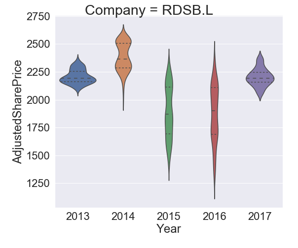
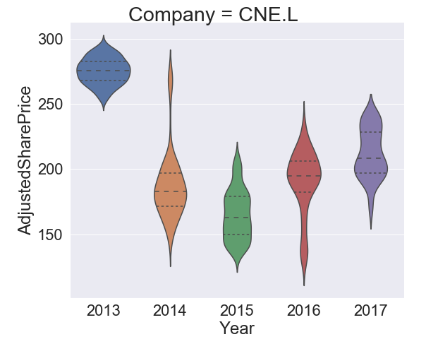
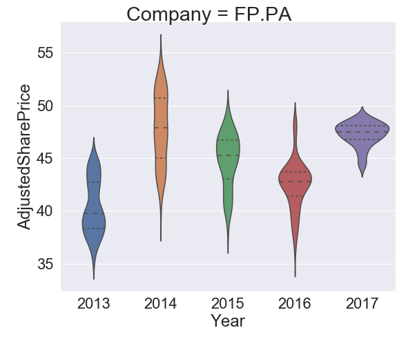
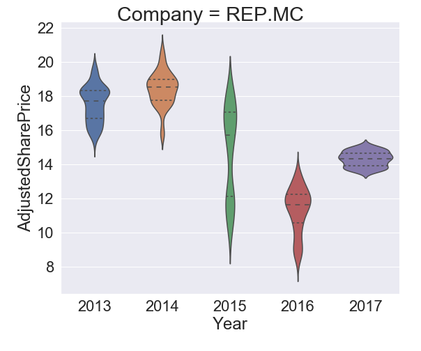
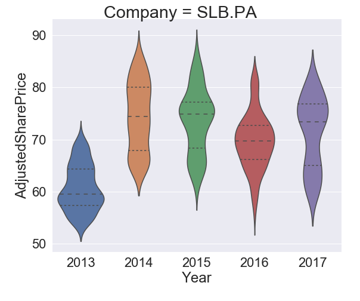

## Introduction

I conducted this small analysis to see how the price of oil (Europe Brent spot price FOB -  $ per barrel ) changed in past and how the share price of some major Oil companies changed over the same time period. My intentions were to see if there was any correlation and find any insights. That is what the Data Scientists do, unravel the secrets from the data. Having worked in Oil and gad Industry for long time I had many ideas which I intend to execute eventually with my Data Science tool kit. I believe this is just the beginning.  

The Python libraries used are :

| Library  | Description   |
|:---|:---|
|`Numpy`   | Library for multidimensional arrays with high level mathematical functions to operate them  |
| `Pandas`  | Works on top of Numpy, offers a great way to manipulate and analyze data in tabular form  |
| `Matplotlib`  | Plotting and visualization.  |
| `Seaborn` |  Works on top of matplotlib to provide a high level interface for attractive plotting and visualization|

## Data

The Data has been taken from the following websites :
  1. Oil price dataset from the U.S Energy Information administration. [Webpage](https://www.eia.gov/dnav/pet/hist/RBRTED.htm)
  2. Share price dataset from Yahoo Finance in a daily frequency. [Webpage](https://uk.finance.yahoo.com/quote/RDSB.L/history?period1=946684800&period2=1499122800&interval=1d&filter=history&frequency=1d)

The companies considered in the analysis are :

| Oil Company  | Listing   |
|---|---|
|Shell | [RDSB.L](https://uk.finance.yahoo.com/quote/RDSB.L/history?p=RDSB.L&.tsrc=fin-srch-v1)|
|British Petroleum | [BP.L](https://uk.finance.yahoo.com/quote/BP.L/history?p=BP.L&.tsrc=fin-srch-v1)|
|Cairn Energy   | [CNE.L](https://uk.finance.yahoo.com/quote/CNE.L/history?p=CNE.L&.tsrc=fin-srch-v1) |
|Premier Oil| [PMO.L](https://uk.finance.yahoo.com/quote/PMO.L/history?p=PMO.L&.tsrc=fin-srch-v1) |
|Statoil | [STL.OL](https://uk.finance.yahoo.com/quote/EQNR.OL?p=EQNR.OL&.tsrc=fin-srch-v1) |
|TOTAL| [FP.PA](https://uk.finance.yahoo.com/quote/FP.PA?p=FP.PA&.tsrc=fin-srch-v1) |
|ENGIE | [ENGI.PA](https://uk.finance.yahoo.com/quote/ENGI.PA?p=ENGI.PA&.tsrc=fin-srch-v1) |
|Schlumberger| [SLB.PA](https://uk.finance.yahoo.com/quote/SLB.PA?p=SLB.PA&.tsrc=fin-srch-v1) |
|REPSOL | [REP.MC](https://uk.finance.yahoo.com/quote/REP.MC?p=REP.MC&.tsrc=fin-srch-v1) |

## Analysis

[Data Cleaning](https://en.wikipedia.org/wiki/Data_cleansing)

The first step of data analysis is always loading the data in proper format in the Jupyter Notebook. I used the pandas library to load the excel and csv files. The Europe Brent Spot Price FOB (Dollars per Barrel) data was available from 1987-05-20 to 2017-06-26.

The trend of Oil price is as shown below :

 *** Brent price *** 

Next I loaded the csv files for all the companies with their share prices. I chose the adjusted closing share price and not the closing price as the former gives accurate representation of the firm's equity value beyond just the simple market price. For comparison purpose I also scaled the share prices between 0 and 1 for each company into a separate column, this could be used to analyze the variation beyond just the absolute share price values. Any Null value in the data wherever existed was removed. The following snippet shows the final form of the table I obtained.

   

 *** Share price record for different companies *** 

To have a broader picture of the relations between Year, Share price and Oil Price I plotted the Pairwise plot for each company.
 

##### Shell

 
##### British Petroleum  

 
##### Cairn Energy

 
##### Premier Oil

 
##### STATOIL

  
##### Total

 
##### Repsol

 
##### ENGIE

 
##### Schlumberger

 

During my tenure in Schlumberger I very distinctly remember watching the oil prices having a free fall second half of 2014 onwards. There are lot of insights we can draw from the above plots but the most distinct that even I am interested in the most comes by looking at the plots between the Oil Price and Adjusted Share price. With the falling oil price the share price of most of the companies also show a major decline. If we notice the top right plot (Row 1 , Column 3) between share prices and oil price, we notice that the lower oil price in 2015 and 2016 has affected all the companies but the impact is probably less on Schlumberger, BP and Shell.

Now lets have a look individually at how the share price changed over 5 year time period for each company, I will show this using my favorite [violin plots](https://blog.modeanalytics.com/violin-plot-examples/). The thickest portion in a violin corresponds to the region of highest kernel density. The horizontal lines in the violin represents the median, $$25^{th}$$ and $$75^{th}$$ quantiles. We can clearly see the spread of the Adjusted share price for different years. The median share price has consistently decreased for Premier Oil and ENGI more or less. 2017 seems to be a come back for Shell, BP, CNE Statoil Total and Repsol after having some downfall in 2015 and 2016.   

|   |   |   |
|---|---|---|
|   |  ||
|  |   ||
|   |   ||

  

  

  

  

## References:

Inspired by javier bravo's post: [Post link](https://www.kaggle.com/javierbravo/a-tour-of-the-oil-industry/notebook)
