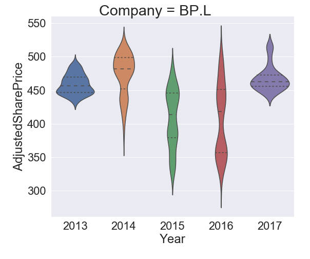
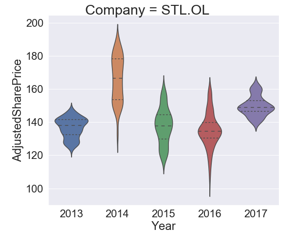
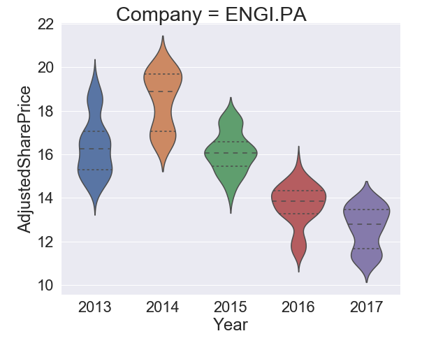

## Introduction

I conducted this small analysis to see how the price of oil (Europe Brent spot price FOB -  $ per barrel ) changed in last few decades and how the share price of some major Oil companies changed over the same time period. My intentions were to see if there was any correlation and find any insights. That is what the Data Scientists do, unravel the secrets from the data. Having worked in Oil and gad Industry for long time I had many ideas which I intend to execute eventually with my Data Science tool kit. I believe this is just the beginning.  

The Python libraries used are :

| Library  | Description   |
|:---|:---|
|`Numpy`   | Library for multidimensional arrays with high level mathematical functions to operate them  |
| `Pandas`  | Works on top of Numpy, offer a great way of manipulate and analyze data.  |
| `Matplotlib`  | Plotting and visualization.  |
| `Seaborn` |  Works on top of matplotlib to provide a high level interface for attractive plotting and visualization|

## Data

The Data has been taken from the following resources :
  1. Oil price dataset from the U.S Energy Information administration. [Webpage](https://www.eia.gov/dnav/pet/hist/RBRTED.htm)
  2. Share price dataset from Yahoo Finance in a daily frequency. [Webpage](https://uk.finance.yahoo.com/quote/RDSB.L/history?period1=946684800&period2=1499122800&interval=1d&filter=history&frequency=1d)

The companies considered in the analysis are :

| Oil Company  | Listing   |
|---|---|
|Shell | [RDSB.L](https://uk.finance.yahoo.com/quote/RDSB.L/history?p=RDSB.L&.tsrc=fin-srch-v1)|
|BP | [BP.L](https://uk.finance.yahoo.com/quote/BP.L/history?p=BP.L&.tsrc=fin-srch-v1)|
|Cairn Energy   | [CNE.L](https://uk.finance.yahoo.com/quote/CNE.L/history?p=CNE.L&.tsrc=fin-srch-v1) |
|Premier Oil| [PMO.L](https://uk.finance.yahoo.com/quote/PMO.L/history?p=PMO.L&.tsrc=fin-srch-v1) |
|Statoil | [STL.OL](https://uk.finance.yahoo.com/quote/EQNR.OL?p=EQNR.OL&.tsrc=fin-srch-v1) |
|TOTAL| [FP.PA](https://uk.finance.yahoo.com/quote/FP.PA?p=FP.PA&.tsrc=fin-srch-v1) |
|ENGIE | [ENGI.PA](https://uk.finance.yahoo.com/quote/ENGI.PA?p=ENGI.PA&.tsrc=fin-srch-v1) |
|Schlumberger| [SLB.PA](https://uk.finance.yahoo.com/quote/SLB.PA?p=SLB.PA&.tsrc=fin-srch-v1) |
|REPSOL | [REP.MC](https://uk.finance.yahoo.com/quote/REP.MC?p=REP.MC&.tsrc=fin-srch-v1) |

## Analysis

[Data Cleaning](https://en.wikipedia.org/wiki/Data_cleansing)

The first step was loading the data in proper format in the Jupyter Notebook. I used the pandas library to load the excel and csv files. The Europe Brent Spot Price FOB (Dollars per Barrel) data was available from 1987-05-20 to 2017-06-26.

The trend of Oil price is as below :

 *** Brent price *** 

Next I loaded the csv files for all the companies with their share prices. I chose the adjusted closing share price and not the closing price as the former gives accurate representation of the firm's equity value beyond just the simple market price. For comparison purpose I also scaled the share prices between 0 and 1 for each company into a separate column, this could be used to analyze the variation beyond just the absolute share price values. Any NA value if exist was removed.

   

 *** Share price record for different companies *** 

To have a broader picture of the relations between Year, Share price and Oil Price i plotted the Pairwise plot for each company.

  

  

  

  

  

  

  

  

  

|   |   |  |
|---|---|---|
|   |  ||
|  |   ||
|   |   ||

  

  

## References:

Inspired by Susan Li's post : [Post link](https://towardsdatascience.com/multi-class-text-classification-with-scikit-learn-12f1e60e0a9f)
