### Motivation

To address my curiosity of how much I should earn based on my current circumstances. I came across Income data from UCI machine learning repository and I decided to build an entire pipeline starting from the [exploratory data analysis](https://en.wikipedia.org/wiki/Exploratory_data_analysis) to choice of machine learning model, comparing the performance of different ML models and then deployment on a microservice [Heroku](https://www.heroku.com/) to let any one use it with a one line command. The task at hand is to determine the probability that a person makes over `$50k` a year.

### Dataset
The dataset is available on the UCI website under the name of Adult Income Data Set :  [URL](https://archive.ics.uci.edu/ml/datasets/adult)

Description of the dataset : <br>


The data is based on the 1990s census data. Out of the total `48842` entries, training dataset contains `32561` entries and the remaining `16281` are the test dataset entries. There are 14 features and 1 response column(income class) containing values `<=$50k` and `>$50k`. For now lets only load the training dataset for exploratory data analysis and keep the test data unseen till we come to validating the machine learning models.

Its a binary classification problem, lets assign `0` to the entries with income `<=$50k` and `1` to income `>$50k` and add new `target` column. The training data set head with 16 columns looks as shown below :


``**Figure 1**``

### Exploratory Data Analysis

Out of 14 we have 9 categorical features :
``Marital-status`` : marital status of the individual
``Race`` : Race of the individual
``sex`` : The gender of the individual,
``Occupation`` : Occupation the individual is involved in,
``Workclass``: Work class of the individual such as Private, Government etc.,
``Education_Label`` and ``Education_Number`` The education level attained by individual in words and corresponding numeric value in `Education-Number` column where Pre school is considered as basic level of education with numeric value 1 and the largest numeric value 16 for the highest level of education attained which is Doctorate.
``Relationship``: Relationship the person is involved such as a Wife, Husband, Unmarried etc.
``Native-country`` The native country of the individual
``Income_class`` : The target variable either `>$50k` or `<=$50k`.

The list of unique categories in each of these features except Native country which we will see below has lot of country names : <br>


``**Figure 2**``

The level of education has been represented in words in `Education` column as well as corresponding numeric value in `Education-Number` column where Pre school is considered as basic level of education with numeric value 1 and the largest numeric value 16 for the highest level of education attained which is `Doctorate`.

Lets see how much data is available for each of the feature in the dataset.

<br>


``**Figure 3 : Number of entries for different native countries **``
<br>

As mentioned above the native country column has most of the data from United States. This is obvious because the survey was collected in the Unites States.

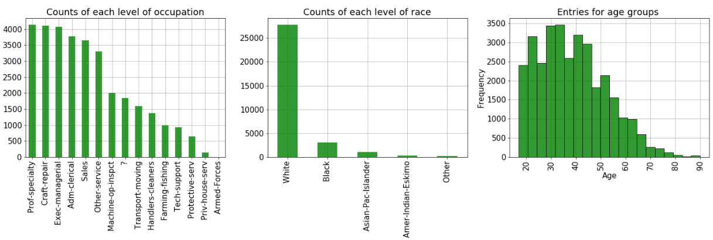
``**Figure 4 : Number of entries with different occupations, race and age groups **``
<br>
Broadly the representation of different categories within some features is not the same.
For instance we have much more data for white people compared to any other race. There is not much data for the aged people (>70 yrs old).

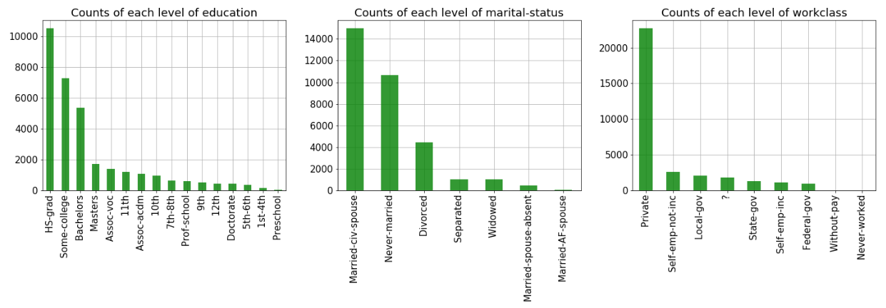
``**Figure 5 : Number of entries for education, marital status and work class **``
<br>

 The people working in private sector jobs dominate the training data set. Most of the entries we have are for high school graduates.


<br>

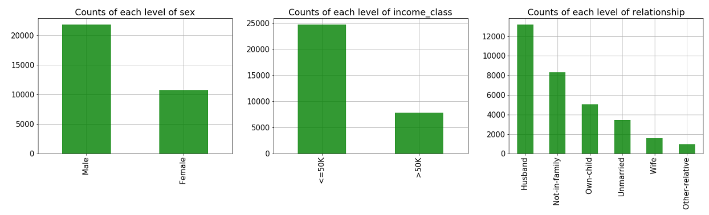
``**Figure 6 : Number of entries for gender, income class and relationships **``


The target variable/Income_Class contains around `24720` entries for the category of people earning `<=$50k` or category 0 and around `7841` entries of people earning more than `$50k` or category `1`. This is important observation indicating that our dataset is biased towards people earning less than `$50k`, checking the [confusion matrix](https://www.dataschool.io/simple-guide-to-confusion-matrix-terminology/) will be a good idea while comparing the ML models. We will discuss this later when we compare the models.

Did you notice there are some ```?``` in ```workclass```, ```native country``` and ```occupation``` level. Its hard to make a guess what these entries could be. Probably some people did not want to disclose these details. If we remove these entries we will loose 2399 entries of which most of them are in the occupation column. Lets keep them for now.<br>

Now lets see what proportion of people in each variable above lie in which income bracket.
Please note these are proportions and while making any conclusion we should have a look at Figure 3 to Figure 6 above to see how much data exists in each category.

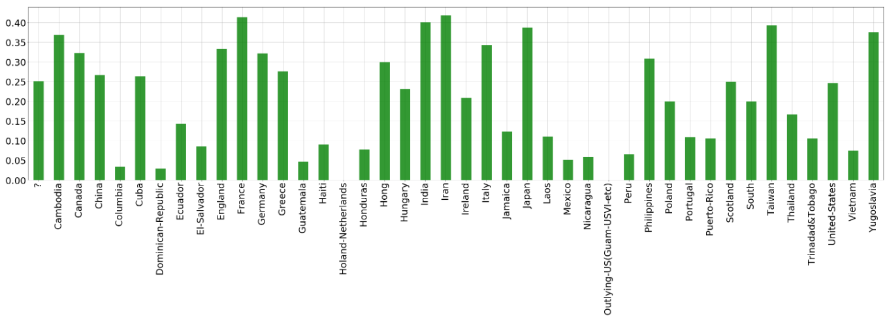
`**Figure 7 : Proportion of people earning >$50k with different Native countries**`
<br>

`Native Country`
 As we saw above the data for United states natives is overwhelmingly higher than other countries (Figure 3). The proportion of people who earn well(>$50k) besides United States are natives from France, Taiwan, Iran. Again its worth noting  that the data for each of these countries is too less to make a sane judgement.


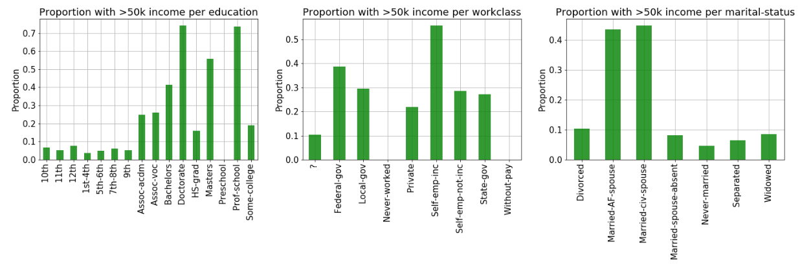

`**Figure 8 : Proportion of people earning >$50k based on education, workclass and marital status**`
<br>

`Education`
Broadly people earning >\$50k are well educated. Professors or Doctorate and Master's
level people earn well. Its worth noting that some students educated less than 12th standard also earn >$50k.

Checking the working hours of people earning over `$50k`. <br>


`**Figure 9 : Number of people with education less than 12th standard earning >$50k **`
<br>

Upon investigating in the Fig 7, most of them work in Private jobs. Probably some college dropouts or smart students having side income.

`Work class`
The Self employed people have a higher proportion of people having income `>$50k` followed by people working in Federal jobs.

`Marital Status`
The Married couple with spouse in Armed forces or a Civilian are in high income category but the dataset contains very few entries for spouse in Armed force to be considered a valid observation.

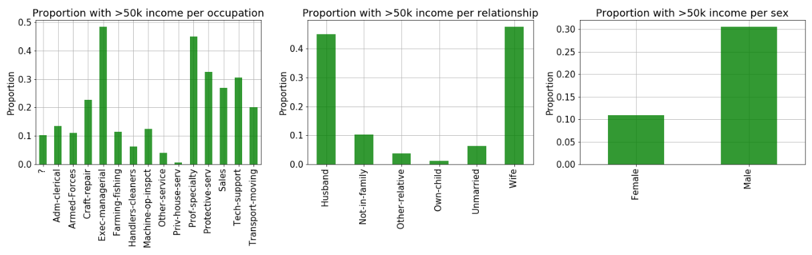

`**Figure 10 : Proportion of people earning >$50k based on occupation, relationship and sex **`
<br>
`Occupation`
The Executive and Managerial roles are the most paid followed by Professors and Protective services. Some of the job categories such as Clerical jobs, farming fishing and Cleaners and handlers are not paid quite well.

`Relationship`
Its overwhelming clear from the plot that proportion of wives with high income is more than the husbands, but when we confirm from Figure 4 the data for wives is just ~1400  entries and for the husbands is ~ 12500 because of which the proportion is a little misleading.

`Gender`
 The proportion of males with high income is more than the females.

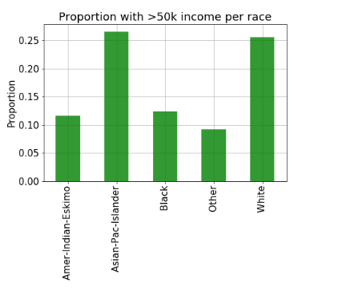
`**Figure 11 : Proportion of people earning >$50k for each Race **`
<br>

`Race`
 We notice that we have too little data for races other than White(Figure 4). Even then if we try to compare the  proportions of each race are earning well (`>$50k`). For the whites ~ 26% people are earning `>$50k` while from the available  data ~28% Asian Pac Islanders earn `>$50k`.

#### Please Note : I chose not to combine the available data plots (Fig 3 - 6) and proportions (Fig 7 - 11) plots as a combined plot would have masked the categories with very few entries for each feature.


`**Figure 12 : Distribution of weekly working hours across different income groups **`

`Hours per week`
 From the distribution above we can say that the people in the higher income group work mostly between 35-60 hours a week. This goes up to 100 as well but there are less of number of those people.

<br>


`**Figure 13 : Distribution of income among different age groups**`
<br>

 `Income vs Age`
 Generally people between the age group of 30-50 are earning `>$50k`. The youngsters up to the age of 27 are under  the low income category. This makes sense as this is the age when the students are either studying or just getting in to their first jobs.

### Transforming input data for Machine Learning Model

Before applying any machine learning model we would need to transform the data in the form that machine learning model understands. As already discussed in the data set section we have total `48842` entries out of which Training dataset contains `32561` and the remaining `16281` are the Test dataset entries. Now is the time to bring train and test data together for transformation, However before training the models we will split them again.

Following assignments were made to make the data ready to be fed into the ML model. The categories were relabeled in the following form :

`Sex`

- Males : `1` <br>
- Females : `0`

` Race `

- Whites : `1`<br>
- Non Whites : `0` <br>

This assignment is because data is skewed with entries mostly for White people.

`Education`

The income bracket looks distinct for students up to standard 12th level of education followed by Associates and then high income group which includes people with Bachelors degree or above, Hence it makes sense to divide them into 3 classes.

- Preschool,$$1^{st}-12^{th} $$   : `0` - Low income <br>

- HS-grad,  Some-college,  Assoc-acdm,  Assoc-voc : `1` - Medium income<br>

- Bachelors,  Masters,  Doctorate, Prof-school : `2` - High income<br>

`Native_Country`

- United_States : `1` <br>
- Rest : `0`<br>

This is because most of the data is available for the United States natives.<br>

`workclass`

- Private : `0`

- State-gov, Federal-gov, Local-gov : `1`

- Self-emp-not-inc, Self-emp-inc, Without-pay, Never-worked : `2`
- Another category is Unknown category : `-1` in case the workclass is missing the prediction will be based on other features.

The people working in private sector jobs were put together in category `0`. People working in one way or the other with the government were put in another category `1`. Remaining people who were either self employed or without income were put together into category `2`.

`Occupation`

- Priv-house-serv, Farming-fishing, Armed-Forces, Machine-op-inspct,Other-service, Handlers-cleaners, Adm-clerical : `0`

- Craft-repair, Sales, Transport-moving : `1`

- Exec-managerial, Prof-specialty,  Protective-serv, Tech-support : `2`
- Another category is Unknown category `-1`, in case the occupation is missing the prediction will be based on other features.

Looking at `Figure 6` specifically the distribution of income per occupation some occupations are likely to earn high such as managerial roles so it makes sense to assign them high pay category `2`. Similarly we can have middle income category `1` for sales, craft repair etc. and the lower income category `0` for professions like farming fishing etc.

Lastly for

`Marital Status`

- Never-married : `0`
- Married-civ-spouse, Married-AF-spouse : `1`
- Divorced, Married-spouse-absent, Separated, Widowed : `2`


For the marital status there are broadly 3 categories. The unmarried people `0`. The people in marriage `1` and another category for those who have separated due to some reason `2`.

After assigning categories to our feature variables we have our dataset in correct form to be used for building the Machine Leaning model. We have 11 features `age` quantitative , `workclass`, `education`, `marital-status`, `occupation`, `race`,
       `sex`, `capital-gain` quantitative, `capital-loss` quantitative, `hours-per-week` quantitative,
       `native-country` and 1 target variable `Income-Class` which is a binary class of people earning  `>$50k` or `1` and `<=$50k` or `0`.

A quick look at the final DataFrame containing 11 features and 1 target variable (Income_Class) :


`**Figure 10**`

### Fitting the Machine learning models

Before moving forward lets split the train and test data again. The training DataFrame with 32561 rows and test dataset with 16281 rows. We are dealing with binary classification problem here and lets try the following ML models.

 1 - [Random Forest](https://scikit-learn.org/stable/modules/generated/sklearn.ensemble.RandomForestClassifier.html) <br>
 2 - [Logistic Regression](https://scikit-learn.org/stable/modules/generated/sklearn.linear_model.LogisticRegression.html) <br>
 3 - [XGBoost technique](https://xgboost.readthedocs.io/en/latest/tutorials/model.html) <br>
 4 - [SVM](https://scikit-learn.org/stable/modules/svm.html) <br>


#### RandomForestClassifier

Random Forest is a non parametric ensemble technique in which several decision trees are trained separately and then the results from all of them are averaged to improve the predictive accuracy and control over-fitting. Random forest relies on reducing the variance of large number of complex models with low bias. Here the composition models(separate decision trees) are not weak but too complex.

Bias Variance concept refresher :     [Understanding the Bias-Variance Tradeoff](https://towardsdatascience.com/understanding-the-bias-variance-tradeoff-165e6942b229)

Training the Random Forest  Classifier without optimization gives me the following accuracies :

```python
model=RandomForestClassifier()
model.fit(X_train,y_train)
```

```python
- results -
The train score is :  93.49%
The Test score is :  84.14%
```

As you can notice the accuracy on the training dataset is ~94% where as the  test accuracy is quite low compared to the training accuracy. This could most likely be the case of Overfitting. That means we are fitting too complex models so far. Since we have not defined any maximum depth of the tree it has the freedom to do quite well on the training dataset but less likely to perform well on the unseen data. To correct this lets do a random search of best hyperparameters `Max_features`, `Max_depth` using sklearn's [RandomizedSearchCV](https://scikit-learn.org/stable/modules/generated/sklearn.model_selection.RandomizedSearchCV.html).

Overfitting concept refresher : [Overfitting vs. Underfitting: A Conceptual Explanation](https://towardsdatascience.com/overfitting-vs-underfitting-a-conceptual-explanation-d94ee20ca7f9)

```python
# Applying Randomized search to find the optimum parameters

param_dist = dict({'max_depth' : np.arange(1,30), 'max_features': np.arange(1,12)})

model_rf=RandomForestClassifier(n_estimators=30)
model_grid=RandomizedSearchCV(model_rf,param_dist,cv=10, n_jobs=-1, n_iter=20, random_state=123)
model_grid.fit(X_train,y_train)

- results -
The Best Features for Random Forest Are :  {'max_features': 8, 'max_depth': 11}
```

The best hyper parameter values obtained are 8 and 11 for maximum number of features and maximum depth of the tree respectively.
Training the model again with best features the accuracies are:

```python
model_best=RandomForestClassifier(max_features=8, max_depth=11, random_state=213)
model_best.fit(X_train,y_train)
```

```python
- results -
The train score is :  87.44%
The Test score is :  86.36%
```
Isn't that great! The training accuracy has decreased overall but the test accuracy has gone up indicating no overfitting now. Putting in perspective, while making predictions on the Training dataset on which the model was trained we were 87.44% accurate in prediction. For Test dataset which was unseen to the trained model we still managed to make 86.36% correct predictions. The model seems to be doing good job.

#### XGBoost Technique

[XGBoost Technique](https://xgboost.readthedocs.io/en/latest/tutorials/model.html) gained lot of popularity recently and has been widely used in the kaggle competitions. It is believed to perform well on huge datasets. It sequentially improves the prediction of the t-1 trees before fitting the $$t^{th}$$ tree. This boosting technique relies on reducing the bias on several simple trees sequentially.

Lets find the set of best combination of `maximum depth` and `learning rate` for XGBoost technique using `RandomizedSearchCV` and fit the model.

```python
model_xgb=XGBClassifier(n_estimators=30,booster='gbtree')
parameters_xgb=dict({'max_depth':np.arange(1,30), 'learning_rate':np.arange(0,1,0.01)})

model_xgb_rs=RandomizedSearchCV(model_xgb,parameters_xgb,cv=5,n_iter=20,n_jobs=-1,
  random_state=123)

```


```python
model_xgb_rs.fit(X_train,y_train)

- results -
The best parameters for XG Boost are :  {'max_depth': 3, 'learning_rate': 0.5}
```
The best combination as obtained from the random search is max_depth : 3 and the learning rate : 0.5. Now training the model using these parameters we obtain following accuracies.

```python
model_xgb_best=XGBClassifier(learning_rate=0.5, max_depth=3, n_estimators=30,
  booster='gbtree', random_state=21)

model_xgb_best.fit(X_train,y_train)

- results -
The train score is :  86.82%
The Test score is :  86.81%
```

The test accuracy has gone up but the improvement is not substantial compared to the Random Forest. The training accuracy has dropped on the other hand.

#### Logistic Regression

Logistic regression uses the Sigmoid loss function and is interpretable being a parametric model.
Lets do a sklearn's [GridSearchCV](https://scikit-learn.org/stable/modules/generated/sklearn.model_selection.GridSearchCV.html) on the regularization parameter `C` and check if the `l1` regularization is required or `l2`.

```python
param_dist = dict({'C' : np.logspace(-3,3,7), "penalty":["l1","l2"]})

model_lr=LogisticRegression()

model_grid_lr=GridSearchCV(model_lr,param_dist,cv=10, n_jobs=-1)
model_grid_lr.fit(X_train,y_train)

- results -
The Best Features for Logistic Regression are :  {'C': 10.0, 'penalty': 'l1'}
```

The best parameter search gives the C value of 10 and l1 regularization as the best combination. It seems the model needs to remove couple of features that is why l1 regularization has been chosen over l2. Training the model using these best parameters :

```python
model_lr_best=LogisticRegression(C=10, penalty='l1')
model_lr_best.fit(X_train,y_train)

- results -
The train score is :  82.88%
The Test score is :  82.74%
```
The train and test scores are still low. Lets try a one last model.

#### Support Vector Machine

The output accuracy values for SVM can be compared in the final comparison matrix.

### Model evaluation

There are two main reasons we might need to look at both accuracy and confusion metrics for model evaluation.
1. As discussed already our target classes are unbalanced. We have 7841 entries `>$50k` and 24741 `=<$50k` entries. we might need the confusion metric to see how well our model is predicting the `>$50k` class.
2. The target values are unbalanced but not severely unbalanced. 1:3 ratio is not extreme hence we also should check the model test and train accuracies to choose the best model. <br>
The final accuracies of different models are as follows:

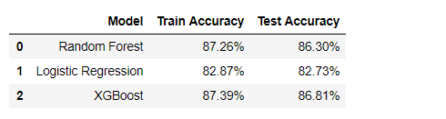

`**Figure 11**`

Confusion matrices for different models on test dataset:

| 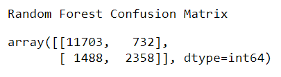 | 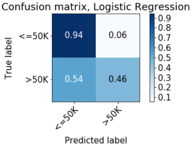 |
|---|---|
|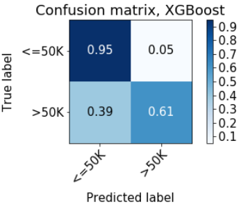|  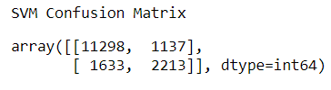|


We notice that all the models are performing well on detection of category 0 which is for `Income <=$50k`, XGBoost seems to be doing slightly better correctly predicting 95% `<=$50k` observations. Comparing all the models the Random Forest and XGBoost are doing close enough job to predict the `Income >$50k`. Even the Train and Test accuracies for Random Forest and XGBoost technique are quite close. The boosting technique XGBoost has not come up with any substantial improvement hence we can use the Random Forest classifier model going forward.

Now that we have narrowed down the model lets combine the training and test datasets to have larger data to train to have a more robust model.

#### Combining the Train and Test data for robust Random Forest classification model

```python
# Combining the Train and Test dataset

Entire_X=pd.concat([X_train,X_test])
Entire_y=pd.concat([y_train,y_test])

# Training RandomForestClassifier on larger dataset

model_best=RandomForestClassifier(max_features=8, max_depth=11, random_state=123)
model_best.fit(Entire_X,Entire_y)
```
At this stage we have the Random Forest classifier trained on the entire dataset which we can now deploy on Heroku.

### Deployment of the Machine learning model

Now that the model is ready I will deploy it on the Heroku cloud platform [url](https://www.heroku.com/platform#platform-diagram-detail).


I will not go much into the detail of the procedure which is quite straightforward. In case you are interested please follow this GitHub repository for detailed instructions of how to deploy on the Heroku platform.

[Heroku_deploy_GitHub_url](https://github.com/LDSSA/heroku-model-deploy).


### How you can use the model

Now that you know everything about how the model was built, just use the following command in the
Bash(Windows) or Terminal(Mac) and get the output probability of earning more than `\$50k`.

```ruby
curl -X POST https://income-app-ml.herokuapp.com/predict -d '{"id": 19, "observation":
  {"age": 45, "workclass":0 , "education": 1, "marital-status": 0,
    "occupation": 1, "race": 1, "sex": 0, "capital-gain": 0,
      "capital-loss":0,"hours-per-week":25,"native-country":1}}' -H "Content-Type:application/json"
```

Please Note :
- Every time you are making a prediction using the above command please increase the "id" by 1 as it stores the output in the unique id and does not overwrite previous ids.

- The `Age`, `Capital-gain`, `Capital-loss`, `Hours-per-week` are numeric inputs.
- The integer values to be entered for different categorical feature are given in the `Transforming input data for Machine Learning Model` section above. <br>

The output will look something like this :

  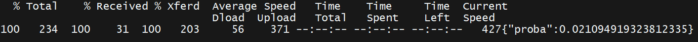 <br>
`**Figure 13**`

In this output the `proba` output is the probability that you will earn greater than $50k.
Try it yourself !


### Prediction for me

Since I started this analysis to beat my curiosity of my likely salary I gave the model my details and the results are :

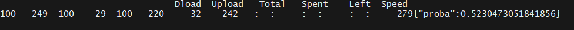 <br>
`**Figure 14**`

It means I have 52% chance of earning more than `>$50k` based on the trained model.

Please let me know your feedback. All the analysis is available on my GitHub the URL of which is given below.

GitHub repository of analysis: [GitHub_Repository](https://github.com/Birinder1469/Income_Prediction) <br>
Email address : birinder1469@gmail.com

#### Resources

0. Master of Data Science, The University of British Columbia, Vancouver..
1. Bias Variance concept :     [Understanding the Bias-Variance Tradeoff](https://towardsdatascience.com/understanding-the-bias-variance-tradeoff-165e6942b229) <br>
2. RandomForest Vs XGBoost:      [StackExchange](https://stats.stackexchange.com/questions/77018/is-random-forest-a-boosting-algorithm) <br>
3. XGBoost Tutorial: [XGBoost Technique](https://xgboost.readthedocs.io/en/latest/tutorials/model.html) <br>
4. Random Forest Classifier scikit learn : [Random Forest](https://scikit-learn.org/stable/modules/generated/sklearn.ensemble.RandomForestClassifier.html) <br>
5. Logistic regression scikit learn : [Logistic Regression](https://scikit-learn.org/stable/modules/generated/sklearn.linear_model.LogisticRegression.html) <br>
6. XGBoost tutorial : [XGBoost technique](https://xgboost.readthedocs.io/en/latest/tutorials/model.html) <br>
7. Support Vector Machines scikit learn : [SVM](https://scikit-learn.org/stable/modules/svm.html) <br>
