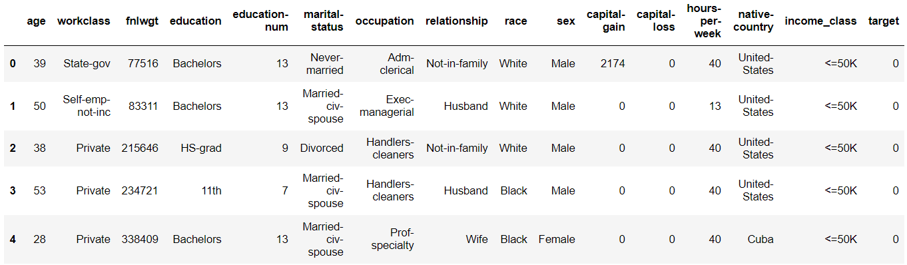
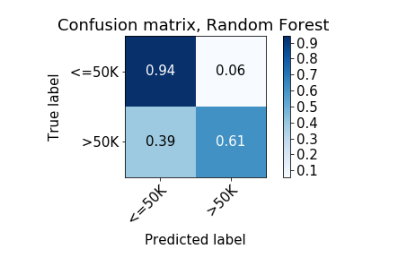
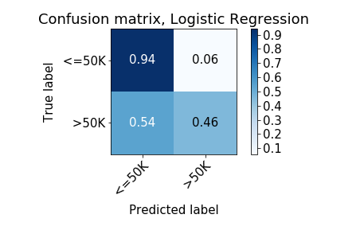
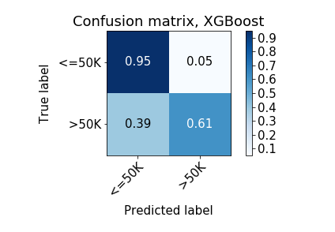
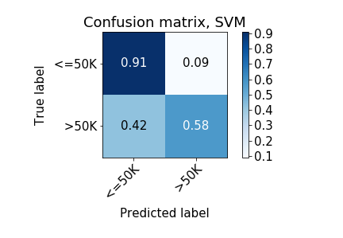
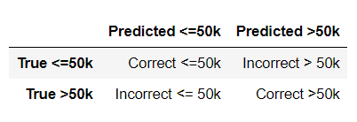

### Motivation

To address my curiosity if I would earn well in 1990s with similar circumstances I have today. I got hold of the Income data from UCI machine learning repository. I built an entire pipeline starting from the Exploratory Data Analysis to choice of Machine Learning model comparing different ML models and then deployment on a microservice [Heroku](https://www.heroku.com/) so it can be used for prediction by anyone. The task at hand is to determine the probability that a person makes over `$50k` a year.


### Dataset
The dataset is available on the UCI website under the name of Adult Data Set/Census Income data.  
Link to the Data Set : [Adult_IncomeDataSet_url](https://archive.ics.uci.edu/ml/datasets/adult)

Characteristics of the data are as shown below : <br>


Out of the total `48842` entries, Training dataset contains `32561` and the remaining `16281` are the Test dataset entries. For now lets only load the training dataset for exploratory data analysis and keep the test data unseen till we come to training machine learning models.

Its a binary classification problem, lets assign `0` to the entries with income `<=$50k` and `1` to income `>$50k` and add new `target` column. The training data set head with 16 columns looks as shown below :



``**Figure 1**``

### Exploratory Data Analysis

The categorical variables ``` 'Occupation','Workclass', 'Education_Label', 'Education_Number',
       'Relationship', 'Race', 'Income_class'  ``` contain the following unique categories : <br>


``**Figure 2**``

The level of education has been represented in words in `Education` column as well as corresponding numeric value in `Education-Number` column where Pre school is considered as basic level of education with numeric value 1 and the largest numeric value 16 for the highest level of education attained which is `Doctorate`.

Lets see how much data is available for each of the variable in the dataset.

<br>


``**Figure 3**``

<br>

We can notice that native country column has majority of the data from United States.


`**Figure 4**`
<br>

Did you notice there are some '?' in workclass, native country and occupation level. Its hard to make a guess what these entries could be. Probably some people did not want to disclose these details. If we remove these entries we will loose 2399 rows of which most of them are in the occupation column. Lets keep them for now.<br>

The target variable/Income_Class contains around `24720` entries for the category of people earning `<=\$50k` or category 0 and around `7841` entries of people earning more than `\$50k` or category `1`. This is important observation indicating that our dataset is biased towards people earning less than `\$50k`, checking the [confusion matrix](https://www.dataschool.io/simple-guide-to-confusion-matrix-terminology/) would be a good idea while comparing the ML models.

Now lets see what proportion of people in each variable above lie in which income bracket.
Please note these are proportions and while making any conclusion we should have a look at Figure 3 and Figure 4 above to see how much data exists in each category.


`**Figure 5 : Proportion of people earning >50k with different Native countries**`
<br>


`**Figure 6**`
<br>


`**Figure 7**`
<br>

`Education`
Broadly people earning >50k are well educated. Professors or Doctorate and Master's
level people earn well. Upon investigating people with low education levels also earning `>$50k`, we can notice from Figure7, most of the people with education level less than 12th standard work in Private jobs. Probably some college dropouts or smart students having side income.

`Work class`
The Self employed people have a higher proportion of people having income `>$50k` followed by people working in Federal jobs.

`Marital Status`
The Married couple with spouse in Armed forces or a Civilian are in high income category but the dataset contains very few entries for Armed force spouse .category to be considered a valid observation.

`Occupation`
The Executive and Managerial roles are the most paid ones followed by Professors and Protective services. Some of the job categories such as Clerical jobs, farming fishing and Cleaners and handlers are not paid quite well.

`Relation ship`
Its overwhelming clear from the plot that proportion of wives with high income is more than the husbands, But when we confirm from Figure 4 the data for wives is just ~1400  entries and for the husbands is ~ 12500 because of which the proportion is a little misleading.

`Gender`
 The proportion of males with high income is more than the females.

`Native Country`
 As we saw above the data for United states natives is overwhelmingly higher than other countries (Figure 3). The proportion of people who earn well(>$50k) besides United States are natives from France, Taiwan, Iran. Again its worth noting  that the data for each of these countries is too less to make a sane judgement.

`Race`
 We notice that we have too little data for races other than White(Figure 4). Still I tried to compare the  proportions of each race who are earning well (>\$50k). For the whites ~ 26% people are earning `>\$50k` while from the available  data ~28% Asian Pac Islander earn greater than `\$50k`.

Checking the working hours of people earning well. <br>


`**Figure 8**`

`Hours per week`
 From the distribution above we can say that the people in the higher income group work mostly between 35-60 hours a week. This goes up to 100 as well but there are less of number of those people.

<br>


`**Figure 9**`
<br>

 `Income vs Age`
 Generally people between the age group of 30-50 are earning `>50k`. The youngsters up to the age of 27 are under  the low income category. This makes sense as this is the age when the students are either studying or just getting in to their first jobs.

### Transforming input data for Machine Learning Model

Before applying any machine learning model we would need to transform the data in the form that machine learning model understands. As already discussed in the data set section we have total `48842` entries out of which Training dataset contains `32561` and the remaining `16281` are the Test dataset entries. Now is the time to bring train and test data together for transformation, However before training the models we will split them again.

Following assignments were made to make the data ready to be fed into the ML model.

`Sex`

- Males : `1` <br>
- Females : `0`

` Race `

- Whites : `1`<br>
- Non Whites : `0` <br>

This assignment is because data is skewed with entries mostly for White people.

`Education`

The income bracket looks distinct for students up to standard 12th level of education followed by Associates and then high income group which includes people with Bachelors degree or above, Hence it makes sense to dovide theem into 3 classes.

- Preschool,$$1^{st}-12^{th} $$   : `0` - Low income <br>

- HS-grad,  Some-college,  Assoc-acdm,  Assoc-voc : `1` - Medium income<br>

- Bachelors,  Masters,  Doctorate, Prof-school : `2` - High income<br>

`Native_Country`

- United_States : `1` <br>
- Rest : `0`<br>

This is because most of the data is available for the United States natives.<br>

`workclass`

- Private : `0`

- State-gov, Federal-gov, Local-gov : `1`

- Self-emp-not-inc, Self-emp-inc, Without-pay, Never-worked : `2`

The people working in private sector jobs were put together in category `0`. People working in one way or the other with the government were put in another category `1`. Remaining people who were either self employed or without income were put together into category `2`.

`Occupation`

- ' Priv-house-serv', ' Farming-fishing',' Armed-Forces',' Machine-op-inspct',' Other-service',' Handlers-cleaners', ' Adm-clerical' : `0`

- Craft-repair', ' Sales', ' Transport-moving : `1`

- Exec-managerial', ' Prof-specialty',  ' Protective-serv',' Tech-support : `2`

Looking at the `Figure 6` specifically the distribution of income per occupation some occupations are likely to be earn high such as Managerial roles so it makes sense to assign them high pay category `2`. Similarly we can have middle income category `1` for Sales etc. and lower income category `0` for professions like Farming etc.

Lastly for

`Marital Status`

- Never-married : `0`
- Married-civ-spouse, Married-AF-spouse : `1`
- Divorced, Married-spouse-absent, Separated, Widowed : `2`


For the marital status there are broadly 3 categories. The unmarried people `0`. The people in marriage `1` and another category for those who have separated due to some reason `2`.

After assigning categories to our feature variables we have our dataset in correct form to be used for building the Machine Leaning model. We have 11 features `age`, `workclass`, `education`, `marital-status`, `occupation`, `race`,
       `sex`, `capital-gain`, `capital-loss`, `hours-per-week`,
       `native-country` and 1 target variable `Income-Class` which is a binary class of people earning  `>\$50k` or `1` and `<=\$50k` or `0`.

A quick look at the final DataFrame containing 11 features and 1 target variable :


`**Figure 10**`

### Fitting the Machine learning models

Before moving forward lets split the train and test data again. The training DataFrame with 32561 rows and test dataset with 16281 rows. We are dealing with binary classification problem here and lets try the following ML models.

 1 - [Random Forest](https://scikit-learn.org/stable/modules/generated/sklearn.ensemble.RandomForestClassifier.html) <br>
 2 - [Logistic Regression](https://scikit-learn.org/stable/modules/generated/sklearn.linear_model.LogisticRegression.html) <br>
 3 - [XGBoost technique](https://xgboost.readthedocs.io/en/latest/tutorials/model.html) <br>
 4 - [SVM](https://scikit-learn.org/stable/modules/svm.html) <br>

The total error in our machine learning model is composited of the Bias and the Variance components. To minimize the error we can either reduce the bias or the variance. The two techniques Random Forest and XGBoost deals with one of them each.

#### RandomForestClassifier

Random Forest is a non parametric ensemble technique in which several decision trees are trained separately and then the results from all of them are averaged to improve the predictive accuracy and control over-fitting. Random forest relies on reducing the variance of large number of complex models with low bias. Here the composition models(separate decision trees) are not weak but too complex.

```python
model=RandomForestClassifier()
model.fit(X_train,y_train)
```
Training the Random Forest  Classifier without optimization gives me the following accuracies :

```python
- results -
The train score is :  93.60%
The Test score is :  84.06%
```

As you can notice the Accuracy on the training dataset is ~94% where as the  test accuracy is quite low compared to the training accuracy. This could most likely be the case of Overfitting. That means we are fitting too complex models so far. Since we have not defined any maximum depth of the tree it has the freedom to do quite well on the training dataset but less likely to perform well on the unseen data. To correct this lets do a random search of best hyperparameters `Max_features`, `Max_depth` using sklearn's [RandomizedSearchCV](https://scikit-learn.org/stable/modules/generated/sklearn.model_selection.RandomizedSearchCV.html).


```python
# Applying Randomized search to find the optimum parameters

param_dist = dict({'max_depth' : np.arange(1,30), 'max_features': np.arange(1,12)})

model_rf=RandomForestClassifier(n_estimators=30)
model_grid=RandomizedSearchCV(model_rf,param_dist,cv=10, n_jobs=-1, n_iter=20, random_state=123)
model_grid.fit(X_train,y_train)

- results -
The Best Features for Random Forest Are :  {'max_features': 8, 'max_depth': 11}
```

The best hyper parameter values obtained are 8 and 11 for maximum number of features and maximum depth of the tree respectively.
Training the model again with best features the accuracies are:   

```python
model_best=RandomForestClassifier(max_features=8, max_depth=11, random_state=123)
model_best.fit(X_train,y_train)
```

```python
- results -
The train score is :  87.26%
The Test score is :  86.30%
```
Isn't that great! The training accuracy has decreased overall but the test accuracy has gone up indicating no overfitting now. Putting in perspective, while making predictions on the Training dataset on which the model was trained we were 87.26% accurate in prediction. For Test dataset which was unseen to the trained model we still managed to make 86.3% correct predictions. The model seems to be doing good job.

#### XGBoost Technique

[XGBoost Technique](https://xgboost.readthedocs.io/en/latest/tutorials/model.html) gained lot of popularity recently and has been widely used in the kaggle competitions. It is believed to perform well on huge datasets. It sequentially improves the prediction of the t-1 trees before fitting the $$t^{th}$$ tree. It relies on reducing the bias on several simple trees sequentially.

Lets find the set of best combination of `maximum depth` and `learning rate` for XGBoost technique using `RandomizedSearchCV` and fit the model.

```python
model_xgb=XGBClassifier(n_estimators=30,booster='gbtree')
parameters_xgb=dict({'max_depth':np.arange(1,30), 'learning_rate':np.arange(0,1,0.01)})

model_xgb_rs=RandomizedSearchCV(model_xgb,parameters_xgb,cv=5,n_iter=20,n_jobs=-1,
  random_state=123)

```


```python
model_xgb_rs.fit(X_train,y_train)

- results -
The best parameters for XG Boost are :  {'max_depth': 4, 'learning_rate': 0.85}
```
The best combination as obtained from the random search is max_depth : 4 and the learning rate : 0.85. Now training the model using these parameters we obtain following accuracies.

```python
model_xgb_best=XGBClassifier(learning_rate=0.85, max_depth=4, n_estimators=30,
  booster='gbtree', random_state=123)

model_xgb_best.fit(X_train,y_train)

- results -
The train score is :  87.39%
The Test score is :  86.81%
```

The test accuracy has gone up but the improvement is not substantial compared to the Random Forest.

#### Logistic Regression

Logistic regression uses the Sigmoid loss function and is interpretable being a parametric model.
Lets do a sklearn's [GridSearchCV](https://scikit-learn.org/stable/modules/generated/sklearn.model_selection.GridSearchCV.html) on the regularization parameter `C` and check if the `l1` regularization is required or `l2`.

```python
param_dist = dict({'C' : np.logspace(-3,3,7), "penalty":["l1","l2"]})

model_lr=LogisticRegression()

model_grid_lr=GridSearchCV(model_lr,param_dist,cv=10, n_jobs=-1)
model_grid_lr.fit(X_train,y_train)

- results -
The Best Features for Logistic Regression are :  {'C': 10.0, 'penalty': 'l1'}
```

The best parameter search gives the C value of 10 and l1 regularization as the best combination. It seems the model needs to remove couple of features that is why l1 regularization has been chosen over l2. The training the model using these best parameters :

```python
model_lr_best=LogisticRegression(C=10, penalty='l1')
model_lr_best.fit(X_train,y_train)

- results -
The train score is :  82.87%
The Test score is :  82.73%
```
The train and test scores are still low. Lets try a one last model.

#### Support Vector Machine

The output accuracy values for SVM can be compared in the final comparison matrix.

### Model evaluation

The final comparison of the scores of the model is as follows :


`**Figure 11**`

Confusion matrices for different models :

| <kbd></kbd> | <kbd></kbd> |
|---|---|
| <kbd></kbd>|  <kbd></kbd>|

Where the format of the Confusion Matrix is as follows :


`**Figure 12**`

We can notice that all the models are performing well on detection of category 0 which is for `Income < 50k`, Random Forest seems to be doing the best though. The More important prediction to us is the `Income>50k` because the training data has much less entries for this category 7841 vs 24720. Comparing the three models its clear that the Random Forest is performing the best to predict the `income>50k`. This is a motivation to use the Random Forest model going forward.

Now that we have narrowed down the model lets combine the training and test datasets to have larger data to train to have a more robust model.

#### Combining the Train and Test data for robust Random Forest classification model

```python
# Combining the Train and Test dataset

Entire_X=pd.concat([X_train,X_test])
Entire_y=pd.concat([y_train,y_test])

# Training RandomForestClassifier on larger dataset

model_best=RandomForestClassifier(max_features=8, max_depth=11, random_state=123)
model_best.fit(Entire_X,Entire_y)
```
At this stage we have the Random Forest classifier trained on the entire dataset which we can now deploy on Heroku.

### Deployment of the Machine learning model

Now that the model is ready I will deploy it on the Heroku cloud platform [url](https://www.heroku.com/platform#platform-diagram-detail).


I will not go much into the detail of the procedure. In case you are interested please follow this GitHub repository for detailed instructions of how to deploy on the Heroku platform.

[Heroku_deploy_GitHub_url](https://github.com/LDSSA/heroku-model-deploy).


### Prediction for me

Since I started this analysis to beat my curiosity of my likely salary I gave the model my details and the results are :


`**Figure 13**`

It means I have 52% chance of earning more than `>50k` based on the trained model.

### How you can use the model

Now that you know everything about how the model was built, just use the following command in the
Bash(Windows) or Terminal(Mac) and get the output probability of earning more than `\$50k`.

```ruby
curl -X POST https://income-app-ml.herokuapp.com/predict -d '{"id": 18, "observation":
  {"age": 45, "workclass":0 , "education": 1, "marital-status": 0,
    "occupation": 1, "race": 1, "sex": 0, "capital-gain": 0,
      "capital-loss":0,"hours-per-week":25,"native-country":1}}' -H "Content-Type:application/json"
```

Please Note :
- Every time you are making a prediction using the above command please increase the "id" by 1 as it stores the output in the unique id and does not overwrite previous ids.

- For your convenience below is the list of values to be used for each variable/predictor .<br>

`Age`: Numeric input <br>

`Capital-gain`: Numeric Input <br>

`Capital-loss`: Numeric Input <br>

`Hours-per-week`: Numeric Input <br>

`Workclass`
- Private : `0`
- State-government, Federal-government, Local-government : `1`
- Self-employed-no-income, Self-employed-income, Without-pay, Never-worked : `2`

`Education`
- Preschool ,$$1^{st} - 12^{th} $$   : `0` <br>
- HS-graduate,  Some-college,  Associate-acdm,  Associate-voc : `1` <br>
- Bachelors,  Masters,  Doctorate, Prof-school : `2`<br>

`Marital Status`

- Never-married : `0`
- Married-civilian-spouse, Married-ArmedForces-spouse : `1`
- Divorced, Married-spouse-absent, Separated, Widowed : `2`

`Occupation`
- Private-house-servant, Farming-fishing, Armed-Forces, Machine-operator or inspector, Other-service, Handlers-cleaners,  Admin-clerical : `0`
- Craft-repair,  Sales,  Transport-moving : `1`
- Exec-managerial, Prof-specialty,   Protective-services, Tech-support : `2`

` Race `
- White : `1`<br>
- Non White : `0` <br>

`sex` :
- Males : `1` <br>
- Females : `0` <br>

`Native_Country`

- United_States : `1` <br>
- Rest : `0`<br>


The output will look something like this :

   <br>
`**Figure 14**`

In this output the `proba` output is the probability that you will earn greater than $50k.
Try it yourself !

Please let me know your feedback. All the analysis is available on my GitHub the url of which is given below.

GitHub repository of analysis: [GitHub_Repository](https://github.com/Birinder1469/Income_Prediction) <br>
Email address : birinder1469@gmail.com


#### Resources

0. I am currently a student of Master of Data Science, The University of British Columbia Vancouver
1. Bias Variance concept :     [Understanding the Bias-Variance Tradeoff](https://towardsdatascience.com/understanding-the-bias-variance-tradeoff-165e6942b229) <br>
2. RandomForest Vs XGBoost:      [StackExchange](https://stats.stackexchange.com/questions/77018/is-random-forest-a-boosting-algorithm) <br>
3. XGBoost Tutorial: [XGBoost Technique](https://xgboost.readthedocs.io/en/latest/tutorials/model.html) <br>
