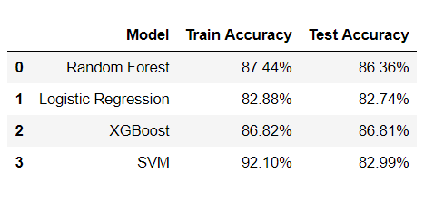

### Motivation

The motivation to do the analysis is to build an entire pipeline starting from the Exploratory Data Analysis to choice of Machine Learning model and then deployment on a microservice [Heroku](https://www.heroku.com/) so that it can be used for analysis by anyone. The task is to is to determine whether a person makes over `$50k` a year.


### Dataset
The dataset is available on the UCI website under the name of Adult Data Set/Census Income data.  
Link to the Data Set : [Adult_IncomeDataSet_url](https://archive.ics.uci.edu/ml/datasets/adult)

Characteristics of the data are as shown below : <br>


Out of the total `48842` entries, Training dataset contains `32561` and the remaining `16281` are the Test dataset entries.

I loaded the data and since its a binary classification problem I converted the entries with income `<=$50` to  `0` and income `>$50k` to `1` as can be seen in the target column. The training data set head with 16 columns is shown below :


### Exploratory Data Analysis

The categorical columns such as ``` 'Occupation','Workclass', 'Education_Label', 'Education_Number',
       'Relationship', 'Race', 'Income_class'  ``` contain the following unique categories : <br>


The level of education has been represented in words `Education` as well as corresponding numeric value `Education-Number` where Pre school is considered as basic level of education with numeric value 1 and the largest value for the highest level of education attained which is `Doctorate`.

Lets see how much data is available for each of the variable.

<br>


*Figure A*

<br>

Native country column has majority of the data from United States.


*Figure B*
<br>

I notice some '?' in workclass and native country and occupation level. After these entries with '?'
I lost around 2399 rows of which most of them were from occupation column.
The target variable/Income_Class contains around 22600 entries for the category of people earning <\$50k and around 7500 entries of people earning more than \$50k. This is important observation indicating that our dataset is biased towards people earning less than \$50k.

Now lets see what proportion of people in each category earn in which income bracket.


*Figure C*
<br>


*Figure D*
<br>


*Figure E*
<br>

`Education`
The wealthy people are generally highly educated. Professors, Doctorate and or masters education
level people earn well  Lets investigate who among low education levels are wealthy what they do how come they can earn so much at such young age. Most of the people with education level less than 12th standard work in Private jobs

`Work class`
The Self employed people have a higher proportion of being rich (>\$50k) followed by people working in Federal jobs

`Marital Status`
The Married couple from Armed forces and Civilian spouse are in high income category but the dataset contains very few entries for Armed force category hence we wont consider them as much of a valid observation

`Occupation`
The Executive and Managerial roles are the most paid ones it seems followed by  Professors and Protective services Some of the job categories such as Clerical jobs, farming fishing and Cleaners and handlers are not that much paid.

`Relation ship`
 Its a little surprising for me to see Husbands having less proportion than Wives with high income,
 I notice that the data for wives is just ~1400  entries and for the husbands is ~ 12500
 because of which the proportion is a little misleading

`Gender`
 The proportion of males with high income is more than the females

`Native Country`
 As we saw above the data for United states natives is overwhelmingly higher than other countries.
 The proportion of people who got wealthy (>$50k) from different natives is very high for France, Taiwan, Iran. Again its worth noting  that the data for each of these countries is too less to make a sane judgement.


*Figure G*
`Hours per week`
 The people in the higher income group work mostly between 35-60 hours a week.
 This goes up to 100 as well but there are less of such people.

 `Race`
 We notice that we have too little data for races other than White(Figure A). Still I tried to compare the  proportions of each race who were wealthy (>\$50k). For the whites ~ 26% people are earning >\$50k while from the available  data ~28% Asian Pac Islander earn greater than \$50k

<br>


*Figure H*
<br>

 `Income vs Age`
 Generally people between the age group of 30-50 are wealthy. The youngsters up to the age of 27 are under  the low income category. This makes sense as this is the age when the students are studying or just getting in  to the employment

### Transforming input for ML Model

Before I can apply any machine learning model I need to transform my data in the form that my machine learning model understands. As already discussed in the data set section I have total `48842` entries out of which Training dataset contains `32561` and the remaining `16281` are the Test dataset entries. For the transformation I applied the following transformations on both the training and test dataset together. Before training my ML model I will split them again so that the test dataset remains unseen.  

I did the following assignments to make my data ready to be fed into the ML model.

`Sex`

- Males : `1` <br>
- Females : `0`

` Race `

- Whites : `1`<br>
- Non Whites : `0` <br>

This assignment is because data is skewed with entries mostly for White people.

`Education`

The income bracket looks distinct for students up to standard 12th level of education followed by Associates and then high income group which includes people with Bachelors degree or above, Hence I am dividing this category into 3 classes.

- Preschool ,$$1^{st}-4^{th}$$,$$5^{th} - 6^{th}$$ ,$$7^{th}-8^{th}$$, $$9^{th}$$, $$10^{th}$$,  $$11^{th}, 12^{th} $$   : `0` <br>

- HS-grad,  Some-college,  Assoc-acdm,  Assoc-voc : `1` <br>

- Bachelors,  Masters,  Doctorate, Prof-school : `2`<br>

`Native_Country`

- United_States : `1` <br>
- Rest : `0`<br>

This is because most of the data is available for the United States natives.<br>

`workclass`

- Private : `0`

- State-gov, Federal-gov, Local-gov : `1`

- Self-emp-not-inc, Self-emp-inc, Without-pay, Never-worked : `2`

The people working in private sector jobs were put together in category 0. People working in one way or the other with the government were put in another category 1. Remaining people who were either self employed or without income were put together into category 1.

`Occupation`

- ' Priv-house-serv', ' Farming-fishing',' Armed-Forces',' Machine-op-inspct',' Other-service',' Handlers-cleaners', ' Adm-clerical' : `0`

- Craft-repair', ' Sales', ' Transport-moving : `1`

- Exec-managerial', ' Prof-specialty',  ' Protective-serv',' Tech-support : `2`

Looking at the Figure D specifically the distribution of income some occupations are believed to be earning high such as Managerial roles so I assigned them high pay category `2`. Similarly Middle `1` for Sales etc. and Lower Pay categories `0` for professions like Farming etc.

Lastly for

`Marital Status`

- Never-married : `0`
- Married-civ-spouse, Married-AF-spouse : `1`
- Divorced, Married-spouse-absent, Separated, Widowed : `2`


For the marital status I have assigned three categories. The unmarried people. The people in marriage and another category for those who have separated due to some reason.

After assigning categories to our feature variables we have our dataset in correct form to be used for building the Machine Leaning model. I am left with 11 features `age`, `workclass`, `education`, `marital-status`, `occupation`, `race`,
       `sex`, `capital-gain`, `capital-loss`, `hours-per-week`,
       `native-country` and 1 target variable `Income-Class` which is a binary class of people earning  `>\$50k` or `<=\$50k`.

A quick look at the final DataFrame containing 11 features and 1 target variable :


*Figure H*

### Fitting the Machine Learning model

After the transformation of the data above I got the DataFrame containing the train and test dataset. I split them again so I have Training DataFrame with 32561 rows and test dataset with 16281 rows.

Since its a binary classification problem I will use the following models for the prediction.

 1 - Logistic Regresion <br>
 2 - Decision Trees / Random Forest <br>
 3 - XGBoost technique <br>

The total error in our machine learning model is composited of the Bias and the Variance components. To minimize the error we can either reduce the bias or the variance. The two techniques Random Forest and XGBoost deals with one of them each.

#### RandomForestClassifier

Random Forest is a ensemble technique in which several decision trees are trained separately and then the results from all of them are combined to prepare an overall model. Random forest relies on reducing the variance of large number of complex models with low bias. Here the composition models are not weak but too complex.

```
model=RandomForestClassifier()
model.fit(X_train,y_train)
```
Training the Random Forest  Classifier without optimization gives me the following accuracies :

```
- results -
The train score is :  93.60%
The Test score is :  84.06%
```

As you can notice the Accuracy on the training dataset is ~94% where as the  test accuracy is quite low compared to the training accuracy. This could most likely be the case of Overfitting. Since we have not defined any maximum depth of the tree it has the freedom to do quite well on the training dataset but the generalization is not expected to be that great on any unseen data. To correct this let me do the Random Search of the best parameters : `Max_features`, `Max_depth`.


```
# Applying Randomized search to find the optimum parameters

param_dist = dict({'max_depth' : np.arange(1,30), 'max_features': np.arange(1,12)})

model_rf=RandomForestClassifier(n_estimators=30)
model_grid=RandomizedSearchCV(model_rf,param_dist,cv=10, n_jobs=-1, n_iter=20, random_state=123)
model_grid.fit(X_train,y_train)

- results -
The Best Features for Random Forest Are :  {'max_features': 8, 'max_depth': 11}
```

Applying the random search for Max features and the Max depth of the tree for the random search I get 8 as the maximum number of features and 11 as the maximum depth of the tree.
Training the model again with the best features I get accuracies :  

```
model_best=RandomForestClassifier(max_features=8, max_depth=11, random_state=123)
model_best.fit(X_train,y_train)
```

```
- results -
The train score is :  87.26%
The Test score is :  86.30%
```
That's great!. The training accuracy has decreased overall but the test accuracy has gone up and there does not seem to overfitting now. Putting in perspective, while making predictions on the Training dataset on which the model was trained we were 87.26% accurate in prediction. For Test dataset which was unseen to the trained model we still managed to make 86.3% correct predictions. The model seems to be doing good job.

#### XGBoost Technique

[XGBoost Technique](https://xgboost.readthedocs.io/en/latest/tutorials/model.html) gained lot of popularity recently and has been widely used in the kaggle competitions believed to be performing well on huge dataset. It sequentially improves the prediction of the t-1 trees before fitting the $$t^{th}$$ tree. It relies on reducing the bias on several simple trees sequentially.

```
model_xgb=XGBClassifier(n_estimators=30,booster='gbtree')
parameters_xgb=dict({'max_depth':np.arange(1,30), 'learning_rate':np.arange(0,1,0.01)})

model_xgb_rs=RandomizedSearchCV(model_xgb,parameters_xgb,cv=5,n_iter=20,n_jobs=-1,
  random_state=123)

```


```
model_xgb_rs.fit(X_train,y_train)

- results -
The best parameters for XG Boost are :  {'max_depth': 4, 'learning_rate': 0.85}
```


```
model_xgb_best=XGBClassifier(learning_rate=0.85, max_depth=4, n_estimators=30,
  booster='gbtree', random_state=123)

model_xgb_best.fit(X_train,y_train)

- results -
The train score is :  87.39%
The Test score is :  86.81%
```

#### Logistic Regression

Lets see how the Logistic regression performs without any optimization of the parameters.
```
model_lr=LogisticRegression()
model_lr.fit(X_train,y_train)
```

```
- results -
The train score is :  82.87%
The Test score is :  82.74%
```

The score is quite low compared to the Random Forest results we obtained above. Lets see if the optimization improves the results. I will do a grid search on the regularization parameter C and check if the l1 regularization us required or l2.

```
param_dist = dict({'C' : np.logspace(-3,3,7), "penalty":["l1","l2"]})

model_lr=LogisticRegression()

model_grid_lr=GridSearchCV(model_lr,param_dist,cv=10, n_jobs=-1)
model_grid_lr.fit(X_train,y_train)

- results -
The Best Features for Logistic Regression are :  {'C': 10.0, 'penalty': 'l1'}
```

The best parameter search gives me the C value of 10 and l1 regularization as the best combination. It seems the model needs to remove couple of features that is why l1 regularization has been chosen over l2. The training the model using these best parameters :

```
model_lr_best=LogisticRegression(C=10, penalty='l1')
model_lr_best.fit(X_train,y_train)

- results -
The train score is :  82.87%
The Test score is :  82.73%
```
The train and test scores are still low. I will probably ignore this model going forward.

The final comparison of the scores of the model are as follows :



I am okay with the results from the Random Forest Classifier to be used for further analysis.

Now that I had narrowed down the model I combined my training and test datasets to have larger data to train for and get a more robust model.

```
# Combining the Train and Test dataset

Entire_X=pd.concat([X_train,X_test])
Entire_y=pd.concat([y_train,y_test])

# Training RandomForestClassifier on larger dataset

model_best=RandomForestClassifier(max_features=8, max_depth=11, random_state=123)
model_best.fit(Entire_X,Entire_y)
```


### Deployment of the Machine learning model

Now that my model was ready I decided to deploy it on the Heroku cloud platform [url](https://www.heroku.com/platform#platform-diagram-detail).


I will not go much into the detail of the procedure. In case you are interested please follow this GitHub repository for detailed instructions of how to deploy on the Heroku platform.

[Heroku_deploy_GitHub_url](https://github.com/LDSSA/heroku-model-deploy).

### How can you use the model

Now that you know everything about how the model was built, just use the following command in the
Bash(Windows) or Terminal(Mac) and get the output probability of earning more than \$50k.

```
curl -X POST https://income-app-ml.herokuapp.com/predict -d '{"id": 15, "observation":
  {"age": 45, "workclass":0 , "education": 1, "marital-status": 0,
    "occupation": 1, "race": 1, "sex": 0, "capital-gain": 0,
      "capital-loss":0,"hours-per-week":25,"native-country":1}}' -H "Content-Type:application/json"
```

Please Note :
- Every time you are making a prediction using the above command please increase the "id" by 1 as it stores the output in the unique id and does not overwrite previous ids.

- You are already familiar of the input categories for each variable. For instance
In the sample command above <br>

`Age`: 45 (Numeric) <br>

`Capital-gain`: 0 (numeric) <br>

`Capital-loss`: 0 (numeric) <br>

`Hours-per-week`: 25 (numeric) <br>

`Workclass`
- Private : `0`
- State-government, Federal-government, Local-government : `1`
- Self-employed-no-income, Self-employed-income, Without-pay, Never-worked : `2`

`Education`
- Preschool ,$$1^{st} - 12^{th} $$   : `0` <br>
- HS-graduate,  Some-college,  Associate-acdm,  Associate-voc : `1` <br>
- Bachelors,  Masters,  Doctorate, Prof-school : `2`<br>

`Marital Status`

- Never-married : `0`
- Married-civilian-spouse, Married-ArmedForces-spouse : `1`
- Divorced, Married-spouse-absent, Separated, Widowed : `2`

`Occupation`
- Private-house-servant, Farming-fishing, Armed-Forces, Machine-operator or inspector, Other-service, Handlers-cleaners,  Admin-clerical : `0`
- Craft-repair,  Sales,  Transport-moving : `1`
- Exec-managerial, Prof-specialty,   Protective-services, Tech-support : `2`

` Race `
- White : `1`<br>
- Non White : `0` <br>

`sex` :
- Males : `1` <br>
- Females : `0` <br>

`Native_Country`

- United_States : `1` <br>
- Rest : `0`<br>


The output will look something like this :

  

In this output the `proba` output is the probability that you will earn greater than $50k.
Try it yourself !

Please let me know your feedback. All the analysis is available on my GitHub the url of which is given below.

GitHub repository of analysis: [GitHub_Repository](https://github.com/Birinder1469/Income_Prediction) <br>
Email address : birinder1469@gmail.com


#### Resources

1. Bias Variance concept :     [Understanding the Bias-Variance Tradeoff](https://towardsdatascience.com/understanding-the-bias-variance-tradeoff-165e6942b229) <br>
2. RandomForest Vs XGBoost:      [StackExchange](https://stats.stackexchange.com/questions/77018/is-random-forest-a-boosting-algorithm) <br>
3. XGBoost Tutorial: [XGBoost Technique](https://xgboost.readthedocs.io/en/latest/tutorials/model.html) <br>
