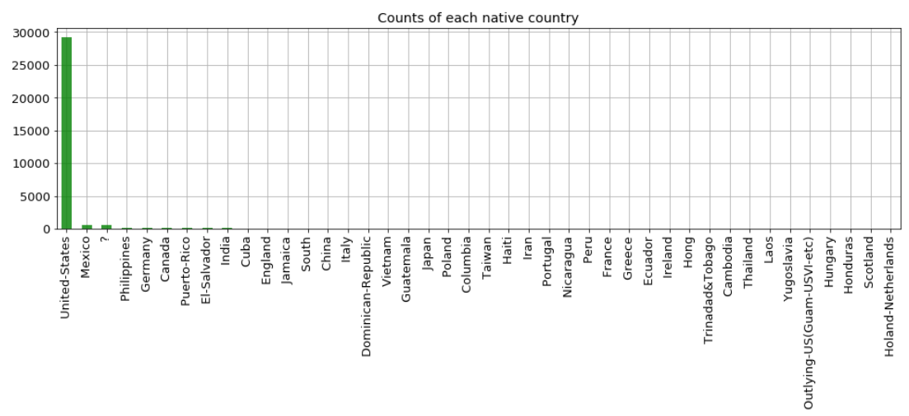
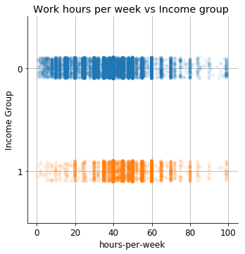

## Motivation

The motivation to do the analysis was to build the entire pipeline starting from the Exploratory Data
Analysis to choice of Machine Learning model and then deployment on a microservice Heroku.

## Objective

Prediction task is to determine whether a person makes over 50K a year.

## Dataset
The dataset is available on the UCI website under the name of Adult Data Set/Census Income.  
Link to the Data Set :  
[AdultDataSet](https://archive.ics.uci.edu/ml/datasets/adult)

| Data Set Characteristics: | Multivariate  | Number of Instances: | 48842   | Area:  | Social  |
| Attribute Characteristics: | Categorical, Integer  | Number of Attributes: | 14  | Date Donated  | 1996-05-01  |
|Associated Tasks:  | Classification  | Missing Values? | Yes  | Number of Web Hits:  | 1427251  |

* taken from UCI website

 

 

 

 

 

 

 

 
