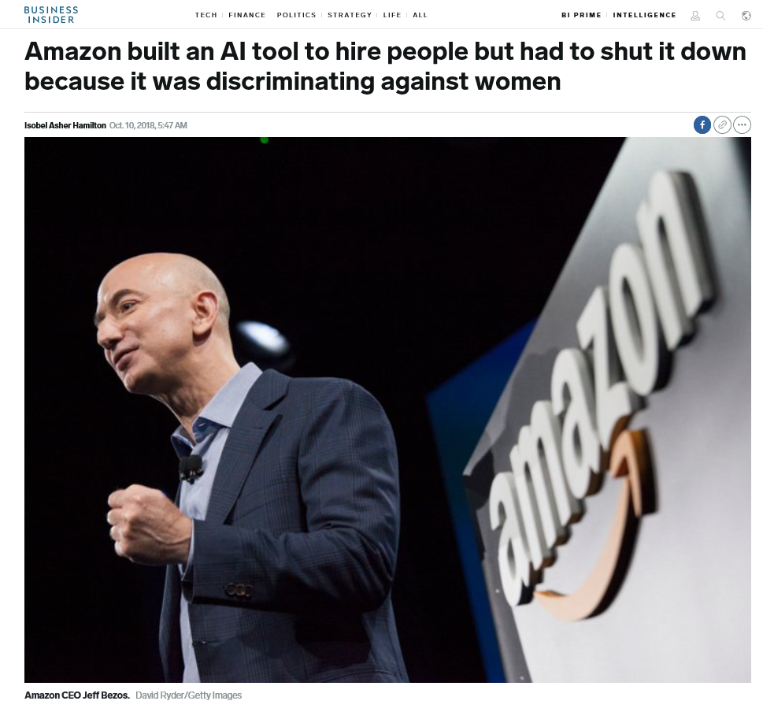

To what extent can and/or should a company monitor a customer?

In my opinion the answer to this is quite subjective. On one hand we may categorize being monitored as breach of privacy but on the other hand when we benefit from the Amazon recommendations online we consider it the technological advancement. The best thing to do in this case is to provide users a choice before monitoring anything. Unknowingly tracking the mobile phone location,  purchase history is probably going to be unappreciated by any user. However if the company gives the users a vision or the reason for monitoring their activities then the user can take a wise decision if they are okay with that. In that case the onus is on the user to do the due diligence and be prepared for any repercussions. The companies also need to be extra cautious while tackling the responsibility of handling the user data. As it has been rightly said the Data is the new Oil for the world economy. The more data a company has the more power resides in its hand and to add to it the more responsibility on its shoulders. Any misuse of the data should be dealt strictly so that the companies do not take it on lighter note and not handle the data well. In case the company acquire the data it needs to ensure that the data if leaked in worst case scenario should not narrow down to the respective individual. This is the best case of de-identification.

#### Resource : [Importance of Monitoring the consumers](https://www.business.com/articles/people-are-talking-are-you-listening-the-importance-of-social-media-monitoring/)

How do we strike a line between reasonable and excessive surveillance? 

In my opinion the surveillance under permission from the user is reasonable and anything other than that for commercial or any other reason is excessive surveillance. I mention this because there may be some cases where the user lets say works in some highly confidential job and tracking his/her location is very risky for his job. On the other hand some other users like me won't be bothered if my location is recorded. Hence action taken by the company without the consent of the user should be discouraged. On top of it any data that the company acquires needs to be de identified so that no user is at risk of being narrowed down in case of data breach. Some may argue that there is no harm in using the technology like Amazon Echo to look for the criminals by identifying them through voice recognition. The plan sounds very robust, for sure it is much easier to catch the criminal from his voice signature by any public telephone line compared to finding him through CCTV cameras. However in my opinion this is unethical. The criminal is not criminal until proven guilty. Even then our law has the provision for the accused to ask for a lawyer before being interrogated. In the eyes of the law the criminal also has the rights and it is not justified to breach any one's privacy under the suspicion that he/she might have committed some crime.

#### Resource : [Suspected criminals get privacy rights—what about the rest of us?](https://www.brookings.edu/blog/techtank/2018/07/05/suspected-criminals-get-privacy-rights-what-about-the-rest-of-us/)

How can you, as a data scientist, control the level of surveillance of your data science products? 

As a data scientist my interest lies in drawing insights from the data. In the process it is my responsibility to handle the data wisely. For instance if my interest lies in finding if the drug is effective in treating some particular disease then the most important thing is how the patients react to the drug usage. It does not matter who the patient is. In this case the de identification can be in the best interest of both the patients and the researchers. Some of the de identification techniques to use can be suppressing the specifics, generalizing the observations, k anonymizing so that its tough to narrow down to an individual. On the other hand if I am building a recommender system on Netflix or amazon then I need to notify the user that the search history is been logged and if he/she is not okay then not do that. Handling data securely can be done by using hash functions or other cryptic techniques so that the transfer of data is safe.

#### Resource :  [6 Good Reasons to De-Identify Data](https://privacyguidance.com/blog/6-good-reasons-to-de-identify-data/),    [Ethical Data Scientist](https://towardsdatascience.com/5-principles-for-big-data-ethics-b5df1d105cd3)

While developers cannot predict everything, they should be able to anticipate common discriminatory harms. What are examples of such harms? What might companies do to minimize these risks? 

Anticipating possible harms that a new technology can have is easier said than done. Based on the business requirements the companies put more effort to improve the model accuracy and subsequent revenue inflow rather than having board meetings to decide what social impact the new technology is likely to have. For instance when the world had come together to increase the participation of women in the corporate world, The most hyped application of making the hiring process automated was in fact discriminating against the women. Amazon built an AI tool to hire people but had to shut it down because it was discriminating against women [URL](https://www.businessinsider.com/amazon-built-ai-to-hire-people-discriminated-against-women-2018-10).

Nevertheless with the infiltration of AI in all the domains its the need of an hour to be cautious of the damage that the technology can have on the sentiments of the user base. Some of the important discriminatory incidents we can avert besides the one mentioned above are :

- Disability : I wonder how the ML model will react to some one with speech impediment. Some people with dyslexia are not fluent while speaking. The ML model might classify them wrongly and hurt the sentiments big time.
- Ethnicities : How can the ML model identify the people from different cultures with different accents while doing speech recognition. Also in the Image analysis how can the computer distinguish between several different communities from Asia who look pretty much similar (distinguish mongoloids from Chinese).
- I was startled to learn that some of the communities from Africa were identified as Gorilla by the Computer vision model [URL](https://www.theguardian.com/technology/2018/jan/12/google-racism-ban-gorilla-black-people). This prediction could be extremely hurting to the individual and needs to be addressed in the beginning. Google however had to take some immediate measures to control the damage.

- Based on the choice of movies some one is watching on Netflix segregating the people into categories could hurt the feelings and probably stereotype the image of the person.

Some efforts the companies can make are
- The obvious but logistically challenging would be to try to get a good representation of the minorities so our model knows more about classifying them.
- Take user inputs upon the prediction. This is an effort to improve the model. Whenever the model classifies some one for example in speech recognition the user can input how accurate the prediction was.
- Train the model in a way that if the probability of classification is low the prediction is a new category :  `Other` which will be a neutral response.

Just because a technological capacity exists, does that mean it should be pursued? What factors should companies take into account when determining whether or not to launch a product? 

In my opinion any invention if pursued wisely can bring more welfare than harm. Technological advancements have made human life much simpler be it healthcare, communication or transportation.   
Its by trial and error that we improve. If something fails it teaches a lesson. The onus lies on the companies, some of the efforts the companies can make before launching a product are:
- Before investing in the projects the companies need to understand the problem at hand which they are trying to address. The public perception about the problem. If they can some how help to address even partial of it then it might be a good choice to choose that as a challenge.
- Ensure Layering of implementation. Google/Amazon have their offices in all countries. They can have a central database and top of it each organizational unit in each country can be responsible for collecting and training on local user data as well.
- Determine the tradeoff between value vs harm like Varada suggested companies can have sociologist and lawyers on the panel for such issues, in short risk assessment is crucial.
- Ensure Data security protocol is ready before deployment. Linked In stored passwords in plain text file which was not a wise move of the organization of that reputation. Companies need to invest adequately in data security. [URL](https://www.computerworld.com/article/2504078/hackers-crack-more-than-60--of-breached-linkedin-passwords.html)
- Educate the consumer : It is the responsibility of the organization to make the user be aware of the limitations of the application and the proper usage.
