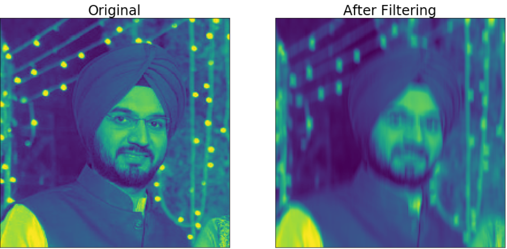

Motivation

I have always been fascinated by the concept of playing around with the images in python. I realized the images are nothing but an array of x height y width and 3 channels corresponding to each RGB (Red, Green and Blue) colors. I tried playing around with my picture by applying some synthetic filters and got some funny results.

The concept of convolution is shown clearly in the image below. The image shows 2d convolution but it can be even in 1d. Instead of 2 dimensional filter we will have 1d filter. In the image shown below we have a image of size 6 by 6. The filter of size 3 by 3 is applied to the image. The filter is centered on every element of the image and the dot product of the image and the filter is computed and the pixel value is replaced with this dot product value.

In the below images the pictures are of size 200 by 200.

Horizontal filter

First I applied horizontal filter shown below on my image. The horizontal filter comprises of 0.1 value 10 times in horizontal direction. The filter id centered on every element of the image and then the value of that pixel is replaced with the dot product value.
The beauty of the horizontal filter as you can imagine would most average the vertical edges. This is evident from the Original and the filtered image below.
 

Vertical filter

Similarly the vertical filter can be applied and the effect would be seen most prominently in the averaging of the horizontal edges.

 

 

Identity filter

Identity filter is kind of retaining the value of each pixel and hence there is no change seen in the image before and after applying the filter.

 

 

Averaging filter

This is interesting filter. Every pixel is averaged over wide region in this case the filter size is 10 by 10 hence the averaging is done of the order of 10 by 10 pixels. It is very clear how the image gets blur.

 

 

Edge detection filter

Edge detection filter aims at identifying points in a digital image at which the image brightness changes sharply or, more formally, has discontinuities. For every point as you can see the filter below it finds the contrast with the neighboring points. Since the sum of the filter is 0 for any other portion of the image the sum will b zero but for the edges the pixel value will be very high compared to the surrounding pixels.

 

 

The code is available on my GitHub repository: [GitHub Repository](https://github.com/Birinder1469/Image_convolutions)
