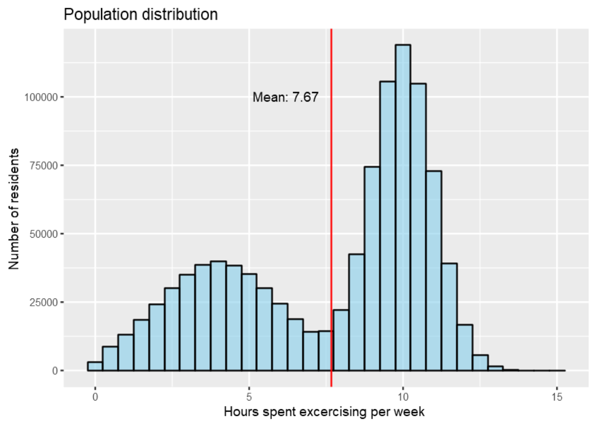
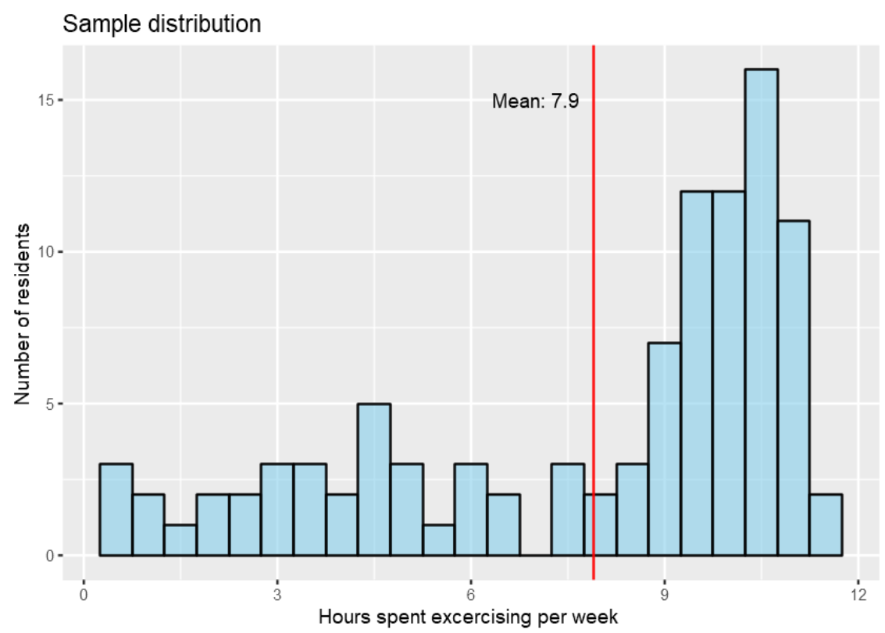
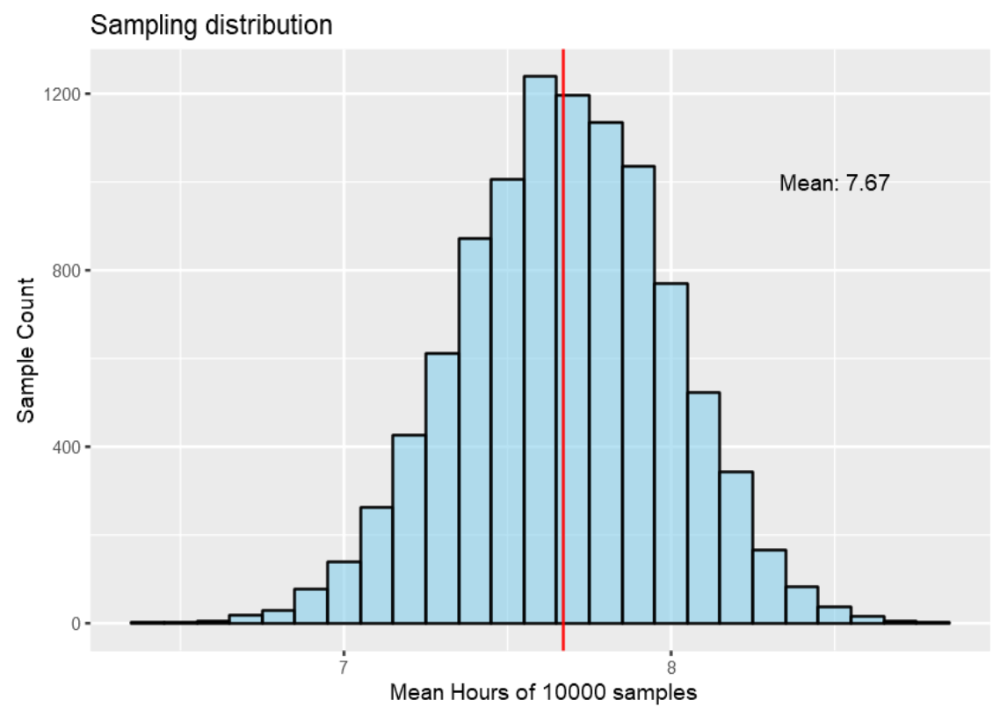
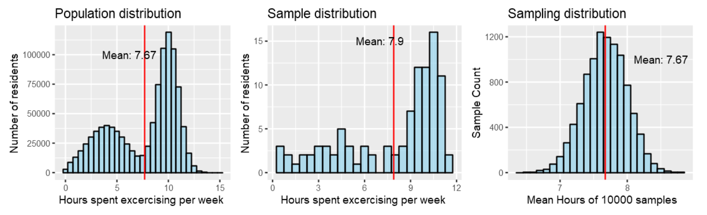

Motivation

I have been in the state where I could not distinguish among the Population, Sample and Sampling distributions. In the following synthetic experiment I will try to distinguish between them.

Analysis

Let us create a synthetic dataset to investigate how much time on an average the people of a locality spend exercising. The below code creates a virtually simulated population data (exercise_data) where the response variable is the number of hours spent per week on exercising by each of the 1,000,000 residents. We also create an resident_id column with a unique number for each person in the data set. The hours of exercising come from two separate normal distributions with different mean and standard deviations.

The distribution of hours spent exercising by 1000000 residents is the population distribution. Let us see how it looks.

 

  

 

From the population we take sample of size 100 (randomly choose 100 residents). Now we can plot the hours of exercise for these 100 residents. This would be our Sample distribution.

 

  

 

This is a plot from just one sample chosen at random from the population. The mean can be different for different samples. For the sample displayed above the mean is 7.9 Hours. We cannot conclude anything about the population mean just looking at one sample distribution.

We obtain 10000 samples each comprising 100 residents. We plot the mean of each of these 10000 samples. This distribution of the means in our case would be called the sampling distribution.

 

  

 

Above plot is plot of the means of the 10000 samples. We obtain the mean of the means and we notice it is quite close to the population mean. This is thanks to the Central limit theorem. The central limit theorem states that when an infinite number of successive random samples are taken from a population, the sampling distribution of the means of those samples will become approximately normally distributed with mean μ (same as the population mean) and standard deviation same as the population standard deviation as the sample size (N) becomes larger, irrespective of the shape of the population distribution.

In our case the population distribution is bimodal but the sampling distribution still comes out to be Normal.
 

  

 
Summary

- First is the population distribution, second plot is the sample of size 100 randomly chosen out of the population. Third is the plot of the means of the 10000 samples collected out of the population where each sample is of size 100.

- The population distribution is showing the hours spent exercising by 1000000 residents vs the count of the residents in different bins. The mean of the population distribution is 7.67 Hours.

- The Sample distribution comprises of 100 residents and we see the hours spent exercising by each of them. The mean for this case could vary a lot and it is 7.9 Hours for the sample above.

- The sampling distribution shows a normal distribution with its mean same as the mean of the population. In sampling distribution we have 10000 samples of size 100 whose mean each has been computed and plotted on X axis.
