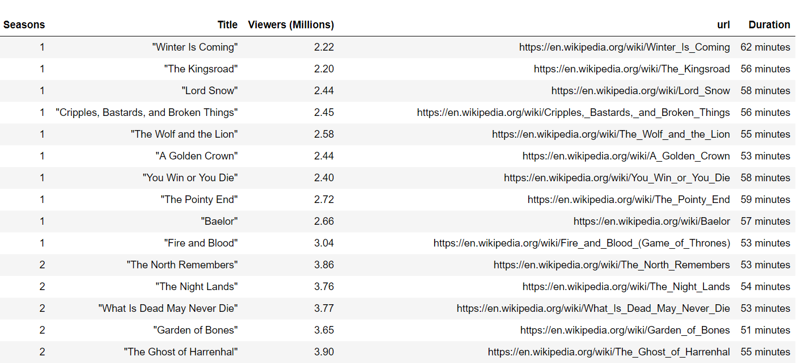

<span style="color:blue;  font-family: Helvetica;font-size:1.5em;">Motivation</span>

<span style="color:black; font-family: Tahoma;font-size:1.1em;">
I have been in the state where I could not distinguish among the Population, Sample and Sampling distributions <br> </span>
<br>


<p align="center">
  
</p>

<p align="center">
  
</p>


<p align="center">
  
</p>


<p align="center">
  
</p>


<br>

<span style="color:black; font-family: Tahoma;font-size:1.1em;">Extracting season, episode name, Number of US viewers and the URL of wikipedia page for each episode.</span>

```python
got_request=requests.get('https://en.wikipedia.org/wiki/List_of_Game_of_Thrones_episodes')
got=BeautifulSoup(got_request.text)

got_tables = got.find_all("table")

seasons=[]
titles=[]
viewers=[]
url=[]
url_start="https://en.wikipedia.org"

for i in range(8):
    table_num=i+1

    table=got_tables[table_num].find_all('tr',{'class':'vevent'})

    for m in range(len(table)):
        if table[m].find_all('td')[1].text !='TBA':
            seasons.append(i+1)
            titles.append(table[m].find_all('td')[1].text)
            viewers.append(table[m].find_all('td')[5].text.split('[')[0])
            url.append(url_start+table[m].find_all('a', {'href':True})[0]['href'])
        else:
            pass

GameOfThrones=pd.DataFrame({'Seasons':seasons,'Title':titles,'Viewers (Millions)':viewers, 'url':url})


```

<span style="color:black; font-family: Tahoma;font-size:1.1em;">Follow the URL of each episode wikipedia page and extracting the running time for each episode.</span>

```python
duration_list=[]

for url_link in GameOfThrones.url:
    duration=requests.get(url_link)
    duration_got=BeautifulSoup(duration.text)
    duration_list.append(duration_got.find_all('table',{'class':'infobox vevent'})[0].find('th', text='Running time').next_sibling.text.split('[')[0])

GameOfThrones['Duration']=duration_list


```

The DataFrame looks like this :



<span style="color:black; font-family: Tahoma;font-size:1.1em;">This is just sample, actual DataFrame contains the details for all the episodes till date.</span>

<p align="center">
  
</p>

<span style="color:black; font-family: Tahoma;font-size:1.1em;">The code is available on my GitHub repository: [GitHub Repository](https://github.com/Birinder1469/web_scraping_GOT)</span>
<br>
<span style="color:blue;  font-family: Helvetica;font-size:1.5em;">Reference</span>

1. [Game of Thrones Wikipedia](https://en.wikipedia.org/wiki/Game_of_Thrones) <br>
2. [Beautiful Soup](https://www.crummy.com/software/BeautifulSoup/bs4/doc/)

<br>
