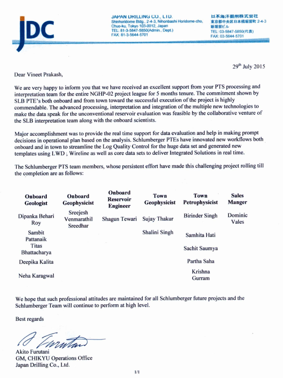
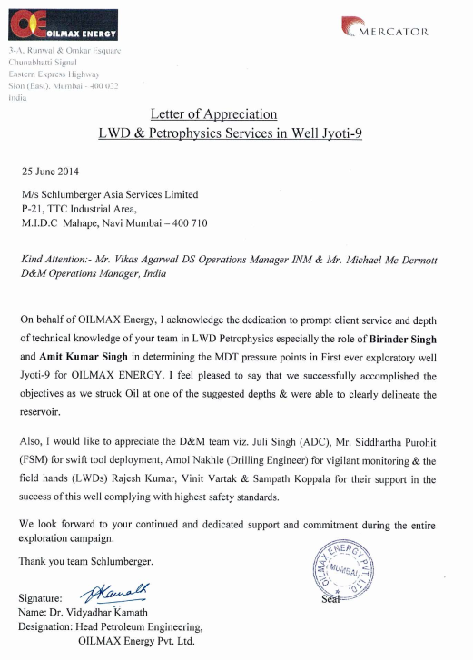
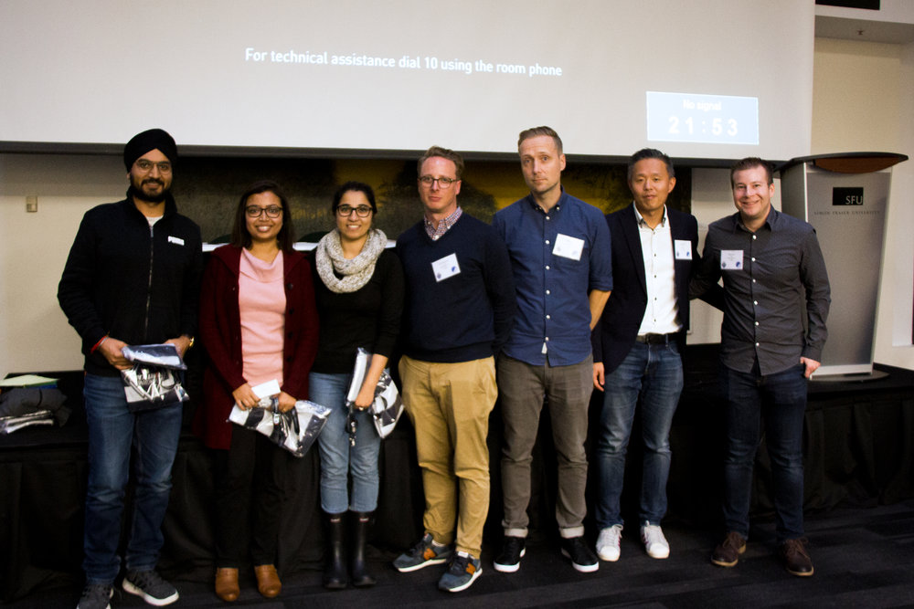
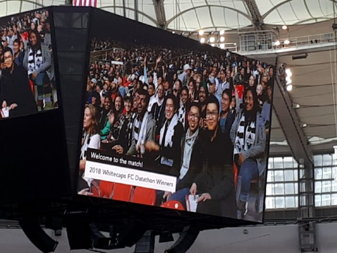

## Geophysicist
#### Indian Institute of Technology, Roorkee

After qualifying the IIT JEE(Indian Institute of Technology [Joint Entrance Examination](https://en.wikipedia.org/wiki/Joint_Entrance_Examination)) in 2008 I got into studying Geophysical Technology from the prestigious IIT Roorkee. I was an outgoing person and the field offered me exactly what I wanted. I loved going on field trips and we had couple of them in my first and second year at IIT Roorkee. Due to my love for the subject I did voluntary internship in 2009 at The Wadiya Institute of Himalayan Geology, Dehradun under the supervision of Dr. Naresh Dhatwalia, Scientist-B. I got great insights about carrying out the Earthquake data analysis and using softwares like SEISAN. I was curious to work in the field of Seismic and in 2011 I got a chance to go on funded Internship at The University of Bergen, Norway. This was a lifetime experience for me. We went on the research cruise aboard G.O SARS looking for Black smokers. Our team from UoB along with the Team from STATOIL now Equinor investigated the gas leakages from the Sliepner Storage sites in the North Sea. I learnt a lot during 2 months in the sea. I worked with advanced Technologies, Multi beam Echo Sounder being one of them.
My experiences are shared on the University website [My Experiences](https://www.uib.no/en/geobio/54047/discovering-new-world-beneath-one%E2%80%99s-feet).
For my final year thesis I worked on the Estimation of attenuation characteristics of Aswan reservoir region, Egypt under the supervision of Prof Sagarika Mukhopadhyay, Department of Earth Sciences, IIT Roorkee. For the first time I got a chance to work on the large volume of data comprising several earthquake records observed in the region of interest over last couple of decades. We were wasting lot of time analyzing these earthquake records manually. To make the procedure efficient I used MATLAB to reduce manual editing and manipulation of excel files. The task which otherwise would have taken more than a month and if there were to bring any change then god knows how much more could now be done in less than a week using these MATLAB scripts.
After a year long hard work we successfully published our work in the prestigious Journal of Seismology [Estimation of attenuation characteristics of Aswan reservoir region, Egypt](https://link.springer.com/article/10.1007/s10950-015-9511-2).

## Petrophysicist and Well Placement Engineer
#### Schlumberger Asia Services Ltd (2013-2016)

I got into Schlumberger through campus placement at IIT Roorkee and had an enriching experience of 5 years working in the field and in the office.
I worked as a Logging While drilling petrophysicist and my job was to carry out real time log analysis and make recommendations to the clients based on their objectives. My job profile brought lot of satisfaction once we successfully met our targets or had some interested findings while drilling. The feeling of accomplishment after I saw the smile on the face of our clients with every successful well used to be the motivation for me to keep giving my best everyday. From log analysis to understanding Mud logs, frequent discussions with Drilling Engineers, Chemists, Reservoir Engineers and Geologists gave me a holistic picture of the entire drilling and interpretation cycle.      
While real time analysis I used to be in touch with the Well placement (WP) engineers and started working on Well placement jobs on my own looking at which the management decided to Cross train me in the Well Placement Domain as well. As a WP engineer I used to Geo steer high angle horizontal wells to maximize the production from the target reservoirs.
One of the major projects that I worked on was the Second Leg of the National Gas hydrate Expedition (NGHP-02) carried out along the East Coast of India. This was a Multi million Dollar project and the teams from Japanese Drilling company, USGS(United States Geological Society), ONGC and Schlumberger were involved. I led the Logging While drilling workforce for the 24 wells drilled by Schlumberger.
We used the top notch technology available which included the Nuclear Magnetic Resonance while drilling , Acoustics and Spectroscopy while drilling to delineate the Methane hydrates under the Ocean floor. The project had many challenges varying from technical to logistic which we had to overcome in order to deliver up to Schlumberger standards. After 5 months of hard work we got appreciation letters from the Japanese Drilling company for the service we provided. We successfully published our work on [New technique for accurate porosity estimation from logging-while-drilling nuclear magnetic resonance data](https://doi.org/10.1016/j.marpetgeo.2018.11.001) in the prestigious Journal (Marine and Petroleum Geology) of international repute.

## Technical Sales Engineer
#### Schlumberger Asia Services Ltd (2015-2016)

I got a chance to get involved directly with Schlumberger clients in India mainly ONGC, OIL, Cairn India Ltd and Oilmax. The main task was to understand the client's requirements and challenges being faced by them and propose appropriate technological solutions. After every visit to Client's office and rig site I used to collect all the well data from the nearby fields drilled in past and carry out petrophysical analysis to see how we could solve any drilling related challenges being encountered. I was on a assignment to understand geological complexities in the North East India where we were regularly loosing our expensive tools in the bore hole. I collected all the well data available in the fields with Schlumberger and the Clients. I had discussions with Mud loggers, Geologists and Drilling engineers and finally we came up with the solution which had a lot to do with type of mud being used. We did some changes in coming wells and introduced some latest Schlumberger Technologies and finally drilled 6 wells back to back successfully. Our effort was highly appreciated by the Client and I got decent bonus (Amount not important) from Schlumberger as a token of appreciation.  

## Petrophysicist
#### Schlumberger Solutions Ltd.( 2016-2018)

I worked as lead Petrophysicist and played a key role in establishing the Data Services Hub which is the center of excellence for the processing and interpretation for Schlumberger. We handled the Schlumberger clients globally, some of the clients we handled were the major O&G giants like SHELL, ExxonMobil, British Petroleum, PetroCanada and Chevron.
Having experienced the drilling and interpretation side of the industry for a significant time I started getting curios in the potential of using Machine Learning automating the redundant tasks. I wrote couple of scripts which would reduce the time spent on manually doing some tasks with much more efficiency and in much less time.  
I started developing my skills in programming and with several ideas in mind decided to get into the structured way of learning Data Science and decided to pursue Master of Data Science from The University of British Columbia, Vancouver.

Here is a glimpse of some good old days from My Schlumberger Trainings and Appreciation Letters/Awards I received.

**Trainings In Schlumberger**

{:.border}

**Appreciation Letters**

*Appreciation Letter from Japanese Drilling Company*

 

*Performed by Schlumberger Award*
 

*Appreciation Letter from Oilmax*

## Data Science Training
#### The University of British Columbia, Vancouver (2018-2019)

I am currently part of the 2018 - 2019 cohort of the Master of Data Science(MDS) at The University of British Columbia.
I got a chance to learn from highly motivated like minded people in my cohort. Within a month of joining the program we(I along with 2 MDS students) won the 2018 Vancouver Whitecaps FC Datathon - Business Case. We estimated the merchandise purchase probability based on the time spent by the viewers inside the stadium and understood the purchase behavior in terms of time of transactions and suggested marketing automation.

*Winner 2018 Vancouver Whitecaps FC Datathon - Business Case*

*Invited to attend the Vancouver Whitecaps game at BC Place, Vancouver*

The detailed curriculum is available on the program website : [Curriculum](https://masterdatascience.ubc.ca/programs/vancouver)

I made a Shiny dashboard `Crime Buster App` which is a classic tool for anyone who wants insights into regional crime situations in the United States of America. Potential users include citizens concerned with the safety of their local area or someone moving to a new location. This app is also potentially useful for sheriffs planning the deployment of their police force by providing visual depictions of past crime data [Blogpost_On_Shinydashbard](https://birinder1469.github.io/BirinderSingh_Blog/CrimeBuster_App/)

I also made a python package harnessing the power of scikit-learn, combining it with pandas dataframes and matplotlib plots for easy, breezy, and beautiful machine learning exploration. The Python package facilitates efficient comparisons of machine learning classifiers and regression models [Blogpost_On_SklearncomPYre_Package](https://birinder1469.github.io/BirinderSingh_Blog/SklearncomPYre_Package/)

Upon completion of the program I got a job on the last day of my program. Overall I had amazing experience and the learning curve despite being very steep was worth putting an effort. I was interviewed by UBC Master of Data Science team and it has been shared on the University website. [Interview_URL](https://masterdatascience.ubc.ca/student-success-stories/mds-spotlight-meet-birinder-singh-mds-vancouver-%E2%80%93-class-2019)

Upon finishing the program I have started working as Data Scientist at Integra Data and Analytic Solutions based in Calgary, Alberta.

#### Contact :
Please take out some time to check some of my work on my GitHub profile :
[BirinderSingh_GitHub](https://github.com/Birinder1469)
