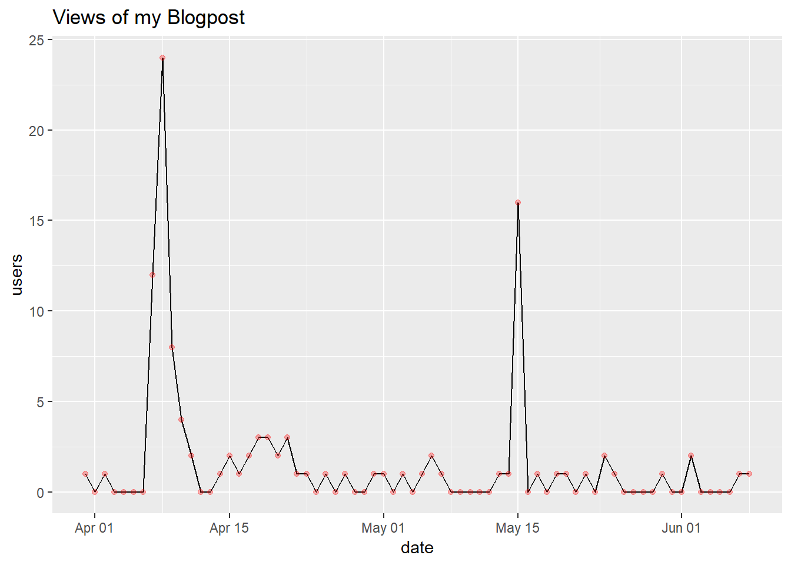

## Connect Google Analytics API and R(powerful statistical analysis tool)

### Motivation:
Just before my talk with an expert in marketing analysis It occurred to me how can a data scientist  add value to the ever expanding domain of marketing analytics. I am quite comfortable doing statistical analysis in R which is my second favorite language after Python and I thought of trying to do something beyond drawing the insights from the Google Analytics.

Couple of months back I wrote a blogpost on predicting income at scale with heroku platform (https://birinder1469.github.io/BirinderSingh_Blog/Income_Prediction_App/).
In this blog post I predicted the income category of an adult in the United States using the census data relating income to social factors. The key learnings include feature engineering, machine learning model evaluation, drawing insights from data using visualizations and finally how to deploy the model on the cloud.
I was curious to see how many people visited my blog post. I used to follow Google Analytics to look into that but since I am in habit of carrying out statistical analysis in R, I thought of why not bring it in R and see if there is a scope of doing more than just visualization. Below you can see what I achieved:

```{r}
# load the required packages.
suppressPackageStartupMessages(library(RGoogleAnalytics)) # Library to connect to Google Analytics.
suppressPackageStartupMessages(library(ggplot2)) # For some initial plots.
suppressPackageStartupMessages(library(forecast)) # for the time series prediction.
```

##### I have not shown here how I authorised the RGoogleAnalytics package to fetch data from my Google Analytics account as it contains some sensitive information of my account.

```{r,eval=T}
# Load the token
load("./token_file")
# Validate the token
ValidateToken(token)
```

Lets make a query to get data between April 1, 2019 and June 09, 2019 from the Google Analytics when my blogpost was active also lets plot and see how the distributions looks like.

```{r, echo=F,eval=TRUE,message = FALSE, warning = FALSE,error = FALSE}


query.init <- Init(start.date = "2019-04-01",
                   end.date = "2019-06-09",
                   dimensions = "ga:date",
                   metrics = "ga:users",
                   max.results = 100,
                   sort = "ga:date",
                   table.id = "ga:XXXXXXX")

query <- QueryBuilder(query.init)
dataframe <- GetReportData(query, token,split_daywise = T)

```


```{r}
# Deal with dates and plot daily users
dataframe$date <- as.Date(dataframe$date, '%Y%m%d')
dataframe$wkd = as.factor(weekdays(dataframe$date))
ggplot( data = dataframe, aes( date, users )) +
  geom_line() +
  ggtitle("Views of my Blogpost") +
  geom_point(colour = "red", alpha = 0.3)
```





### Observations
I notice a jump in the visitors when I launched my blog within the period of April 08 - April 12. Also there is another peak around May 15 when some people followed my blog post in a meetup.


### My Vision

I am aware of the utility of the Google Analytics tool in making marketing decisions. It can help us make decisions based on the historical records patterns and so on. In this quick experiment I explored the possibility of making future predictions based on the Time Series Analysis. For several organizations there can be some common trends in sales. For example some seasonal components associated with store sales. We can explore the trends from analytics tools like I did above and carry out our time series analysis for making better predictions.
Due to lack of activity on my blog I could not go forward with that but for more visited website I can for sure do the forecast.

Reference:
1. https://github.com/Tatvic/RGoogleAnalytics
2. https://feliperego.github.io/blog/2017/05/28/Time-Series-Google-Analytics
