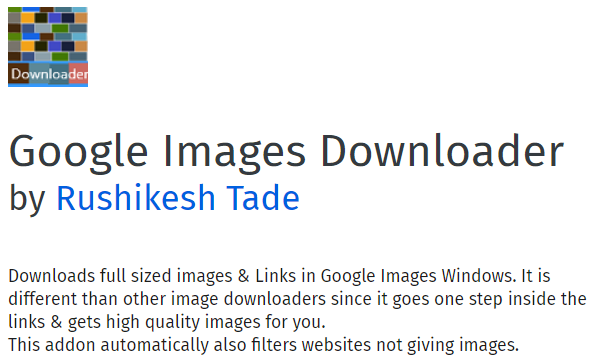

## fast.ai Course Image classification
### About the course

While I was looking for some good courses on Deep Learning, my search ended when I came across this course by fast.ai: [Practical Deep Learning for Coders, v3](https://course.fast.ai/). This is the part 1 of the two part series by fast.ai. Part 1 covers four applications:

1. Computer Vision
2. Natural Language Text
3. Collaborative filtering  
4. Tabular Data

The course teaches how to train PyTorch models using the fastai library. The instructor Jeremy is the cofounder of the Fast.ai. The course helps the user set up the cloud service in the beginning before getting into the actual deep learning problems. In this course Jeremy has followed a unique approach of hands on experience in coding first and then getting into the concepts of what is going on under the hood. My experience in Computer Vision during my Capstone project through Master of Data Science program was in Keras but I found the fastai commands quite straightforward.
The number of lines of codes in fastai is generally 1/6th those in Keras.

## Motivation

The 1st tutorial video was based on Pet detection which is classification of 25 breeds of dogs and 12 breeds of cats. Upon completion I decided to execute Image classification which was more relevant to me. I had recently moved to Calgary and already fallen in love with the Banff area which is home to several beautiful lakes. I realized whenever some one showed me a picture of a any of those lakes I could hardly tell which Lake that picture belonged to. I decided to build a classification problem for these Lakes. I choose the lakes I had visited viz.

1. Lake Moraine
2. Lake Louise
3. Lakes Grassi
4. Lake Minnewanka
5. Lake Emerald

The first task was to collect the Images of these lakes to train our model. I used the add-on for Mozilla Firefox

This add-on allows you to directly download multiple pictures from google search.
With not much effort I collected around 100 images for each of these Lakes.

*Under progress* ........
