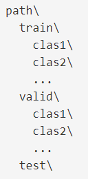
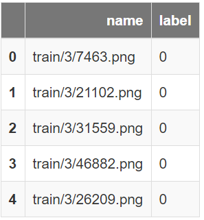
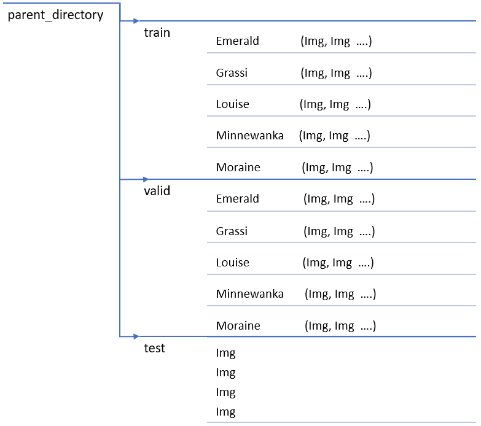
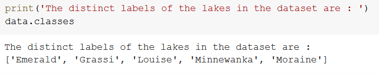

## fast.ai Course Image classification
### About the course

While I was looking for some good courses on Deep Learning, my search ended when I came across this course by fast.ai: [Practical Deep Learning for Coders, v3](https://course.fast.ai/). This is the part 1 of the two part series by fast.ai. Part 1 covers four applications:

1. Computer Vision
2. Natural Language Text
3. Collaborative filtering  
4. Tabular Data

The course teaches how to train PyTorch models using the fastai library. The instructor Jeremy is the cofounder of the Fast.ai. The course helps the user set up the cloud service in the beginning before getting into the actual deep learning problems. In this course Jeremy has followed a unique approach of hands on experience in coding first and then getting into the concepts of what is going on under the hood. My experience in Computer Vision during my Capstone project through Master of Data Science program was in Keras but I found the fastai commands quite straightforward.
The number of lines of codes in fastai is generally 1/6th those in Keras.

## Motivation

The 1st tutorial video was based on Pet detection which is classification of 25 breeds of dogs and 12 breeds of cats.  Gone are the days when we were fascinated with Dog and Cat classification, this problem has taken it to the next level by detecting even more intricate features detection hence the name fine grained image classification. Upon completion I decided to execute Image classification which was more relevant to me. I had recently moved to Calgary and already fallen in love with the Banff area which is home to several beautiful lakes. Whenever some one showed me a picture of a any of those lakes I could hardly tell which Lake that picture belonged to. I realized for me to be able to distinguish these lakes from each other I would need to identify more intricate differences similar to what Jeremy did for cat, dog breed identification. I decided to build a classification problem for these Lakes. I chose the lakes I had visited viz.

1. Lake Moraine
2. Lake Louise
3. Lakes Grassi
4. Lake Minnewanka
5. Lake Emerald

## Data collection

The first task was to collect the Images of these lakes to train my model. I used the add-on for Mozilla Firefox


This add-on allows you to directly download multiple pictures from google search.
With not much effort I collected around 100 images for each of these Lakes. Now that I had all the images I had to organize them in the way my I use them to train my model.


Before any work can be done a dataset needs to be converted into a fastai DataBunch object, and in the case of the computer vision data - specifically into an ImageDataBunch subclass.

There is a group of shortcut methods provided by ImageDataBunch which reduce the multiple stages of the data block API, into a single wrapper method. These shortcuts methods work really well for:


To be able to use the Images to train the model I would need to organize my data in one of the formats the following functions handle.

1. [ImageDataBunch.from_folder](https://docs.fast.ai/vision.data.html#ImageDataBunch.from_folder)



In this method we add the images in their specific class folders in the train, valid(validation) and if we wish in the test folders. For instance class1, class2 folders within the train folder will be considered for training the model and the images within the class1 folder will be assigned the label "class1" and so on.


2. [ImageDataBunch.from_df](https://docs.fast.ai/vision.data.html#ImageDataBunch.from_df)



A pandas DataFrame with a column of filenames and a column of labels which can be strings for classification, strings separated by a label_delim for multi-classification or floats for a regression problem (ImageDataBunch.from_df)

3. [ImageDataBunch.from_csv](https://docs.fast.ai/vision.data.html#ImageDataBunch.from_csv)

Create an ImageDataBunch from path by splitting the data in folder and labelled in a file csv_labels between a training and validation set. Use valid_pct to indicate the percentage of the total images to use as the validation set. An optional test folder contains unlabeled data and suffix contains an optional suffix to add to the filenames in csv_labels (such as '.jpg').

4. A list of filenames and a list of targets [ImageDataBunch.from_lists](https://docs.fast.ai/vision.data.html#ImageDataBunch.from_lists)

5. A list of filenames and a function to get the target from the filename [ImageDataBunch.from_name_func](https://docs.fast.ai/vision.data.html#ImageDataBunch.from_name_func)

6. A list of filenames and a regex pattern to get the target from the filename [ImageDataBunch.from_name_re](https://docs.fast.ai/vision.data.html#ImageDataBunch.from_name_re)

In the last five factory methods, a random split is performed between train and validation, in the first one it is based on the separation between training and a validation folders. For more details on the usage of these methods please follow the links alongside the method.
In my case I used the 1st option. I simple organized different folders for train, validation and test data.




## Loading data in Google Colab

To do nearly everything in this course, we need access to a computer with an NVIDIA GPU.
Several options have been discussed in the course at [platform_setup_url](https://course.fast.ai/index.html). Setting up a computer takes time and energy, I would rather concentrate my energy to focus on deep learning right now. Therefore, renting access to a computer that already has everything I need preinstalled and ready to go sounds more reasonable. Since I have been working on Google Colab for quite some time, I decided to build the model on Google Colab which comes with a free GPU instance.

I uploaded the dataset on the google drive and then accessed it through the Jupyter Notebook on Google Colab.
Lets load the dataset and create a Image Data Bunch.

```
# Create a Image Data Bunch

batch_size= 16

data = ImageDataBunch.from_folder(path = 'parent_directory/',
        ds_tfms=get_transforms(do_flip=False),
        size=224,
        bs=batch_size,
        test="test").normalize()
```

In the above code chunk we created a Image.DataBunch object with image size 224x224 for each image. Some relevant image transforms have been applied on the images. I have  Finally the images have been normalized in a way that the pixel values have mean of 0 and standard deviation of 1. Normalization is important as otherwise there can be huge variation in the pixel values for RGB channels. I have intentionally not flipped the images as I think we wont add lot of value by flipping the image of Lakes while training the model. To know more abouot the trainsforms which can be applied to the dataset please follow the url: [get_transforms](https://docs.fast.ai/vision.transform.html).

Lets look at some of the train images:


We notice the class of each image is displayed on the top of the image. This class label has been identified based on the folder structure. Any image in the Moraine folder will belong to the Lake Moraine and so on.


We are dealing with 5 different lakes here. Lets confirm by looking at the dataset we just loaded. As we notice below our dataset has 5 labels viz. Lake Emerald, Grassi, Louise, Moraine and Minnewanka.



## Model Training

There are two options we have for training the model. The first is to train the model from scratch and the other is to utilize what we call Transfer learning. The concern with first approach is that we don't have sufficient data to be able to catch the intricate features.


## Testing the performance on the new data


## Reference:
1. The credit for this blogpost goes to Practical Deep Learning for Coders, v3 : [course_url](https://course.fast.ai/)
2. The documentation by fast ai has been very helpful : [doc_url](https://course.fast.ai/)
