## fast.ai course on Image Classification
### About the course

While I was looking for some good courses on Deep Learning, my search ended when I came across this course by fast.ai: [Practical Deep Learning for Coders, v3](https://course.fastai/). This is the part 1 of the two part series by fast.ai. Part 1 covers four applications:

1. Computer Vision
2. Natural Language Text
3. Collaborative filtering  
4. Tabular Data

The course teaches how to train PyTorch models using the fastai library. The course is taught by Jeremy who is also the cofounder of fast.ai. The course helps the user set up the cloud service in the beginning before getting into the actual deep learning problems. In this course Jeremy has followed a unique approach of hands on experience in coding first and then getting into the concepts of what is going on under the hood. My experience in Computer Vision during my Capstone project through the Master of Data Science program, University of British Columbia Vancouver was in Keras but I found the fastai commands quite straightforward.
The number of lines of codes in fastai is generally 1/6th those in Keras.

## Motivation

The 1st tutorial video was based on Pet detection which is classification of 25 breeds of dogs and 12 breeds of cats.  Gone are the days when we were fascinated with simply classifying a Dog and a Cat, this problem has taken it to the next level by detecting even more intricate features to identify the breeds of dogs and cats hence the name fine grained image classification. Upon completion I decided to execute Image classification which was more relevant to me. I had recently moved to Calgary and had already fallen in love with the Banff area which is home to several beautiful lakes. Whenever some one showed me a picture of any of those lakes I could hardly identify the lake in that picture. It realized that for me to be able to distinguish between these lakes I would need to identify more intricate differences similar to what Jeremy did for cat, dog breed identification. I decided to build a classification problem for these Lakes. I chose the lakes I had visited viz.

1. Lake Moraine
2. Lake Louise
3. Lakes Grassi
4. Lake Minnewanka
5. Lake Emerald

## Data collection

The first task was to collect the Images of these lakes to train my model. I used the add-on for Mozilla Firefox


This add-on allows you to directly download multiple pictures from google search.
With not much effort I collected around 100 images for each of these Lakes. Now that I had all the images I had to organize them so I can use them to train my model.

fastai library expects the dataset to be converted into ImageDataBunch. ImageDataBunch is simply an object which fastai library easily comprehends before getting into training, validation and testing the model.

There are several wrapper methods in case of ImageDataBunch which make it easy for us to handle the dataset. To do so, I would need to organize my data in one of the following formats which the ImageDataBunch can identify:

1. [ImageDataBunch.from_folder](https://docs.fastai/vision.data.html#ImageDataBunch.from_folder)

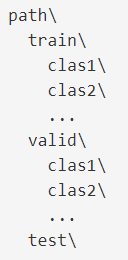

In this method we add the images in their specific class folders in the train, valid(validation) and if we wish in the test folders. For instance class1, class2 folders within the train folder will be considered for training the model and the images within the class1 folder will be assigned the label "class1" and so on.


2. [ImageDataBunch.from_df](https://docs.fastai/vision.data.html#ImageDataBunch.from_df)

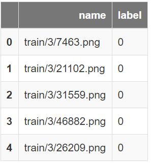

A pandas DataFrame with a column of filenames and a column of labels which can be strings for classification, strings separated by a label_delim for multi-classification or floats for a regression problem (ImageDataBunch.from_df)

3. [ImageDataBunch.from_csv](https://docs.fastai/vision.data.html#ImageDataBunch.from_csv)

Create an ImageDataBunch from path by splitting the data in folder and labelled in a file csv_labels between a training and validation set. Use valid_pct to indicate the percentage of the total images to use as the validation set. An optional test folder contains unlabeled data and suffix contains an optional suffix to add to the filenames in csv_labels (such as '.jpg').

4. A list of filenames and a list of targets [ImageDataBunch.from_lists](https://docs.fastai/vision.data.html#ImageDataBunch.from_lists)

5. A list of filenames and a function to get the target from the filename [ImageDataBunch.from_name_func](https://docs.fastai/vision.data.html#ImageDataBunch.from_name_func)

6. A list of filenames and a regex pattern to get the target from the filename [ImageDataBunch.from_name_re](https://docs.fastai/vision.data.html#ImageDataBunch.from_name_re)

In the last five factory methods, a random split is performed between train and validation, in the first one it is based on the separation between training and a validation folders. For more details on the usage of these methods please follow the links alongside the method.
In my case I used the 1st option. I simple organized different folders for train, validation and test data.


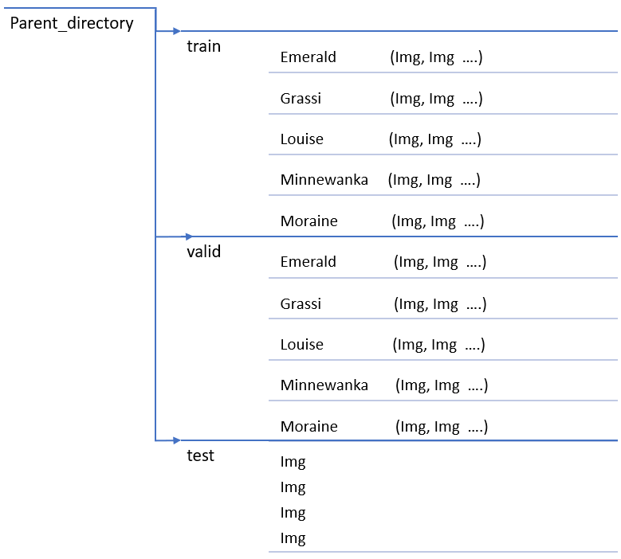

## Loading data in Google Colab

To do nearly everything in this course, we need access to a computer with an NVIDIA GPU.
Several options have been discussed in the course at [platform_setup_url](https://course.fastai/index.html). Setting up a computer takes time and energy, I would rather concentrate my energy to focus on deep learning right now. Therefore, renting access to a computer that already has everything I need preinstalled and ready to go sounds more reasonable. Since I have been working on Google Colab for quite some time, I decided to build the model on Google Colab which comes with a free GPU instance.

I uploaded the dataset on the google drive and then accessed it through the Jupyter Notebook on Google Colab.
Lets load the dataset and create a Image Data Bunch.

```
# Create a Image Data Bunch

batch_size= 16

data = ImageDataBunch.from_folder(path = 'parent_directory/',
        ds_tfms=get_transforms(do_flip=False),
        size=224,
        bs=batch_size,
        test="test").normalize()
```


In the above code chunk we create a Image.DataBunch object with image size 224x224 for each image. Some relevant image transforms have been applied on the images. The images have been normalized so that the pixel values have mean of 0 and standard deviation of 1. Normalization is important as otherwise there can be huge variation in the pixel values for each of the R,G and B channels. I have intentionally not flipped the images as I think it wont add lot of value by flipping the image of Lakes while training the model. To know more about the transforms which can be applied to the dataset please follow the url: [get_transforms](https://docs.fastai/vision.transform.html).


This is how the Image Data Bunch object looks like.

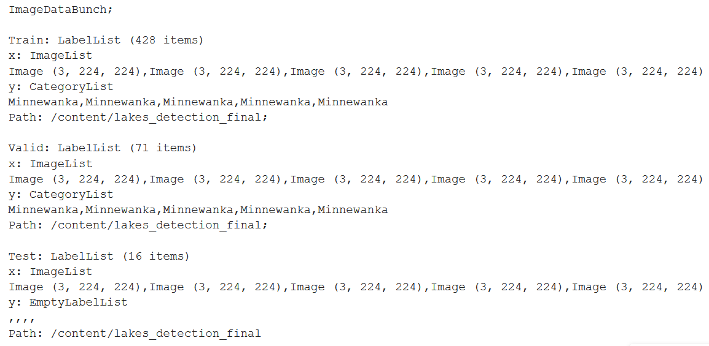

We can see the number of Images in the Train, Valid and Test dataset.


Lets look at some of the train images:

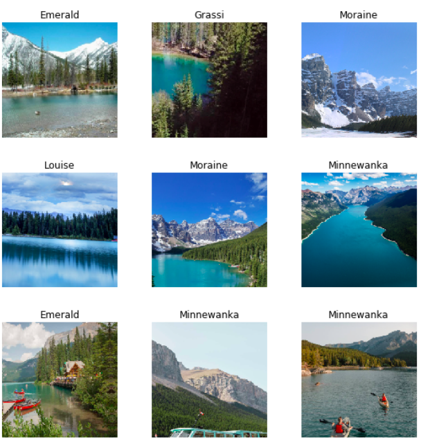

We notice the class of each image is displayed on the top of the image. This class label has been identified based on the folder structure. Any image in the Moraine folder will belong to the Lake Moraine and so on.


We are dealing with 5 different lakes here. Lets confirm by looking at the dataset we just loaded. As we notice below our dataset has 5 labels viz. Lake Emerald, Grassi, Louise, Moraine and Minnewanka.

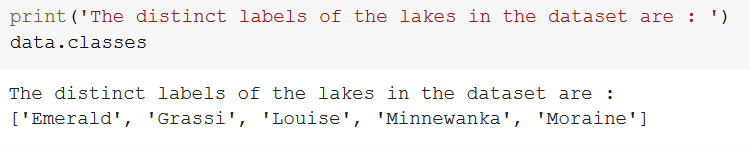

## Model Training

There are two options we have for training the model. The first is to train the model from scratch which includes designing the network architecture ourselves and the other is to utilize what we call the [Transfer learning](https://docs.fastai/vision.learner.html).
Transfer learning is a technique where we use a model trained on a very large dataset (usually ImageNet in computer vision) and then adapt it to our own dataset.

In our case we will use the ResNet34(contains 34 layers) architecture with the model weights trained on the ImageNet dataset and replace the last few layers to suite our specific case. Our aim is the have the last layer give us the probability of the input image being any of the 5 labels of lakes. The one with highest probability will be chosen as the prediction for the input image.

```
# Download the ResNet34 model weights

learn = cnn_learner(data, models.resnet34, metrics=error_rate)

# We will train for 4 epochs (4 cycles through all our data).

learn.fit_one_cycle(4)

```

The 'cnn_learner' factory method helps to automatically get a pretrained model from a given architecture with a custom head that is suitable for our data. We train our model for 4 epochs. An epoch is defined as a look through the data once. 4 Epochs means we have 4 cycles through our data. The results are as shown below.
We notice that the error_rate has fallen to ~24% or we can say our model is around 76% accurate. This is not a great accuracy.

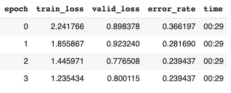


## Model Evaluation

```
# Look for the images with top losses

interp = ClassificationInterpretation.from_learner(learn)
losses,idxs = interp.top_losses()

interp.plot_top_losses(9, figsize=(15,11))
```

Below are the top losses and the corresponding Images with highest losses.

```
# Top losses

tensor([5.9310, 3.4642, 3.3008, 2.6140, 2.4885, 2.3212, 2.3197, 1.9972, 1.9669,
        1.9248, 1.7802, 1.7560, 1.6066, 1.5754, 1.3843, 1.3363, 1.2030, 1.1969,
        1.0201, 0.9424, 0.9262, 0.7708, 0.7560, 0.7550, 0.7249, 0.6982, 0.6869,
        0.5669, 0.5280, 0.5184, 0.5173, 0.5171, 0.4213, 0.3496, 0.3265, 0.3263,
        0.2940, 0.2421, 0.2144, 0.2093, 0.1944, 0.1845, 0.1601, 0.1589, 0.1545,
        0.1488, 0.1342, 0.1334, 0.1256, 0.1232, 0.1000, 0.0721, 0.0721, 0.0672,
        0.0643, 0.0585, 0.0530, 0.0515, 0.0413, 0.0336, 0.0309, 0.0307, 0.0290,
        0.0237, 0.0230, 0.0223, 0.0191, 0.0181, 0.0117, 0.0090, 0.0072])
```


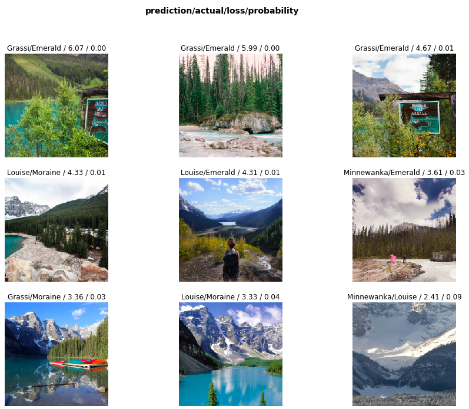

On top of the Images we have the ``prediction/actual/loss/probability``.
The `prediction` is the category of lake that has been predicted by the model.    
`actual` refers to the actual category of the lake. The `loss` is the value of the loss while predicting the category and the `probability` is the probability of the image belonging to the actual category of the lake.
For instance for the first image we see:

``Grassi/Emerald/6.07/0.00`` this means our model predicted this image is from ``Grassi Lake``. In reality the image is from `Emerald lake`. The `loss` while detecting this was 6.07. While predicting this Image our model gave 0 `probability` to the actual class which was Emerald lake.

Lets see the [Confusion matrix](https://scikit-learn.org/stable/auto_examples/model_selection/plot_confusion_matrix.html) for the model performance. The diagonal entries are the correct predictions and non diagonal elements signify how much our model has incorrectly predicted for each category. We notice the model has performed poorly on the detection of Emerald lake. The Grassi lake has been predicted very well. This could be because of the input images we have used for training the model.    

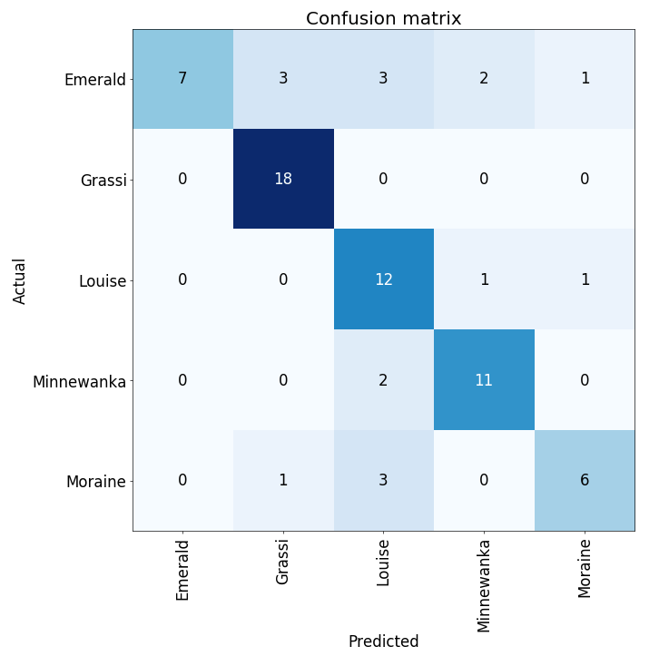

## Model Improvement

In the above model training we took the model weights from the ResNet34 just replaced the last couple of fully connected layers to suit our dataset. We had just trained the last couple of layers. Now lets train the model from the beginning. We will use the ResNet34 architecture but the weights will be trained from scratch. There is another important parameter that we can improve upon, `learning rate`. Below we see how the loss varies with different learning rates. The default learning rate is 1e-3 which seems to correspond to the least loss. Changing the learning rate might not add any significant value but we can try training the model weights from scratch specific to our dataset. Using the `unfreeze()` method we can instruct the model to train the weights for the entire network.


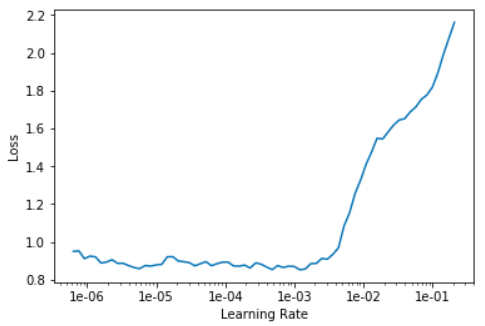


After unfreezing the network and training from scratch we get the following results.


```
learn.unfreeze()
learn.fit_one_cycle(4)
```
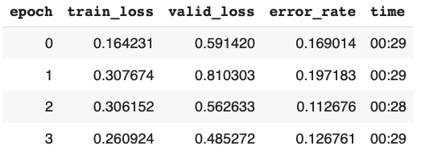


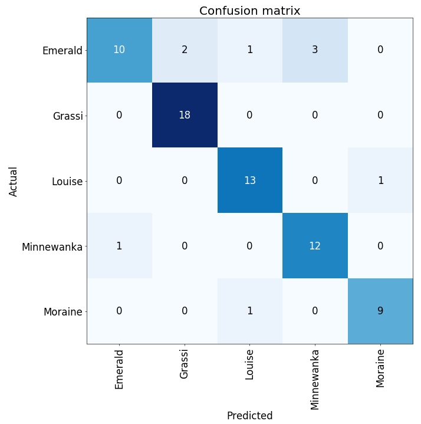


We notice significant improvement in the model performance. The error_rate has fallen from 24% to ~13%. This indicates accuracy of 87%. I notice some randomness in this part where we unfreeze the layers. Every time I train this model I get different results. Most of the time unfreezing is giving me better results than just training the last layers.  I am hoping to have more clarity on this in the subsequent lectures.

## Prediction on test dataset

In the beginning we kept some images in the test dataset which the model has still not seen.

I made predictions on these images and below you can see some of the results.

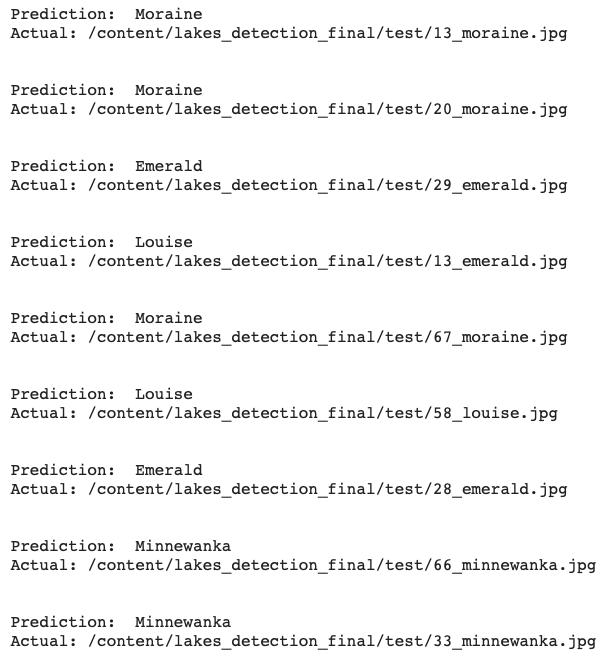

In the above snapshot the `Prediction` corresponds to what the model predicted and the `Actual` is the filename or the actual label. We can see that the model has performed well on most of the images but has not detected the Emerald lake in one of the instances where the actual lake was Emerald but the model predicted it as Louise. Even if we see the confusion matrix of the improved model we notice the model has performed worst in detection of Emerald lake and works well otherwise. There could be a problem with the input dataset for Emerald lake.


We can further try some more complex model architectures. For instance we have used the ResNet34 architecture which contains 34 layers. We can also make use of the ResNet50 architecture which contains 50 layers and can handle more complex images.

This blogpost was based on the first lecture of the course and I am looking forward the rest of the course.


## Reference:
1. The credit for this blogpost goes to Practical Deep Learning for Coders, v3 : [Course_url](https://course.fastai/)
2. The documentation by fast ai has been very helpful : [Doc_url](https://course.fastai/)
