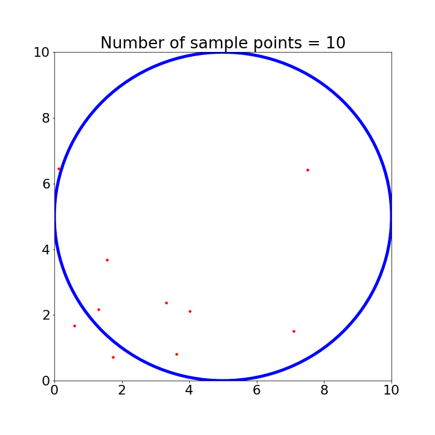
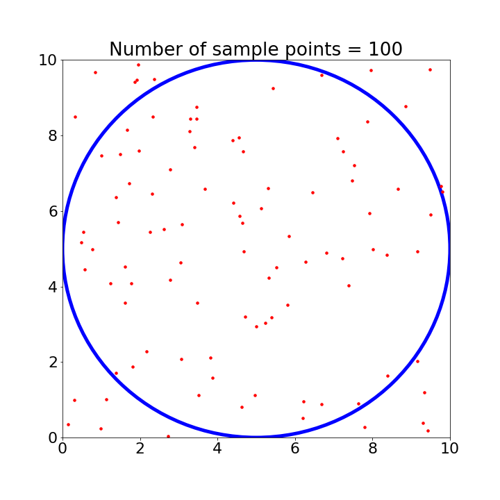
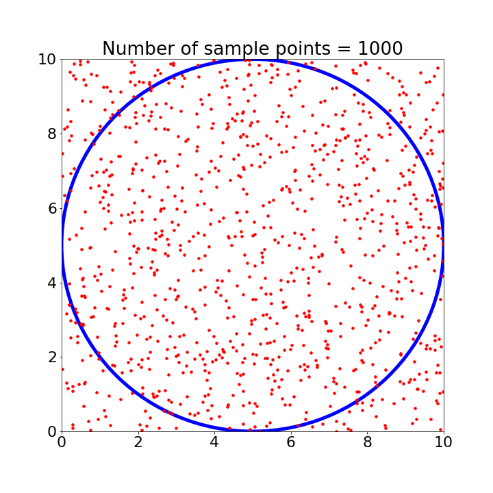
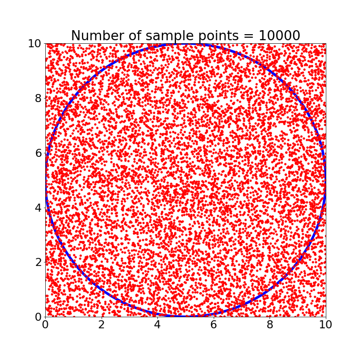

## Monte Carlo Simulation

| N =10  | N=100  |
|   |   |
|   |   |

| N=1000   | N=10000 |
|   |  |
|   |  |

*In progress*

## Reference:
1. https://towardsdatascience.com/a-zero-math-introduction-to-markov-chain-monte-carlo-methods-dcba889e0c50
