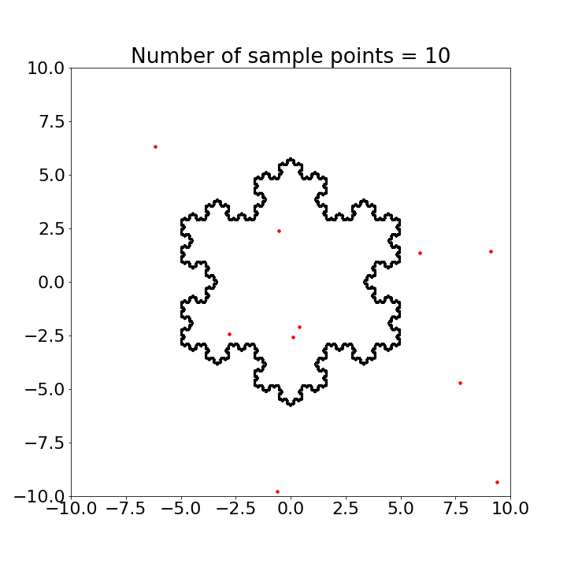
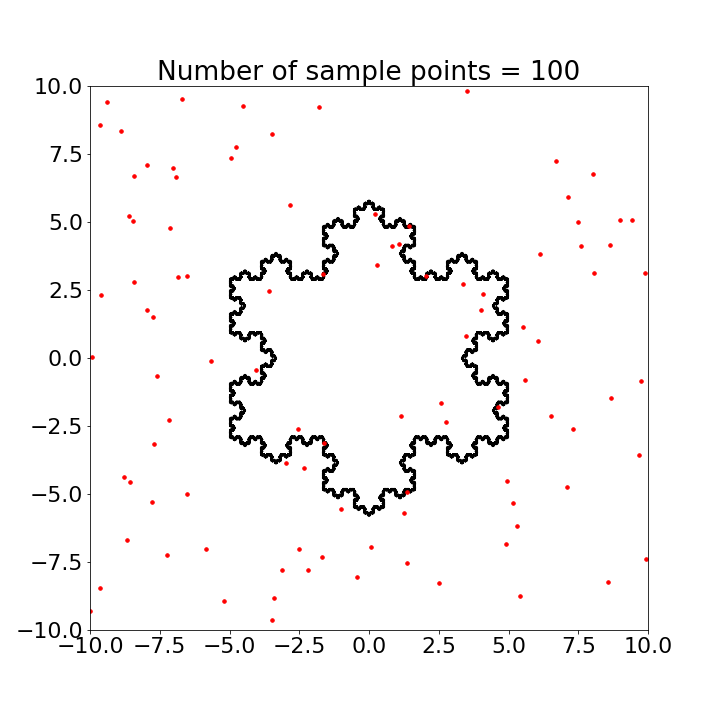
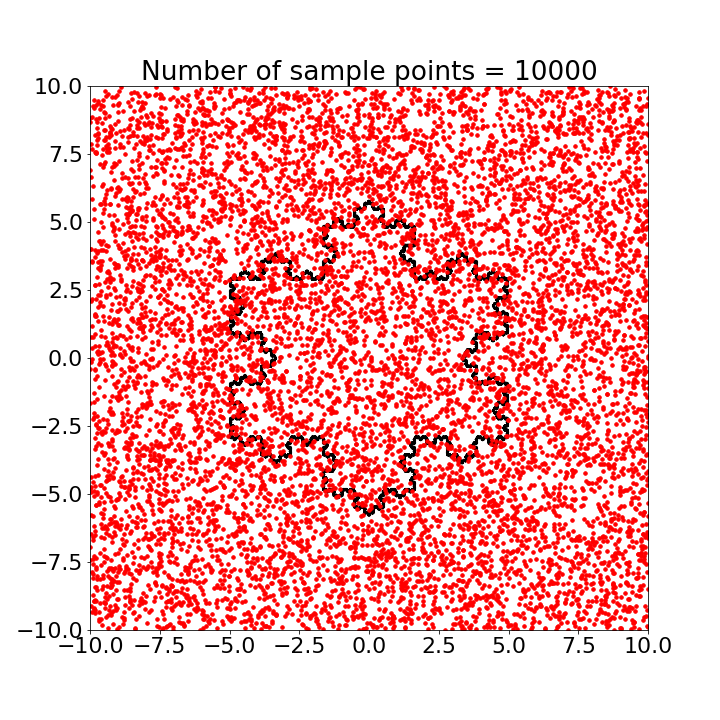

## Monte Carlo Simulation

Based on my understanding, Monte Carlo Simulation is a technique to estimate the parameter of interest(otherwise difficult to compute) by carrying out computations on random numbers picked repeatedly from a distribution. Sounds complicated right. Let me make it a little more intuitive. Lets say if we want to find the area of a Square, what can do what we have been doing since high school which is to use the formula $Side^2$. Or alternately we can count and sum total number of points(many, many points) enclosed in the square. Ideally both of them will give us the same and correct answer. What if I now ask the area of the Circle enclosed within the Square. Again using our higgiven the owledge we can either use $\pi r^2$. Or if we already know the area of the square we can roughly find the proportion of randomly picked points lying within the circle and this proportion will give us of the area of the Circle given the area of Square.

| --  | --  |
|   |   |
|   |  |

|-- | -- |
|   |  |
|   |   |

*In progress*

## Reference:
1. https://towardsdatascience.com/a-zero-math-introduction-to-markov-chain-monte-carlo-methods-dcba889e0c50
2. https://matplotlib.org/3.1.1/gallery/lines_bars_and_markers/fill.html#sphx-glr-gallery-lines-bars-and-markers-fill-py
