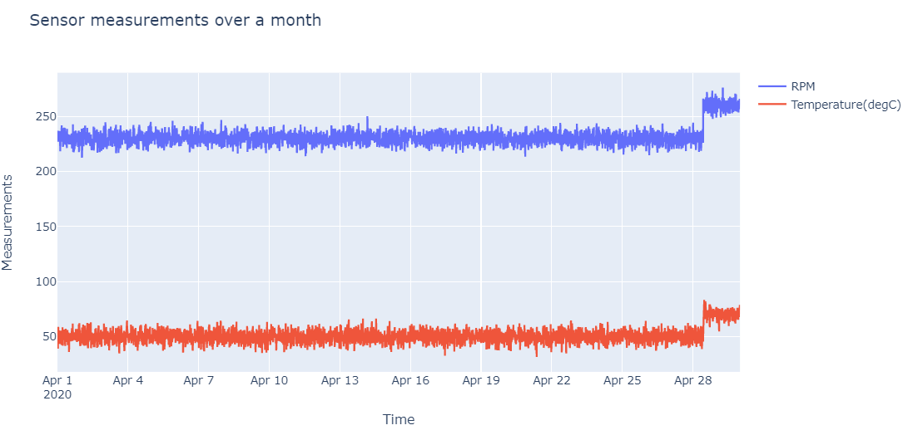
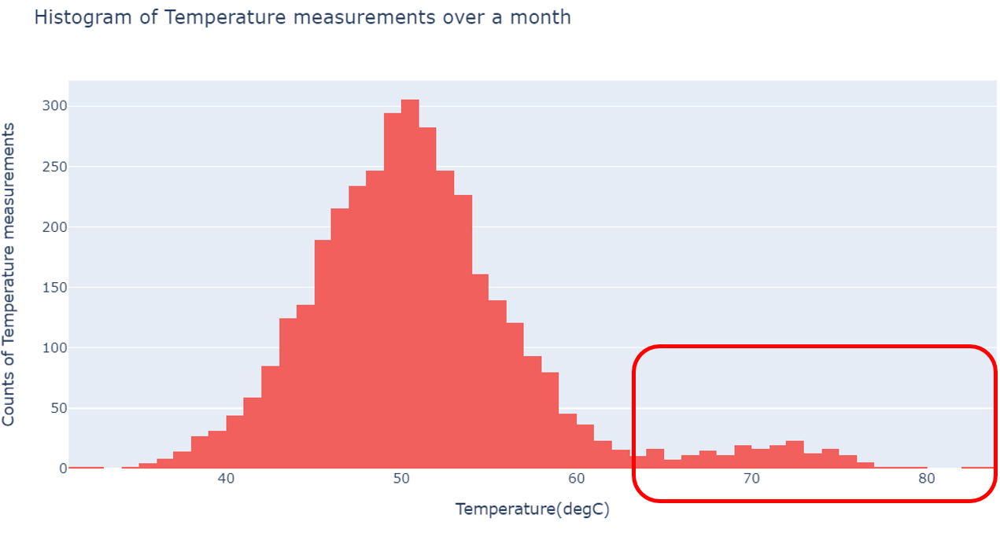
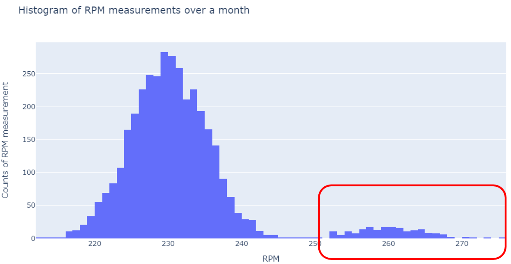
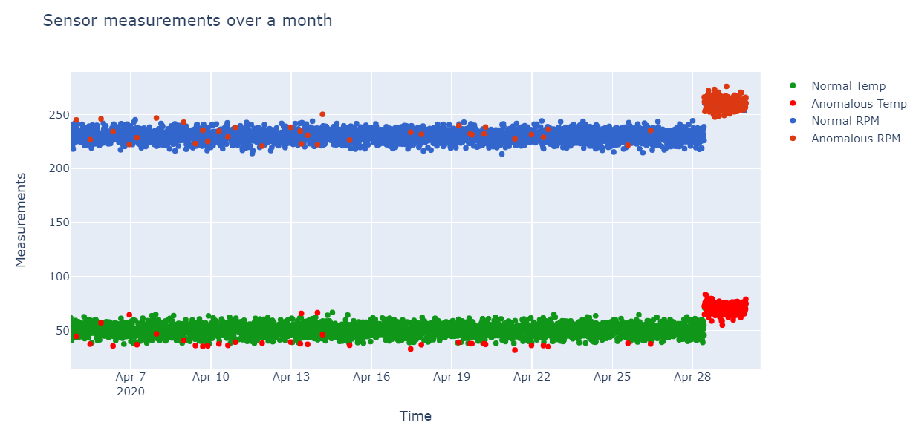

## Anomaly Detection explained

In upstream and mid-stream operations the engineers often deal with lot of sensor
data which they are expected to interpret and before taking appropriate actions.
Lot of times this data is getting updated Real Time and its a laborious task for the engineers
to devote his full concentration on what each of those 100s of measurements are trying to show.

It has been widely believed that the next tool failure is already in the data we have with us.
It means the data already contains some kind of Anomaly in the measurements which
could be potentially warning us about the upcoming incident.

Machines in current time have seen massive upgradation in the processing power and storage space
compared to what it used to be couple of decades back.
These days we have the capability to make machines process N dimension multi gega bytes
data and spit out any weird behavior of the measurements.

In this blog one such technique has been discussed using a very simple toy example
of a RPM measurement recorded from the Rotor and the corresponding Temperature
measurement.

In the below plot we notice RPM and temperature measurements recorded over month of
April,2020 by a Rotor.
The data has been synthetically generated from a Normal distribution N(230,5) for RPM and N(50,5) for Temperature.
We notice some abnormal behavior from the rotor in the last week of April 2020, where suddenly the rotations per minute shoot up which leads to corresponding increase in the temperature.
These measurements have been obtained from N(260,5) for RPM and N(70,5) for Temperature.

Even though this is a hypothetical situation, it is a possible in the day to day operations.
We are considering only two measurements to have ease of plotting but machine learning can handle large number of measurements and
data over much longer period.

## Anomalous detection from Visualizations
We can use some quick visualizations to identify any Anomalous behavior of the rotor.
Below are the plots showing the histogram of RPM and Temperature measurements.

We notice a normal behavior from both Temperature and RPM in a nice normal distribution
but as highlighted in red box there are some higher than average values as well.
If these values are close to the tolerance limit of the Rotor they could indicate a problem with rotor and a suitable
remedial action can be taken based on this finding.

This technique was simple to implement in a small dataset and just two variables.
But what if the dataset is huge and there are multiple measurements.

We will do the same analysis but this time using Machine Learning technique.
We will be using Isolation Forest algorithm here.

## Anomaly detection using Isolation Forest

Isolation Forest is similar in principle to Random Forest and is built on the basis of decision trees.
Isolation Forest, however, identifies anomalies or outliers rather
than profiling normal data points. Isolation Forest isolates observations by
randomly selecting a feature(Temperature and RPM in this case) and then
randomly selecting a split value between the maximum and minimum values of that selected feature. This split depends on how long it takes to separate the points.

Random partitioning produces noticeably shorter paths for anomalies.
When a forest of random trees collectively produces shorter path lengths
for particular samples, they are highly likely to be anomalies.

### References

1. Outlier detection : https://scikit-learn.org/stable/modules/outlier_detection.html
2. Isolation Forest : http://docs.h2o.ai/h2o/latest-stable/h2o-docs/data-science/if.html
