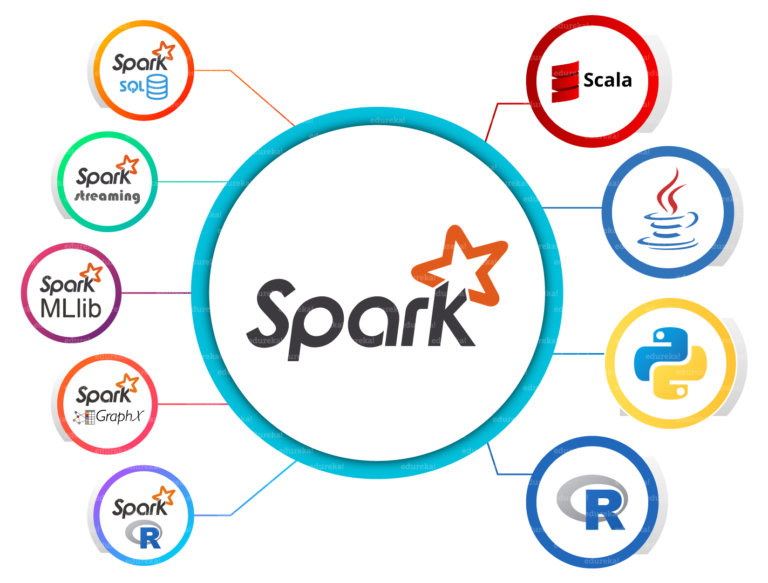

*In progress*

*Alert - this blog is going to be a long. It will showcase all the research I had done to understand Spark as well.*

# Taking Data Processing to next level

## What led me to discover Apache Spark and its power of parallel computing?

I am an experienced Data Scientist and I have been at the forefront of managing the entire data science project life cycle including defining project scope, identifying data requirements and acquisition, data cleaning, feature engineering, Machine Learning model building, evaluating and deploying.

This time around in one of the projects we had to analyze the high frequency data and build a machine learning model pipeline. I started with a sample to understand the data structure.

But soon I realized it was not going to be possible to scale what I was doing on the entire dataset. Talking to my peers I came across Dask, an open source library for parallel computing written in Python and Koalas, which is the pandas DataFrame API for handling Big Data. Very recently Koalas has been highlighted as a good alternative to PySpark as there is no learning curve for the user if you already know pandas. Check: [Koalas - pandas API on Apache Spark](https://github.com/databricks/koalas).

In this blogpost I will take you through the Spark architecture to understand how is it able to handle big data processing and we will go through a used case together. I cannot discuss about the project that I was working on because of the client confidentiality but we can definitely play around with open source datasets :)
That is the power of being the Data Science practitioner, nothing can stop you from learning if you want to.

Lets dig into it.

## How is Spark handling big data processing?

Traditionally when we were working only on our laptops we were limited to the storage capacity and the processing power as per the configuration of the laptop.

Since the inception of cloud we are able to scale up our storage and processing and having second thoughts about upper limit on both is almost out of scope now. Be it Azure or AWS you just pay for as much as you want.

But what is it that Spark is doing to get complex processing run on such high amount of datasets. The answer lies in parallelization.

Let us understand with an example, lets say if I am given a task to count the M&Ms in the gif box which I got on my birthday, I can do it pretty easily right.
This is same as when you have a usual CSV file such as the infamous Titanic dataset which we can easily handle with the Pandas and do the manipulations.
On the other hand if now I am given a task to count the number of M&Ms in the store next to my house, I will hesitate a bit but after spending a day or two dedicatedly I can do it. It is slow but still something I can handle.
Now if I am asked to count the number of M&Ms in every store in Vancouver, I give up right away. I cannot handle this task myself, what I can do instead is call all my UBC friends to go to the stores near their house and give me a count of M&Ms. In the end what I will do it collect all the counts from all my UBC friends and sum them all.

**M&Ms in my gift box**

**M&Ms in whole of Vancouver**

| Orphelia | Aditya | Sayanti | Akansha |
| ------ | ------ | ------ | ------ |
|  |  || |

What happened here, I split the task into the hands of my friends(equivalent to the Workers in Spark) and then aggregated the final results. Note one more thing, we encourage our friends to not interact till they reach the final count of their share of M&Ms, that means no information is exchanged and no gossip about who is having higher count is happening here. Any gossip amongst them has the potential of slowing down the process.
This is what is happening in Spark. It splits the data in partitions which lie on different cluster nodes you can simple say different laptops and when you execute some operations they are executed in parallel fashion and we aggregate the results in the end.

Now some one may ask what is so different from MapReduce, it was doing the same parallelization into Map and Reduce steps. That is a valid question and I will answer that in the upcoming section.

Let us understand the architecture of the Spark and some essential components before we dig deeper into Used Case.

## Apache Spark Architecture

Apache Spark is an open-source distributed general-purpose cluster-computing framework.  Instead of trying to process computationally-expensive programs on a single computer, these tasks can be divided between multiple computers that communicate with each other. When Spark says it has to do with distributed data, this means that it is designed to deal with very large datasets and to process them on a distributed computing system.

This is how the Spark Eco System looks like.

test

#### Essential components of the eco system are:

1. **Spark Core**  

Spark Core is the heart of the Apache Spark framework. It holds the components for task scheduling, fault recovery, interacting with storage systems and memory management. Spark Core is also home to the API that defines resilient distributed datasets (RDDs), which are Spark’s main programming abstraction. RDDs represent a collection of items distributed across many compute nodes that can be manipulated in parallel. Spark Core provides many APIs for building and manipulating these collections.

2. **Spark SQL**  

Spark SQL is Spark’s package for working with structured data.It allows querying data via SQL as well as the Apache Hive variant of SQL—called the Hive Query Language (HQL)—and it supports many sources of data, including Hive tables, Parquet, and JSON.

3. **Spark Streaming**  

Spark Streaming is a Spark component that supports scalable and fault-tolerant processing of streaming data. It uses Spark Core's fast scheduling capability to perform streaming analytics. A common example is processing log data from a website or server.

4. **Spark GraphX**  

GraphX is the Spark API for graphs and graph-parallel computation. To manipulate graph, it supports various fundamental operators like subgraph, join Vertices, and aggregate Messages.

5. **Spark Machine Learning(MLlib)**  

Spark comes with a library containing common machine learning (ML) functionality, called MLlib. MLlib provides multiple types of machine learning algorithms, including classification, regression, clustering, and collaborative filtering, as well as supporting functionality such as model evaluation and data import. All of these methods are designed to scale out across a cluster.

6. **Spark R**  

It is an R package that provides a distributed data frame implementation. It also supports operations like selection, filtering, aggregation but on large data-sets.

Under the hood another very important component is the **Cluster manager**.
Spark is designed to efficiently scale up from one to many thousands of compute nodes. To achieve this while maximizing flexibility, Spark can run over a variety of cluster managers, including Hadoop YARN, Apache Mesos, and a simple cluster manager included in Spark itself called the Standalone Scheduler.

## Used Case - Data loading, wrangling, ML model - build, evaluate and deploy

## References
1. [Spark_Architecture](https://www.edureka.co/blog/spark-architecture/)
2. [Getting_started_with_Spark](https://pages.databricks.com/rs/094-YMS-629/images/Databricks-on-AWS-01-Getting-Started-Apache-Spark-Slides.pdf)
