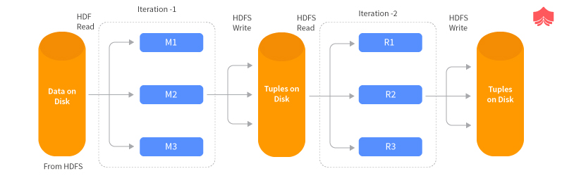
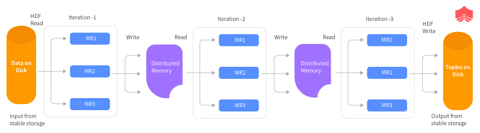

# Take your data processing to the next level

## What led me to discover Apache Spark

I am an experienced Data Scientist and I have been at the forefront of managing the entire data science project life cycle including defining project scope, identifying data requirements and acquisition, data cleaning, feature engineering, building, evaluating and deploying machine learning models.

This time around in one of the projects, I had to analyze the high frequency data and build a machine learning model pipeline. I started with a sample to understand the data structure.

But soon I realized it was not possible to scale what I was doing to the entire dataset. Talking to my peers I came across 1. Dask, an open source library for parallel computing written in Python and 2. Koalas, which is the pandas DataFrame API for handling Big Data. Very recently Koalas has been highlighted as a good alternative to PySpark as there is no learning curve for the user if you already know pandas. Check: [Koalas - pandas API on Apache Spark](https://github.com/databricks/koalas).

In this blogpost I will take you through the Spark architecture to understand how is it able to handle big data processing and we will go through a used case together in the next blogpost. I cannot discuss about the project that I was working on because of the client confidentiality but we can definitely play around with open source datasets :)
That is the power of being a Data Science practitioner, nothing can stop you from learning if you want to.

Let's start

## How is Spark handling big data processing

Traditionally when we were working only on our laptops we were limited to the storage capacity and the processing power as per the configuration of the laptop.

Since the inception of cloud we are able to scale up our storage and processing and having second thoughts about upper limit on both is almost out of scope now. Be it Azure or AWS you just pay for as much as you want.

But what is it that Spark is doing to get complex processing run on such high amount of datasets. The answer lies in parallelization.

Let us understand with an example, let's say if I am given a task to count the M&Ms in a gift box which I got on my birthday, I can do it pretty easily, right.
This is same as when you have a usual CSV file such as the infamous Titanic dataset which we can easily handle with the Pandas and do the manipulations.
On the other hand if now I am given a task to count the number of M&Ms in the store next to my house, I will hesitate a bit but after spending a day or two dedicatedly, I can do it. It is slow but still something I can handle.
Now if I am asked to count the number of M&Ms in every store in Vancouver, I give up right away. I cannot handle this task myself, what I can do instead is call all my UBC friends to go to the stores near their house and give me a count of M&Ms. In the end what I will do is collect all the counts from all my UBC friends and sum them all.

**M&Ms in my gift box**

**M&Ms in whole of Vancouver**

| Orphelia | Aditya | Sayanti | Akansha |
| ------ | ------ | ------ | ------ |
|  |  || |

What happened here, I split the task into the hands of my friends(equivalent to the Workers in Spark) and then aggregated the final results. Note one more thing, we encourage our friends to not interact till they reach the final count of their share of M&Ms, that means no information is exchanged and no gossip about who is having higher count is happening here. Any gossip amongst them has the potential of slowing down the process.
This is what is happening in Spark. It splits the data in partitions which lie on different cluster nodes you can simple say different laptops and when you execute some operations they are executed in parallel fashion and we aggregate the results in the end.

Now some one may ask what is so different from MapReduce, it was doing the same parallelization into Map and Reduce steps. That is a valid question and I will answer that in the upcoming section.

Let us understand the architecture of the Spark and some essential components.

## Apache Spark architecture

Apache Spark is an open-source distributed general-purpose cluster-computing framework.  Instead of trying to process computationally-expensive programs on a single computer, these tasks can be divided between multiple computers that communicate with each other.

This is how the Spark Eco System looks like.

### Essential components of the ecosystem are:

**1. Spark Core**  

Spark Core is the heart of the Apache Spark framework. It holds the components for task scheduling, fault recovery, interacting with storage systems and memory management. Spark Core is also home to the API that defines resilient distributed datasets (RDDs), which are Spark’s main programming abstraction. RDDs represent a collection of items distributed across many compute nodes that can be manipulated in parallel. Spark Core provides many APIs for building and manipulating these collections.

**2. Spark SQL**  

Spark SQL is Spark’s package for working with structured data.It allows querying data via SQL as well as the Apache Hive variant of SQL—called the Hive Query Language (HQL)—and it supports many sources of data, including Hive tables, Parquet, and JSON.

**3. Spark Streaming**  

Spark Streaming is a Spark component that supports scalable and fault-tolerant processing of streaming data. It uses Spark Core's fast scheduling capability to perform streaming analytics. A common example is processing log data from a website or server.

**4. Spark GraphX**  

GraphX is the Spark API for graphs and graph-parallel computation. To manipulate graph, it supports various fundamental operators like subgraph, join Vertices, and aggregate Messages.

**5. Spark Machine Learning(MLlib)**  

Spark comes with a library containing common machine learning (ML) functionality, called MLlib. MLlib provides multiple types of machine learning algorithms, including classification, regression, clustering, and collaborative filtering, as well as supporting functionality such as model evaluation and data import. All of these methods are designed to scale out across a cluster.

**6. Spark R**  

It is an R package that provides a distributed data frame implementation. It also supports operations like selection, filtering, aggregation but on large data-sets.

Under the hood another very important component is the **Cluster manager**.
Spark is designed to efficiently scale up from one to many thousands of compute nodes. To achieve this while maximizing flexibility, Spark can run over a variety of cluster managers, including Hadoop YARN, Apache Mesos, and a simple cluster manager included in Spark itself called the Standalone Scheduler.

### Data Representation

**Spark Resilient Distributed Dataset (RDD)**

RDDs are the fundamental data structures of Spark or we can say the building blocks of any Spark application. RDDs Stands for:

*Resilient*: Fault tolerant and capable of rebuilding data on failure
*Distributed*: Distributed data among the multiple nodes in a cluster
*Dataset*: Collection of partitioned data with values

There are two ways to create RDDs − **parallelizing** an existing collection in your driver program, or **referencing a dataset** in an external storage system, such as a shared file system, HDFS, HBase, or any data source offering a Hadoop Input Format.
Spark makes use of RDDs to achieve the same or similar processing results as MapReduce but at a much faster speed usually of the order by 10 to 100x.

**MapReduce Vs Spark**

MapReduce has established itself as one of the best technologies to process and generate huge datasets parallelly using distributed algorithms in distributed environments. It helps users and developers to do parallel computations using high-level APIs and the users do not have to get involved and take care of the intricacies of work distribution, concurrency issues and making the processing systems fault-tolerant.

When we need to reuse data between different computation stages say in MapReduce processing, the only way to do this is to write the output of the first stage to physical storage e.g. HDFS. Both the iterative and interactive applications need data sharing to be very fast across parallel jobs. But the data sharing is not that fast in MapReduce due to disk IO, serialization, deserialization, and replication involved in writing to stable storage for intermediate results. It is found that Hadoop applications spend almost 90% of their time in reading and writing to storage systems.

Iterative Operations on MapReduce

In interactive operations, the user runs an ad-hoc query on the same subset of data and each time the query will go to the disk and perform IO to fetch the data and return back to the user. This increases the interactive query time for the user and hampers the user experience.

To overcome this slowness Spark was developed which works on the concept of Resilient Distributed Datasets which essentially are in-memory objects but are partitioned and distributed on a cluster and also fault-tolerant. So the intermediate stage outputs do not require to be written to stable storage and can be accessed from memory avoiding the biggest bottleneck of the MapReduce systems. This in-memory sharing makes Spark 10 to 100 times faster than MapReduce.

Let us now see how iterative and interactive operations take place in Spark’s Resilient Distributed Datasets.

Iterative Operations on Spark RDD

The diagram above shows how Spark’s RDD work in iterative applications. The intermediate results are written to memory instead of the stable disk storage and the subsequent steps can read the same memory RDD objects. Only when the memory(RAM) is insufficient to store the whole RDD, the results are spilled to the disk. But overall the whole system is way faster than the MapReduce application due to this optimization

When to use RDDs:

- Low-level transformation and actions and control on dataset
- Data is unstructured, such as media streams or streams of text
- No requirement of imposing a schema, such as columnar format, while processing or accessing data attributes by name or column
- Can afford to forgo some optimization and performance benefits available with DataFrames and Datasets for structured and semi-structured data.

**Spark DataFrames**

Spark DataFrames came into focus in the recent releases of Spark, DataFrame is an immutable distributed collection of data. Unlike an RDD, data is organized into named columns, like a table in a relational database. Designed to make large data sets processing even easier, DataFrame allows developers to impose a structure onto a distributed collection of data, allowing higher-level abstraction

**Spark Datasets**

Datasets in Apache Spark are an extension of DataFrame API which provides type-safe, object-oriented programming interface.

When to use DataFrames or Datasets?

- For rich semantics, high-level abstractions, and domain specific APIs, use DataFrame or Dataset.
- For high-level expressions, filters, maps, aggregation, averages, sum, SQL queries, columnar access and use of lambda functions on semi-structured data, use DataFrame or Dataset.
- Higher degree of type-safety at compile time, want typed JVM objects, take advantage of Catalyst optimization, and benefit from Tungsten’s efficient code generation, use Dataset.
- Unification and simplification of APIs across Spark Libraries, use DataFrame or Dataset.
- If you are a R user, use DataFrames.
- If you are a Python user, use DataFrames and resort back to RDDs if you need more control.

### Working of Spark Architecture

 Spark has a concept of a master and slave(worker) nodes. The master node has a driver program which drives the application.
The first thing Driver node does is to create a Spark Context which is an entry point to any Spark functionality just like the Database connection. Spark Context works with the Cluster Manager to manage various jobs. The Driver and the Spark Context take care of the jobs on the clusters. Any job is split into multiple tasks which are split across the worker nodes. The worker nodes are responsible for executing the task assigned to them. With more workers you can split the data into more partitions.

The driver talks to the cluster manager and negotiates the resources. Cluster manager launches executors in worker nodes on behalf of the driver. At this point, the driver will send the tasks to the executors based on data placement. When executors start, they register themselves with drivers. So, the driver will have a complete view of executors that are executing the task.
During the course of execution of tasks, driver program will monitor the set of executors that runs. Driver node also schedules future tasks based on data placement.

### RDD Operations

The Spark operations are combination of **Transformation** and **Actions**. Transformations create new RDDs from existing dataset and Actions return a value after running a computation on the dataset. For instance *MAP* is a transformation that passes each element of the dataset into the function but *REDUCE* is the action that aggregates all the elements of the RDD and passes through a function and returns the final result to the driver program.

All the transformations in Spark are lazy, which means that they do not compute the results right away. Instead they just memorize the series of transformations that are acting on a dataset. These transformations are computed only when a action requires a result to be returned to the driver program. When we run the MAP transformation followed by REDUCE action the large mapped dataset is not returned to the Driver rather only the final computation result from the REDUCE is sent. This makes execution through Spark much more efficient.

I hope this overview gave you better understanding of the working of Spark. In the next part we will work on a used case for better understanding of how a large dataset is partitioned and processed with Spark.

## References
1. [Spark_Architecture](https://www.edureka.co/blog/spark-architecture/)
2. [Getting_started_with_Spark](https://pages.databricks.com/rs/094-YMS-629/images/Databricks-on-AWS-01-Getting-Started-Apache-Spark-Slides.pdf)
3. [Resilient Distributed Dataset (RDDs)](https://www.knowledgehut.com/tutorials/apache-spark-tutorial/resilient-distributed-datasets)
4. [RDDs Vs DataFrames Vs Datasets](https://databricks.com/blog/2016/07/14/a-tale-of-three-apache-spark-apis-rdds-dataframes-and-datasets.html)
5. [Spark Operations](https://training.databricks.com/visualapi.pdf)
